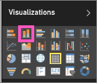

<properties
   pageTitle="Tutorial: Part I, Add visualizations to a Power BI report"
   description="Tutorial: Part I, Add visualizations to a Power BI report"
   services="powerbi"
   documentationCenter=""
   authors="mihart"
   manager="mblythe"
   editor=""
   tags=""
   qualityFocus="no"
   qualityDate=""/>

<tags
   ms.service="powerbi"
   ms.devlang="NA"
   ms.topic="article"
   ms.tgt_pltfrm="NA"
   ms.workload="powerbi"
   ms.date="04/29/2016"
   ms.author="mihart"/>

# Tutorial: Part I, Add visualizations to a Power BI report

This article gives a quick introduction to creating a visualization in a report.  For more-advanced content, please [see Part II](powerbi-service-add-visualizations-to-a-report-ii.md). 

  

1.  Open a [report in Editing View](powerbi-service-go-from-reading-view-to-editing-view.md). This tutorial uses the Sales and Marketing sample.

2.  If the Fields pane isn't visible, select the arrow icon to open it. 

    

3.  [Add a blank page to the report](powerbi-service-add-a-page-to-a-report.md).

4.  Create a visualization by selecting a field from the **Fields** pane.  

    **Start with a numeric field: Power BI creates a column chart with a single column**.

    

    **Start with a category field**, such as Name or City: Power BI creates a Table and adds that field to the **Values** well.

    

5.  Select other fields to add to the visualization.  Select **Count of** **Product** to add it to the **Values** well.

    

6.  Change the visualization to a column chart by selecting the column chart icon.

    

7.  When you create visualizations in your report, you can [pin them to your dashboard](powerbi-service-pin-a-tile-to-a-dashboard-from-a-report.md). To pin the visualization, select the pin icon .

    

8.  Now you can:

    Continue on to [Part 2: Add visualizations to a Power BI report](powerbi-service-add-visualizations-to-a-report-ii.md)

    [C](powerbi-service-change-the-type-of-visualization-in-a-report.md)[hange the visualization type](powerbi-service-change-the-type-of-visualization-in-a-report.md)[.](powerbi-service-change-the-type-of-visualization-in-a-report.md)

    [Pin the visualization](powerbi-service-pin-a-tile-to-a-dashboard-from-a-report.md) to your dashboard as a tile.

    [Interact with the visualizations](powerbi-service-interact-with-a-report-in-reading-view.md) in the report.

    [Do even more with visualizations](powerbi-service-visualizations-for-reports.md).

    [Save your report](powerbi-service-save-a-report.md).

## See also

More about [Visualizations in Power BI reports](powerbi-service-visualizations-for-reports.md).

[Reports in Power BI](powerbi-service-reports.md)

[Power BI - Basic Concepts](powerbi-service-basic-concepts.md)
