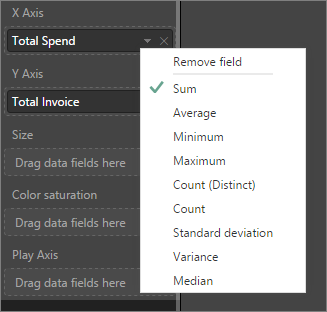

<properties
   pageTitle="Aggregates (sum, average, maximum, etc.) in Power BI"
   description="Change the aggregation in a chart (sum, average, maximum, etc.) in Power BI"
   services="powerbi"
   documentationCenter=""
   authors="mihart"
   manager="mblythe"
   editor=""
   tags=""
   qualityFocus="no"
   qualityDate=""/>

<tags
   ms.service="powerbi"
   ms.devlang="NA"
   ms.topic="article"
   ms.tgt_pltfrm="NA"
   ms.workload="powerbi"
   ms.date="03/23/2016"
   ms.author="mihart"/>

# Aggregates in Power BI  

## What is an aggregate?

A numeric field is a value that will be aggregated (summed or averaged, for example).  These are often referred to as **measures**. Measures in Power BI are imported with the data (defined in the data model your report is based on). In the Fields list, measures are shown with the ∑ symbol. For more information see [The report editor... take a tour](powerbi-service-the-report-editor-take-a-tour.md).

## Change how a numeric field is aggregated

Say you have a chart that sums the sales data for different regions, but you'd rather have the average. 

1.  Add the measure to a visualization.

2.  Find that field in the Visualizations pane, right-click, and select the aggregate type you need.

    

>**NOTE:**   
>**The options available in the dropdown will vary depending on the field selected.**

Some of the options that may be available for aggregating a field:

-   **Do Not Summarize**. With this option chosen, each value in that field is treated separately and not summarized. This is often used if you have a numeric ID column that shouldn't be summed.

-   **Sum**. This adds all the values in that field up.

-   **Average**. Takes an arithmetic mean of the values.

-   **Minimum**. Shows the smallest value.

-   **Maximum**. Shows the largest value.

-   **Count (Not Blanks).** This counts the number of values in that field that are not blank.

-   **Count (Distinct).** This counts the number of different values in that field.

- **Standard deviation.**

- **Variance**.

- **Median**.  Shows the median (middle) value. This is the value that has the same number of items above and below.  If there are 2 medians, Power BI averages them.

For example, this data:

| Country   | Amount |
|:----------|:-------|
| USA       | 100    |
| UK        | 150    |
| Canada    | 100    |
| Germany   | 125    |
| France    |        |
| Japan     | 125    |
| Australia | 150    |

Would give the following results:

-   **Do Not Summarize**: Each value is shown separately

-   **Sum**: 750

-   **Average**: 125

-   **Maximum**:  150

-   **Minimum**: 100

-   **Count (Not Blanks):** 6

-   **Count (Distinct):** 4

- **Standard deviation:** 20.4124145...

- **Variance:** 416.666...

- **Median:** 125

## Use a non-aggregated field as a numeric field

You can also use a non-aggregated field as a numeric field. For example, if you have a Product Name field, you can add it as a value and then set it to **Count** or **Distinct count**. 

1.  For example, if you select **Store > Chain**.

    

2.  And if you change the aggregation from the default **Do not summarize** to **Count (Distinct)**, Power BI counts the number of different chains. In this case, there are 2: Fashions Direct and Lindseys.

    

3.  And if you change the aggregation to **Count**, Power BI counts the total number. In this case, there are 104 entries for **Chain**. By adding **Chain** as a filter, you can see that there are 37 rows for Fashions Direct and 67 rows for Lindseys.  

    

## See also  
[Visualizations in Power BI reports](powerbi-service-visualizations-for-reports.md)  
[Power BI - Basic Concepts](powerbi-service-basic-concepts.md)  
