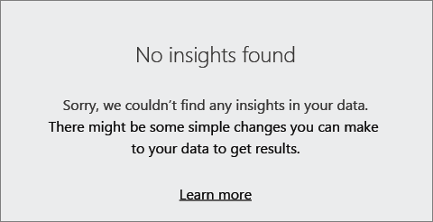

<properties
   pageTitle="Optimize your data for Power BI Quick Insights"
   description="Optimize your data for Power BI Quick Insights. If Power BI doesn't find any insights in your data, here are some things you can do."
   services="powerbi"
   documentationCenter=""
   authors="mihart"
   manager="mblythe"
   editor=""
   tags=""/>

<tags
   ms.service="powerbi"
   ms.devlang="NA"
   ms.topic="article"
   ms.tgt_pltfrm="NA"
   ms.workload="powerbi"
   ms.date="11/23/2015"
   ms.author="mihart"/>

# Optimize your data for Power BI Quick Insights

Here are some changes to your dataset that you can do to improve Auto Insight results:

- Hide or unhide columns in your dataset. Power BI Auto Insights doesn't search hidden columns.  So hide duplicate or unnecessary columns and unhide interesting columns.

- Use a mix of data types such as names, times, dates, and numbers.

- Avoid columns with duplicate information.  This takes valuable time away from searching for meaningful patterns.  For example, one column with state names spelled out and another column with state name abbreviations.

## See also

[Power BI Quick Insights](powerbi-service-auto-insights.md)

[Power BI - Basic Concepts](powerbi-service-basic-concepts.md)

[Dashboards in Power BI](powerbi-service-dashboards.md)
