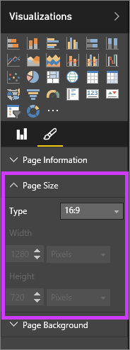

<properties
   pageTitle="Page display settings in a Power BI report"
   description="Page display settings in a Power BI report"
   services="powerbi"
   documentationCenter=""
   authors="mihart"
   manager="mblythe"
   backup=""
   editor=""
   tags=""
   featuredVideoId="5tg-OXzxe2g"
   qualityFocus="monitoring"
   qualityDate=""/>

<tags
   ms.service="powerbi"
   ms.devlang="NA"
   ms.topic="article"
   ms.tgt_pltfrm="NA"
   ms.workload="powerbi"
   ms.date="08/10/2016"
   ms.author="mihart"/>

# Page display settings in a Power BI report

We understand it is critical to keep your report layout pixel perfect. Sometimes, it can be challenging, because you and your colleagues view those reports on screens with different aspect ratios and sizes. 

The default display view is **Fit to page** and the default display size is **16:9**. If you want to lock in a different aspect ratio, or want to fit your report in a different way, there are two tools to help you: ***Page View*** settings and ***Page Size*** settings.

<iframe width="560" height="315" src="https://www.youtube.com/embed/5tg-OXzxe2g" frameborder="0" allowfullscreen></iframe>

## Page View settings

The *Page View* settings let you control the display of your report page relative to the browser window.  You can choose between:

-   **Fit to Page** (default): contents are scaled to best fit the page
-   **Fit to Width**: contents are scaled to fit within the width of the page
-   **Actual Size**: contents are displayed at full size

Page View settings are available in both [Reading View](powerbi-service-interact-with-a-report-in-reading-view.md) and [Editing View](powerbi-service-interact-with-a-report-in-editing-view.md). In Editing View, a report owner can assign a Page View setting to individual report pages, and those settings are saved with the report. When a colleague opens that report in Reading View, she sees the report pages display using the owner's settings.  However, while working with the report in Reading View, she can temporarily change the Page View settings.  Once she leaves the report, the Page View settings revert back to those that were set by the report owner.

## Page Size settings

The *Page Size* settings control the display ratio and actual size (in pixels).  Page Size settings are only available in Editing View.

-   4:3 ratio

-   16:9 ratio (default)

-   Cortana

-   Letter

-   Custom (height and width in pixels)

## Next Step

[Learn how to use Page View and Page Size settings in your own Power BI reports](powerbi-service-tutorial-change-report-display-settings.md).

## See also

Read more about [reports in Power B](powerbi-service-reports.md)

[Power BI - Basic Concepts](powerbi-service-basic-concepts.md)
