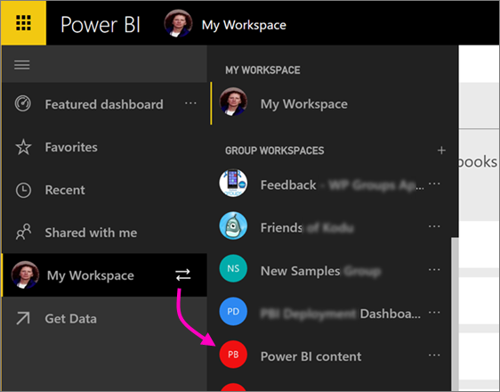
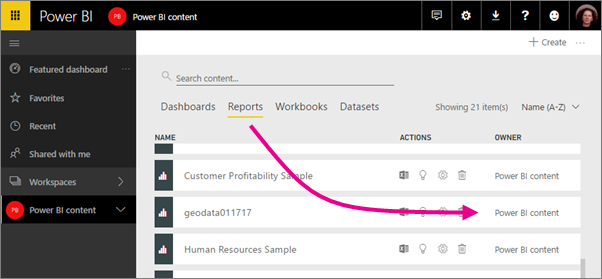
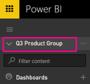
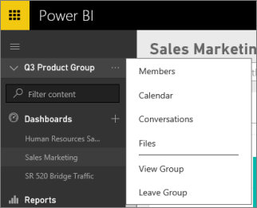

<properties 
   pageTitle="Collaborate in your Power BI group workspace"
   description="Read about collaborating on Power BI Desktop files in your group, and with Office 365 services like sharing files on OneDrive for Business, conversations in Exchange, calendar, and tasks."
   services="powerbi" 
   documentationCenter="" 
   authors="ajayan" 
   manager="erikre" 
   backup="maggiesMSFT"
   editor=""
   tags=""
   qualityFocus="no"
   qualityDate=""/>
 
<tags
   ms.service="powerbi"
   ms.devlang="NA"
   ms.topic="article"
   ms.tgt_pltfrm="NA"
   ms.workload="powerbi"
   ms.date="02/28/2017"
   ms.author="ajayan"/>
# Collaborate in Office 365 with your Power BI group workspace

Power BI group workspaces are great places to collaborate with your colleagues on dashboards, reports, and datasets. That's what groups are designed for -- collaboration. If you just want to distribute a finished dashboard with colleagues, then you're better off *sharing* it with them, or creating an *organizational content pack*. Read [How should I share dashboards, reports, and tiles](powerbi-service-how-should-i-share-my-dashboard.md) first, if you haven't done so yet. 

Collaboration doesn’t end with groups in Power BI. Office 365 offers other group services such as sharing files on OneDrive for Business, conversations in Exchange, shared calendar and tasks, and so on. Read more about [groups in Office 365](https://support.office.com/article/Create-a-group-in-Office-365-7124dc4c-1de9-40d4-b096-e8add19209e9).

>**Note**: Groups are only available with [Power BI Pro](powerbi-power-bi-pro-content-what-is-it.md).

## Collaborate on Power BI Desktop files in your group

After you create a Power BI Desktop file, if you publish it to your Power BI group, then everyone in your group can collaborate on it.

1. In Power BI Desktop, select **Publish** on the **Home** ribbon, then in the **Select a destination** box, select your group workspace.

    

2. In the Power BI service, select the double arrows next to My Workspace > select your group workspace.

    

3. Select the Reports tab and find your report.

    Notice that the owner is the name of the group, not your name.

    

4. Select your report. 

    From here, it's like any other report. You and others in your group can [modify the report](powerbi-service-reports.md) and save tiles to a dashboard of your choosing.

## Collaborate in Office 365

Collaborating in Office 365 starts from the group’s workspace in Power BI.

1.  In Power BI, switch to the group’s workspace, so the group name is in the top-left corner. 

    

2.  Select the ellipsis (**…**) next to your group name.

    

    >**Note**: The first time you go to your group in Office 365, it may take some time. Give it 15 to 30 minutes, then refresh your browser.

## Have a group conversation

1.  Select the ellipsis (…) next to your group name \> **Conversations**. 

    This opens the email and conversation site for your group in Outlook for Office 365.

    

2.  Read more about [group conversations in Outlook for Office 365](https://support.office.com/Article/Have-a-group-conversation-a0482e24-a769-4e39-a5ba-a7c56e828b22).

## Schedule an event on the group’s calendar

1.  Select the ellipsis (**…**) next to your group name \> **Calendar**. 

    This opens the calendar for your group in Outlook for Office 365.

    

2.  Read more about [group calendars in Outlook in Office 365](https://support.office.com/Article/Add-edit-and-subscribe-to-group-events-0cf1ad68-1034-4306-b367-d75e9818376a).

## Manage a group

If you’re owner or admin for a group, you can also add or remove group members. Read more about [managing your Power BI groups](powerbi-service-manage-your-group-in-power-bi-and-office-365.md).

### See also

- [Create a group in Power BI](powerbi-service-create-a-group-in-power-bi.md)
- More questions? [Try the Power BI Community](http://community.powerbi.com/)
 

