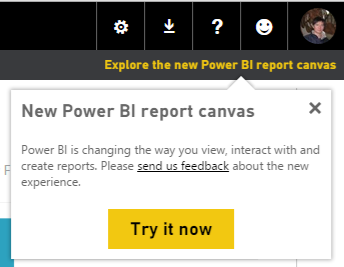

<properties 
   pageTitle="Converting your reports to the new report editor"
   description="Converting your reports to the new report editor"
   services="powerbi" 
   documentationCenter="" 
   authors="jastru" 
   manager="mblythe" 
   editor=""
   tags=""/>
 
<tags
   ms.service="powerbi"
   ms.devlang="NA"
   ms.topic="article"
   ms.tgt_pltfrm="NA"
   ms.workload="powerbi"
   ms.date="10/15/2015"
   ms.author="jastru"/>

# Converting your reports to the new report editor  

If you participated in the Power BI Preview, you may notice that our report editor has been updated. [Take a tour of the new report editor](https://support.powerbi.com/knowledgebase/articles/665494).

You have a choice...you can continue to work in the classic reporting canvas or upgrade your reports for the new canvas.  The new reporting canvas has a larger selection of visualizations, more control over formatting of titles, legends, axes, colors, backgrounds, etc... We've made some changes to the look and feel of some visuals in your report, and we think you'll be happy with them.  

You can try out the new reporting canvas without losing or overwriting your classic reports.  But once you save the report in the new reporting canvas, you can't go back.  

The new canvas is great, but your old reports and visualizations may not transition perfectly.  For example, there may be features in your classic reports that either aren't currently supported in this new report canvas or that can't be automatically migrated.

>**Note:**  
>Our plan is to eventually add all of these features back into Power BI and the new reporting canvas.  Your feedback will help us prioritize which to reintroduce first.

## Unsupported features  
Some visuals aren't supported and will show up as grey boxes in the new reporting canvas:

-   **Small Multiples** - these are the small, side-by-side charts that share an axis

-   **Play axis** - this is the bubble chart with trails showing changes over time. You'd only have this in your report if you had created it using Power View in Excel.

-   **Tiles** - these are a container that you can put other charts inside. You'd only have this in your report if you had created it using Power View in Excel.

Some other report features aren't supported in the new reporting canvas. The visualization may still display in the new canvas, but these specific features and functions will not work:

-   **KPIs** - these are the red/amber/green status indicators that measure progress against a metric. You'd only have these if you'd uploaded an Excel workbook with the KPIs in a Power Pivot model.

-   **Hierarchies** - these organize your data in levels. You'd only have these if you'd uploaded an Excel workbook with a Power Pivot model.

-   **Drill** - this feature let you navigate up and down through a visual.

-   **Images from your model** - you could show images from your model in slicers and in tables. You'd only have these if you'd uploaded an Excel workbook with images in a Power Pivot model and a Power View worksheet.

-   **Drag-and-drop creation of Combo charts** - you won't be able to create them using this method nor separate them using the shake method.

## Converting your reports  
When you open a report that doesn't contain any of the unsupported features above, we'll automatically convert your report and show you the new report experience. You'll get a notification that you're seeing the new version:

If you choose to edit the report, you'll be working in the new reporting canvas. You won't need to do anything else to migrate your report.

When you open a report that does have one of the unsupported features listed above, your report will open in the classic reporting canvas. Your visuals will look the same and the report editor will be the same as what you saw in the Power BI Preview. You can continue to work in the classic reporting canvas or try out the new canvas by selecting **Try it now** in the notification that appears in the top right:  

You'll still be able to edit the report in the new reporting canvas, but you'll have to remove any unsupported visuals (grey boxes) before you can save the report. You'll be reminded of this when you try and save:  

Remember, as long as you don't save the report, you're not going to affect the original so don't worry about losing your work! But the conversion process is one-way so do be sure that you're ready to stay in the new experience before you save your report.

## See Also  
Read more about [reports in Power BI](powerbi-service-reports.md)  
[Get started with Power BI](powerbi-service-get-started.md)  
[Power BI - Basic Concepts](powerbi-service-basic-concepts.md)  