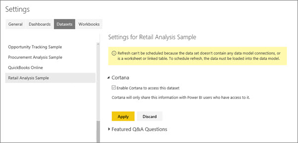

<properties
   pageTitle="Activate Cortana for Power BI"
   description="Use Cortana with Power BI to get answers from your data. Activate Cortana for each Power BI dataset and then enable Cortana to access your datasets from mobile devices."
   services="powerbi"
   documentationCenter=""
   authors="mihart"  
   manager="mblythe"
   editor=""/>

<tags
   ms.service="powerbi"
   ms.devlang="NA"
   ms.topic="article"
   ms.tgt_pltfrm="NA"
   ms.workload="powerbi"
   ms.date="11/16/2015"
   ms.author="mihart"/>

# Enable Cortana for Power BI

Ask natural language questions in Cortana and find answers from data stored in Power BI. Before Cortana can look for answers in your Power BI datasets and reports, you'll need:
- a dataset in Power BI enabled for Cortana to access
- to add the account you use with Power BI for Windows

>[AZURE.NOTE]Cortana for Power BI is currently only available in English. Cortana is not currently available on mobile devices.

## Enable Cortana to access data in Power BI
In the Power BI service, you'll need to repeat these steps for each dataset that you want Cortana to be able to access.

1. Sign-in to Power BI service.

2. In the upper right corner, select the cog icon and choose **Settings**.

    

3. Select the **Datasets** tab and choose the dataset from the list on the left.

4.  Select **Q&A and Cortana** > **Allow Cortana to access this dataset** > **Apply**.

    

    In this example, we're enabling Cortana on the Retail Analysis Sample dataset.

    >[AZURE.NOTE]   When a new dataset or custom Cortana Answer Page is added to Power BI and enabled for Cortana, it can take up to 30 minutes for results to begin appearing. Logging in and out of Windows 10, or otherwise restarting the Cortana process in Windows 10, will allow new content to appear immediately.

    >[AZURE.IMPORTANT]  If you enable a dataset for Cortana, and that dataset is part of a content pack you own, you will need to re-publish for your colleagues to also be able to use it with Cortana.

5.  Determine which Windows 10 version you are running. Check which version you have by selecting **Settings** > **System** > **About**.

    - If you have Windows 10 version 1511 (Windows 10 November Update) up until 1607, add your work or school account and Microsoft account (complete steps 6 and 7 below).

    - If you have Windows 10 version 1607 (Windows 10 July 2016 update) or later, add your work or school account (complete only step 6 below).

6.  Add your work or school account for Cortana.

    - Open **Windows Settings** > **Accounts**.

        

    -   Scroll to the bottom and select **Add a work or school account**.

        

7.  On the **Accounts** page, scroll to the bottom where you'll see **Add a Microsoft account**

    

    Sign in with the account you use with Power BI.

Cortana will use this work or school account to check Power BI for potential answers to your questions in Cortana. 

## See also
[Create Cortana *answer cards* in Power BI](powerbi-service-cortana-desktop-entity-cards.md)

[Q&A in Power BI](powerbi-service-q-and-a.md)
