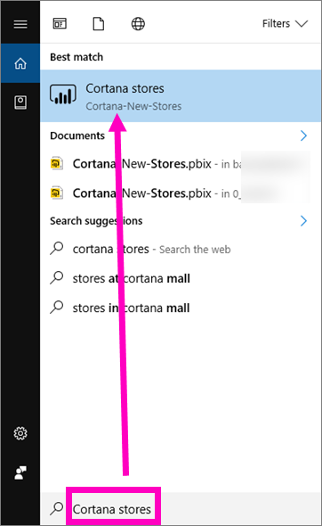
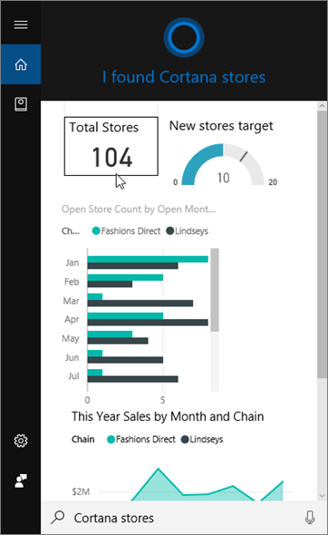
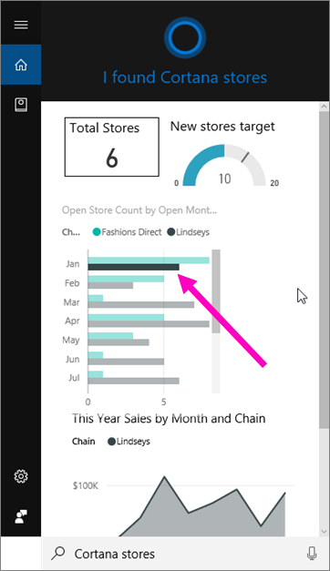
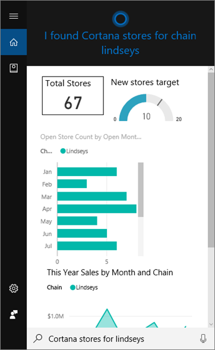
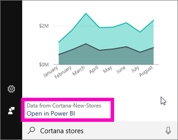

<properties
   pageTitle="Introduction to Cortana for Power BI"
   description="Use Cortana with Power BI to get answers from your data. Activate Cortana for each Power BI dataset."
   services="powerbi"
   documentationCenter=""
   authors="mihart"  
   manager="erikre"
   editor=""/>

<tags
   ms.service="powerbi"
   ms.devlang="NA"
   ms.topic="article"
   ms.tgt_pltfrm="NA"
   ms.workload="powerbi"
   ms.date="05/25/2017"
   ms.author="yaron"/>

# Introduction to Cortana for Power BI
Use Cortana across your Windows 10 devices to get instant answers to your important business questions. By integrating with Power BI, Cortana can retrieve key information directly from Power BI datasets and reports. Interact with the data visualizations in Cortana or open the answers in Power BI to explore further. All it takes is Windows 10 November 2015 version or later, Cortana, Power BI, and at least one dataset enabled for Cortana.

This series of articles will take you through the steps to

**Article 1** (this article): understand how Cortana and Power BI work together

**Article 2**: [Enable the Cortana - Power BI - Windows integration](powerbi-service-cortana-enable.md)

**Article 3**: [Create special *Cortana answer cards*](powerbi-service-cortana-desktop-entity-cards.md)

**Article 4**: [Troubleshoot issues](powerbi-service-cortana-troubleshoot.md)

## How do Cortana and Power BI work together?

When you use Cortana to ask a question, Power BI can be one of the places Cortana looks for answers. In Power BI, Cortana can find rich data-driven answers from Power BI  reports that contain a special type of report page called a *Cortana answer card*.

Answer cards are designed specifically for display by Cortana. When you ask Cortana a question using the title (or keywords) of one of these answer cards, Cortana shows you the answer -- without you having to navigate to Power BI.  The answer card shows up right there in your Cortana screen.

When you ask a question in Cortana, Power BI answers can range from simple numerical values (“revenue for the last quarter”), charts (“number of opportunities by team”), maps (“average customer spending in California by city”), or even complete reports from Power BI all provided directly from Cortana. Potential answers are determined by Cortana on the fly directly from the Cortana *answer cards* already created in Power BI that help answer a question. To further explore an answer, simply open a result in Power BI.

> [AZURE.NOTE]Before Cortana can look for answers in your Power BI datasets and reports, you'll need to [enable this feature using the Power BI service and set up Windows to communicate with Power BI](powerbi-service-Cortana-enable.md).  

##  Use Cortana to get answers from Power BI

1.  Select the Cortana icon in the taskbar and click in the Search box.

2.  Type your question into the Cortana search bar. Cortana displays the available results. If there is a Power BI answer card that matches the question, it shows up under **Best Match** or **Power BI**.  And in this example the .pbix file (and backup) that I used to create the answer cards also display under **Documents**.

    

3.  Otherwise, select the **Cortana stores** *answer card* to display it in the Cortana window.

       

    Remember, an *answer card* is a special type of Power BI report page that was created by a dataset owner.  For more information, see [Create a Cortana answer card](powerbi-service-cortana-desktop-entity-cards.md).

##  Interact with the answer card without leaving Cortana

But that's not all. Interact with the visualizations on the answer card as you would in Power BI.

-   For example, select an element on one visualization to cross-filter and highlight the other visualizations on the answer card.

    

-   Or, use natural language to filter the results instead.  For example, ask **Cortana stores for Lindseys** and see the card filtered to only show data for the Lindseys chain.

    

-    Continue exploring. Scroll to the bottom of the Cortana window and select **Open in Power BI**.

     

     The entire report opens in Power BI service.

##  Create a Cortana card

Dataset owners can [create the special Cortana report *answer cards* in Power BI service or Power BI Desktop](powerbi-service-cortana-desktop-entity-cards.md). Answer cards should be designed to answer the most-common questions.   

##  Considerations and limitations

- Cortana will not have access to any Cortana cards that have not been [enabled for Power BI](powerbi-service-Cortana-enable.md).

- Still can't get Cortana to work with Power BI?  Try the [Cortana troubleshooter](powerbi-service-cortana-troubleshoot.md).

- Cortana for Power BI is currently only available in English.

- Cortana is not currently available on mobile devices.

More questions? [Try the Power BI Community](http://community.powerbi.com/)
