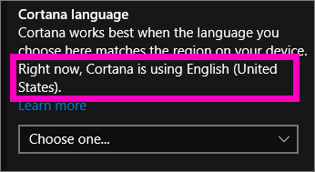
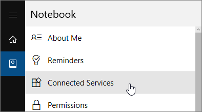
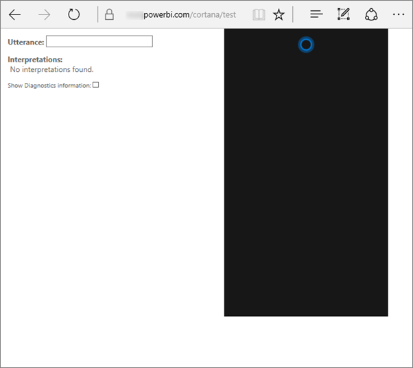
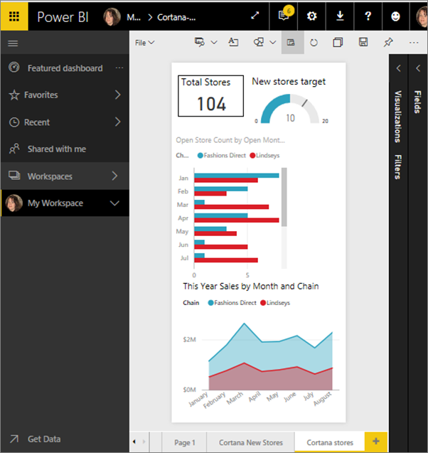
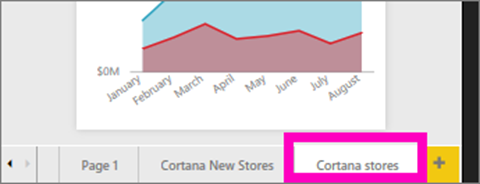
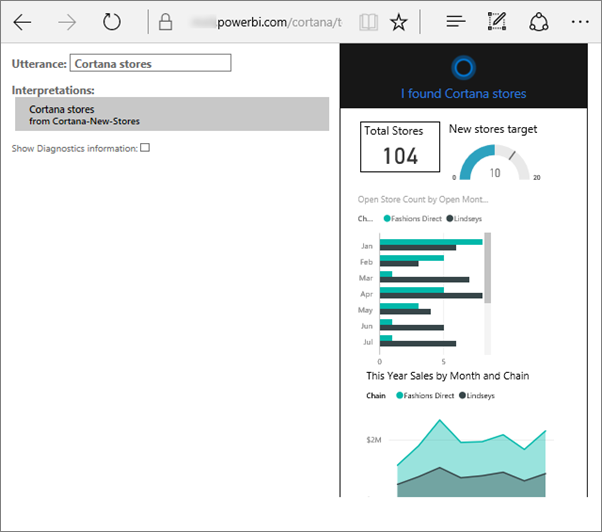

<properties
   pageTitle="Troubleshoot Cortana for Power BI"
   description="If you're having trouble using Cortana with Power BI, try these suggestions. "
   services="powerbi"
   documentationCenter=""
   authors="mihart"  
   manager="erikre"
   editor=""/>

<tags
   ms.service="powerbi"
   ms.devlang="NA"
   ms.topic="article"
   ms.tgt_pltfrm="NA"
   ms.workload="powerbi"
   ms.date="03/15/2017"
   ms.author="mihart"/>

# Troubleshoot Cortana for Power BI

This article is part of a series. If you haven't already, we recommend reading the following three articles.

**Article 1**: [Understand how Cortana and Power BI work together](powerbi-service-cortana-intro.md)

**Article 2**: [Enable the Cortana - Power BI - Windows integration](powerbi-service-cortana-enable.md)

**Article 3**: [Create special *Cortana answer cards*](powerbi-service-cortana-desktop-entity-cards.md)

If you're still having problems getting Cortana to integrate with Power BI, you've come to the right place. Follow the steps below to diagnose and fix the problem.

## Why doesn't Cortana find answers from my Power BI datasets?

### Do you have all the requirements covered?

1.  Do you have a Power BI account?  If not, [sign up, it's free](powerbi-service-self-service-signup-for-power-bi.md).

2. Is Cortana working?  Do you see the Cortana icon in your taskbar?

    

    When you select it, does Cortana open with an **Ask me anything** field?

3.  Are you using a mobile device?  Unfortunately, we don't yet support Power BI and Cortana integration on mobile devices.

4.  Do you have any reports with Cortana **answer cards**? Answer cards are the only way Cortana can find answers in your Power BI data.  Learn how to create an answer card by reading [Create Cortana answer cards in Power BI service and Power BI Desktop](powerbi-service-cortana-desktop-entity-cards.md).

5.  Is Cortana configured for English?  The current Cortana-Power BI integration only supports English. Open Cortana and select the cog icon to display Settings. Scroll down to **Cortana language** and ensure it's set to one of the English options.

    

6.  Are your running Windows version 1511 or later?  Find out by opening Windows Settings and selecting **System > About**. If not, update your version of Windows.

7.  Are your Windows and Power BI accounts connected? This can be confusing. Follow the instructions in [Activate Cortana for Power BI](powerbi-service-cortana-enable#Add your Power BI credentials to Windows).

8.  Do you have access to any datasets enabled for Cortana? Maybe a colleague has shared a dataset that she has already enabled for Cortana. But, if not, [learn how to enable datasets for Cortana yourself](powerbi-service-cortana-enable.md). It's quick and easy.

9.  Do you have more than 100 datasets and reports enabled for Cortana?  Cortana only searches up to 100 total.  To ensure that your dataset or report is included, move or copy it to your **My Workspace** because Cortana searches there first.

10. You might just need to give it some time. The first time you type a query the model might be *cold*. Wait a few seconds so the model can be loaded into memory, and then try again. Also, when a new dataset or custom answer card is added to Power BI and enabled for Cortana it can take up to 30 minutes for results to begin appearing in Cortana. Logging in and out of Windows 10, or otherwise restarting the Cortana process in Windows 10, will allow new content to appear immediately. Or disconnect from Office 365 and reconnect.

    

### Try the Cortana troubleshooting tool to narrow down the issue
Now is a good time to run the Cortana troubleshooting tool. Before running the troubleshooting tool, make sure to set the **Page level** filters on your Cortana answer cards to **Require single selection**. For help doing this see [Create Cortana answer cards](powerbi-service-cortana-desktop-entity-cards.md).

1.  Open the troubleshooting tool by adding "/cortana/test" to the end of your Power BI service URL. Your URL should look similar to this:

    app.powerbi.com/cortana/test

    

2.  In the **Utterance** field, type the name of a Cortana answer card ***exactly as it appears in the Power BI tab***.

    

     

    

3.  Sometimes, the first time you type something into the **Utterance** field, nothing happens. Think of it as priming the system; you're letting the troubleshooting tool know that it's time to turn on. Cut and paste or retype into the **Utterance** field again. In this example, the name of our answer card is **Cortana stores**. Pasting or typing "Cortana stores" into the tool produces a single result that displays in the **Interpretations** field. Click to see the answer card displayed in the Cortana window.

    

    Because we got a result, we now know that Cortana **is** enabled in Power BI. That narrows down the problem to something on the Windows side or the Cortana language setting or having more than 100 datasets enabled for Cortana.

####  Troubleshooting tool known issues

- If the tool doesn’t always fetch the results the first time. Instead, paste the query into the Utterance text box.

- The query must be 2 or more words, by design.  If your query is too short, add the word "show".

- Some query strings with prepositions might not work (e.g. sales by item). Try different query terms that don't use prepositions and are meaningful/unique.

More questions? [Try the Power BI Community](http://community.powerbi.com/)
