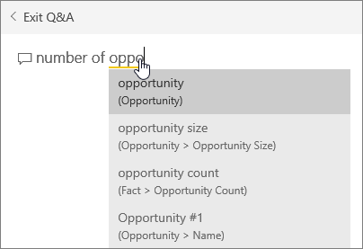
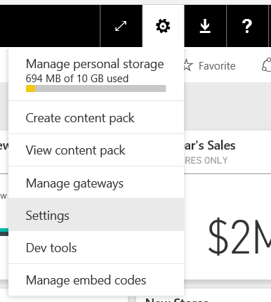
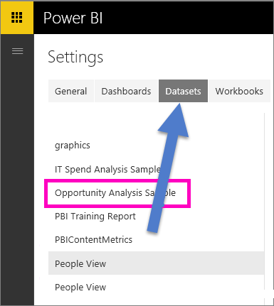

<properties
   pageTitle="Create a big number tile from Q&A"
   description="Create a big number tile for a Power BI dashboard by asking a question"
   services="powerbi"
   documentationCenter=""
   authors="mihart"
   manager="erikre"
   backup=""
   editor=""
   tags=""
   qualityFocus="no"
   qualityDate=""/>

<tags
   ms.service="powerbi"
   ms.devlang="NA"
   ms.topic="article"
   ms.tgt_pltfrm="NA"
   ms.workload="powerbi"
   ms.date="05/02/2017"
   ms.author="mihart"/>

# Create a big number tile from Q&A  

Sometimes a single number is the most important thing you want to track in your Power BI dashboard, such as total sales, market share year over year, or total opportunities. You can [create a big number tile in a Power BI report](powerbi-service-create-a-big-number-tile-from-a-power-bi-report.md) or by asking a question in the Q&A box. This article explains how to create one in Q&A.

The question box is the easiest way to make a number tile like this.

1.    Create a [dashboard](powerbi-service-dashboards.md) and [get data](powerbi-service-get-data.md). This example uses the [Opportunity Analysis sample](powerbi-sample-opportunity-analysis-take-a-tour.md).

2.    At the top of your dashboard, start typing what you want to know about your data in the question box. This example uses the Opportunity Analysis sample.

      

3.   For example, type "number of opportunities" in the question box.

     

     The question box suggests, restates as **Showing opportunity count**, and displays the total number.  

4.  Select the pin icon  in the upper-right corner to add the number tile to the dashboard. 

    

5.  Pin the tile to an existing dashboard or to a new dashboard. 

    -   Existing dashboard: select the name of the dashboard from the dropdown. Your choices will be limited to only those dashboards withing the current workspace.

    -   New dashboard: type the name of the new dashboard and it will be added to your current workspace.

6.  Select **Pin**.

    A Success message (near the top right corner) lets you know the visualization was added, as a tile, to your dashboard.  

    

7.  Select **Go to dashboard** to see the new tile. There, you can [rename, resize, add a hyperlink, and reposition the tile, and more](powerbi-service-edit-a-tile-in-a-dashboard.md) on your dashboard. 

    
    

## Considerations and troubleshooting
If you do not see a question box at all, it may be that the dataset owner has not enabled Q&A for this dataset.  

##  Enable Q&A

1.  In the upper-right corner of Power BI, select the cog icon  and choose **Settings**.

    

2.  Select **datasets** and choose the dataset to enable for Q&A.

    

3. Expand **Q&A and Cortana**, select the checkbox for **Turn on Q&A for this dataset** and choose **Apply**.

    

## Next steps  
[Dashboard tiles in Power BI](powerbi-service-dashboard-tiles.md)  
[Dashboards in Power BI](powerbi-service-dashboards.md)  
More questions? [Try the Power BI Community](http://community.powerbi.com/)
