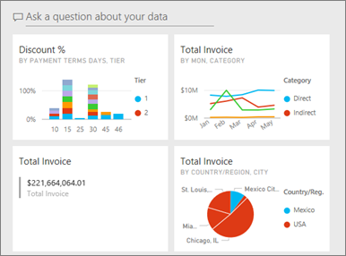

<properties
   pageTitle="Create a copy of a Power BI dashboard"
   description="Duplicate a Power BI dashboard "
   services="powerbi"
   documentationCenter=""
   authors="mihart"
   manager="erikre"
   backup=""
   editor=""
   tags=""
   featuredVideoId=""
   qualityFocus=""
   qualityDate=""/>

<tags
   ms.service="powerbi"
   ms.devlang="NA"
   ms.topic="article"
   ms.tgt_pltfrm="NA"
   ms.workload="powerbi"
   ms.date="04/18/2017"
   ms.author="mihart"/>

# Create a copy of a Power BI dashboard

There are many different reasons to make a copy of your dashboard.  Maybe you want to make changes and test its performance against the original; or create slightly different versions to distribute by colleague, region, or team. Perhaps a colleague admires your dashboard design and wants to use it for reporting out to her managers. Another reason would be if you have a new database with the same data structure and data types and want to reuse the dashboard you've already created -- this too can be done but would require some work in Power BI Desktop.

1.    Open the dashboard.

2.    From the top-right corner, select the ellipses (...) and choose **Duplicate dashboard**.

      

3.   Give the dashboard a name and select **Duplicate**. 

     

4.    The new dashboard is saved in the same workspace as the original. 

      

##    Next steps

-    [Edit, resize and move tiles](powerbi-service-edit-a-tile-in-a-dashboard.md) 
- [Tips for designing a great dashboard](powerbi-service-tips-for-designing-a-great-dashboard.md) 
- [Set data alerts](powerbi-service-set-data-alerts.md)

More questions? [Try the Power BI Community](http://community.powerbi.com/)

