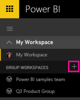
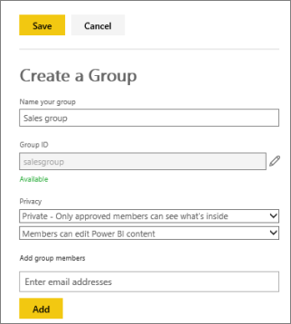

<properties 
   pageTitle="Create a group in Power BI "
   description="Create a group in Power BI"
   services="powerbi" 
   documentationCenter="" 
   authors="maggiesMSFT" 
   manager="mblythe" 
   editor=""
   tags=""
   qualityFocus="no"
   qualityDate=""/>
 
<tags
   ms.service="powerbi"
   ms.devlang="NA"
   ms.topic="article"
   ms.tgt_pltfrm="NA"
   ms.workload="powerbi"
   ms.date="02/23/2016"
   ms.author="maggies"/>

# Create a group in Power BI  

Groups in Power BI bring together people and information, and connect with apps across Office 365 to foster communication and collaboration. You can create a group in Power BI, or in Office 365 -- it will have the same characteristics either way. 

>**NOTE:**  Groups are only available with [Power BI Pro](powerbi-power-bi-pro-content-what-is-it.md).

As the creator of the group, you are automatically an admin. As admin, you can add and delete members, and make a member an admin. All admins can create, update, and delete the dashboards, reports, and other content of the group. 

You can invite peers from your organization to your Power BI group, even if they aren't in Azure Active Directory.  

You can decide if all members of the group can modify the group's content, or if only the admins can modify the content, and members can only read it.

1.  In Power BI, select the down arrow next to My Workspace, then select the plus sign (+) next to **Group Workspaces**.   
    

2.  In the **Create a Group** pane on the right, fill in a name.  
    

    Power BI suggests a Group ID and lets you know if it's available. If it's not, select the pencil to the right of the **Group ID** box to modify it.  

    >**Note:**  The group ID will be the group's email address:  
    >*yourgroupID*@service.microsoft.com.  
    >If you forget the group ID, you can see it by going to the group's Office 365 Outlook account.

3.  Select a privacy setting:

    **Private:** Only group members can see the group’s contents. 

    **Public:** People in your organization can see the group’s contents even if they aren’t explicitly added as members of the group. 

4.  To limit members to only viewing the group's content, under **Privacy**, select **Members can only view Power BI content**.

     

5.  Add members by typing in the **Add group member** box, or copying and pasting multiple email addresses from Outlook. Select **Add**. 

    >**NOTES**:  
    >
    > - Currently you can't add team or security group distribution lists to groups. 
    >  
    > - If some potential members don't already have a Power BI account and aren't in Azure Active Directory, Power BI sends them an email invitation to join Power BI. When they accept, you see them as members of the group. 

5.  Select **Admin** or **Member** for each group member.
	Admins can modify content in the group. By default, members can modify the content, unless you changed that in the previous step.

7.  Select **Save**.

Now you have a group where you can store files, and everyone in the group can work on, or at least view, them.

More about [groups in Power BI](powerbi-service-groups.md).