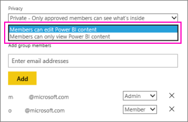

<properties 
   pageTitle="Create a group to collaborate in Power BI"
   description="Read about creating groups in Power BI where you and your team can collaborate on team dashboards and connect with apps across Office 365."
   services="powerbi" 
   documentationCenter="" 
   authors="ajayan" 
   manager="erikre" 
   backup="maggiesMSFT"
   editor=""
   tags=""
   qualityFocus="complete"
   qualityDate="04/27/2016"/>
 
<tags
   ms.service="powerbi"
   ms.devlang="NA"
   ms.topic="article"
   ms.tgt_pltfrm="NA"
   ms.workload="powerbi"
   ms.date="02/02/2017"
   ms.author="ajayan"/>

# Create a group to collaborate in Power BI

Groups in Power BI are workspaces where you and your colleagues can collaborate on your Power BI dashboards and reports. When you're a member of a group, you can create a dashboard in the group workspace. Everyone in the group can view, interact with, and edit the dashboard and its reports. They have the same permission you have. 

Power BI groups are built on [groups in Office 365](https://support.office.com/article/Create-a-group-in-Office-365-7124dc4c-1de9-40d4-b096-e8add19209e9). You can create a group in Power BI, or in Office 365 -- it has the same characteristics either way. 

As the creator of a group, you are automatically an admin. As admin, you can add and delete members, and make other members admins. All admins can create, update, and delete the dashboards, reports, and other content of the group. You can invite colleagues from your organization to your Power BI group, even if they aren't in Azure Active Directory.  

> **Notes:**  
> 
> -   Groups are only available with [Power BI Pro](powerbi-power-bi-pro-content-what-is-it.md).
> -  You can't publish reports to the web from a group.

## Create a group and add members

1.  In Power BI, select the down arrow next to My Workspace, then select the plus sign (+) next to **Group Workspaces**.   
    

2.  In the **Create a Group** pane on the right, give your group a name.  
    

    Power BI suggests a Group ID and lets you know if it's available. If it's not, select the pencil to the right of the **Group ID** box to modify it.  

    > [AZURE.NOTE]  The group ID will be the group's email address:  
    >*yourgroupID*@service.microsoft.com.  
    >If you forget the group ID, you can see it by going to the group's Office 365 Outlook account.

3.  Select a privacy setting:

    **Private:** Only group members can see the group’s contents. People in your organization can request membership in your group. You or another admin can accept or reject their request.

    **Public:** People in your organization can make themselves members of the group, without needing permission from an admin. As soon as they're members, they have the same permissions as other group members.

    > [AZURE.NOTE]  You can't change the Public/Private setting after you've created the group.

4.  Decide whether all members of the group can modify the group's content, or if only the admins can modify the content, and members can only read it. Select either:
     
    - **Members can edit Power BI content** or
 
    - **Members can only view Power BI content**

    

    You can change the edit/view-only setting later, after you've created the group. 

5.  Add members by typing in the **Add group member** box, or copying and pasting multiple email addresses from Outlook. 

    > **Notes:**
    > 
    > - Currently you can't add team or security group distribution lists to groups. 
    > - If some potential members don't already have a Power BI account and aren't in Azure Active Directory, Power BI sends them an email invitation to join Power BI. When they accept, you see them as members of the group. 

6.  Select **Add**. 

5.  Select **Admin** or **Member** for each group member.

    All admins can modify content in the group. By default, members can modify the content, unless you changed that in the previous step.

7.  Select **Save**.

Now you have a group where you can store files, and everyone in the group can work on, or at least view, them.

## More about groups in Power BI  

Groups in Power BI are a place for you and your colleagues to collaborate, communicate, and connect with your data across Office 365. 

Groups and [organizational content packs](powerbi-service-organizational-content-packs-introduction.md) complement each other. If you just want to share a finished dashboard with colleagues, don't add those colleagues to the group. Instead, [share the dashboard](powerbi-service-share-unshare-dashboard.md) with them, or [create an organizational content pack](powerbi-service-organizational-content-packs-introduction.md) and publish it. See [How should I collaborate on and share dashboards and reports?](powerbi-service-how-should-i-share-my-dashboard.md) for more about other ways to share.  

Collaboration doesn’t end with Power BI. Office 365 offers other group services, like sharing files on OneDrive for Business, conversations in Exchange, shared calendar and tasks, and so on. [Collaborate in Office 365 with your Power BI group](powerbi-service-collaborate-with-your-power-bi-group.md).

## See also
- [Connect to files on your group's OneDrive for Business](powerbi-service-connect-to-files-on-your-groups-onedrive-for-business.md)  
- [Collaborate in Office 365 with your Power BI group](powerbi-service-collaborate-with-your-power-bi-group.md)  
- [Manage your group](powerbi-service-manage-your-group-in-power-bi-and-office-365.md) 
- [How should I collaborate on and share dashboards and reports?](powerbi-service-how-should-i-share-my-dashboard.md) 
- More questions? [Try the Power BI Community](http://community.powerbi.com/)
 