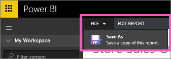

<properties pageTitle="Create a new Power BI report" description="Create a new Power BI report" services="powerbi" documentationCenter="" authors="v-anpasi" manager="mblythe" editor=""/>
<tags ms.service="powerbi" ms.devlang="NA" ms.topic="article" ms.tgt_pltfrm="NA" ms.workload="powerbi" ms.date="06/26/2015" ms.author="v-anpasi"/>
#Create a new Power BI report

[← All about reports](https://support.powerbi.com/knowledgebase/topics/65157-all-about-reports)

There are different ways to create a new report:

-   From a dataset
-   From an existing report

##Create a new report from a dataset

This method creates a new report from scratch.

1.  Click a dataset to open it or right-click and select Explore.

     

2.  Explore your data and [add visualizations](http://support.powerbi.com/knowledgebase/articles/434821-visualizations-in-power-bi-reports).
3.  [Save your report](http://support.powerbi.com/knowledgebase/articles/444112-save-a-report).

##Create a new report from an existing report

1.  [Open a report](http://support.powerbi.com/knowledgebase/articles/439920-open-a-report-in-reading-view).
    
2.  From the **File** menu, select **Save As**.

    
        
3.  Type a name for the new report and click **Save**.

    

    A Success message lets you know that the new report was saved to Power BI.

       
    
4.  Back in your Power BI navigation pane, click the new report to open it.

    
        
5.  Have fun updating and editing your new report.
    

##Next Steps:

[Create new visualizations](https://powerbi.uservoice.com/knowledgebase/articles/441777-part-i-add-visualizations-to-a-power-bi-report)  
[Delete visualizations](http://support.powerbi.com/knowledgebase/articles/465144-delete-a-visualization) you don't need

##See Also:

Read more about [reports in Power BI](http://support.powerbi.com/knowledgebase/articles/425684-reports-in-power-bi)  
[Get started with Power BI](http://support.powerbi.com/knowledgebase/articles/430814-get-started-with-power-bi)  
[Power BI - Basic Concepts](http://support.powerbi.com/knowledgebase/articles/487029-power-bi-preview-basic-concepts)  

