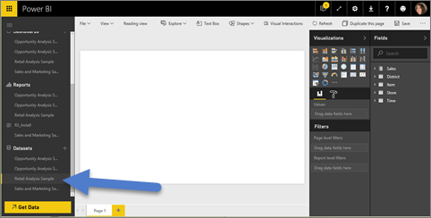
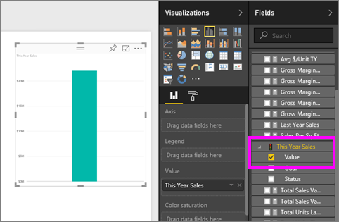
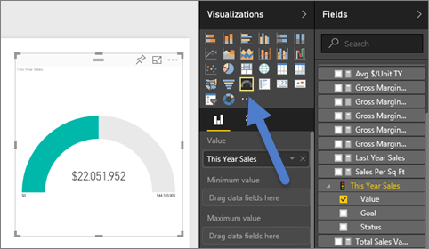
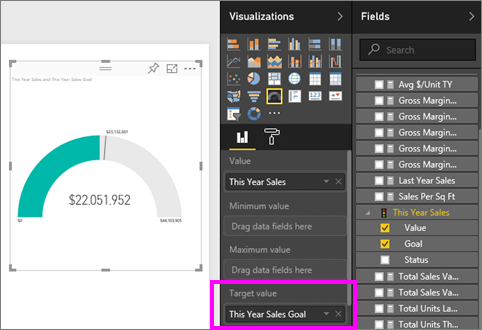

<properties
   pageTitle="Create a new Power BI report"
   description="Create a new Power BI report"
   services="powerbi"
   documentationCenter=""
   authors="mihart"
   manager="mblythe"
   backup=""
   editor=""
   tags=""
   qualityFocus="monitoring"
   qualityDate=""/>

<tags
   ms.service="powerbi"
   ms.devlang="NA"
   ms.topic="article"
   ms.tgt_pltfrm="NA"
   ms.workload="powerbi"
   ms.date="01/20/2017"
   ms.author="mihart"/>
# Create a new Power BI report

There are many different ways to create a new report. This topic shows you two of them.

-   From a dataset

-   From an existing report

## Create a new report from a dataset

This method creates a new report from scratch. To follow along, [download the Retail Analysis sample](powerbi-sample-downloads.md).

1.  Start in Power BI service and select a dataset to open it. Opening a dataset actually opens the report editor.  You'll see a blank canvas and the report editing tools.

    

2.  Explore your data and [add visuals](powerbi-service-visualizations-for-reports.md). For this report, let's add a Gauge visual that tracks this year's sales.

   -  In the **Fields** pane, select **Sales** > **This Year Sales** > **Value**.

        

   -  Convert the visual to a Gauge by selecting the Gauge template  from the **VIsualizations** pane.

        

   -  Drag **Sales** > **This Year Sales** > **Goal** to the **Target value** well.

        

3.  Optionally, continue adding visualizations, and then [save your report](powerbi-service-save-a-report.md).

    

## Create a new report from an existing report
Maybe you have a report that already connects to your dataset and has some visuals that you'd like to re-use or modify.  Why not simply copy that report as a basis for a new report?  To do that:

1.  [Open a report](powerbi-service-open-a-report-in-reading-view.md).

2.  From the **File** menu, select **Save As**.

    

3.  Type a name for the new report and select **Save**.

    

    A Success message lets you know that the new report was saved to Power BI.

    

4.  Back in your Power BI navigation pane, select the new report to open it. Optionally, delete visuals you don't want to keep, modify other visuals, and add new ones.

    

5.  Have fun updating and editing your new report.

## Next Steps:

[Create new visualizations](powerbi-service-add-visualizations-to-a-report-ii.md)

[Delete visualizations](powerbi-service-delete-a-visualization.md) you don't need

## See also

Read more about [reports in Power BI](powerbi-service-reports.md)

[Get started with Power BI](powerbi-service-get-started.md)

[Power BI - Basic Concepts](powerbi-service-basic-concepts.md)

More questions? [Try the Power BI Community](http://community.powerbi.com/)
