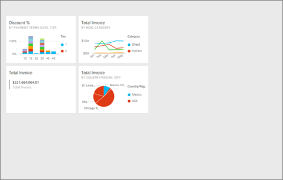
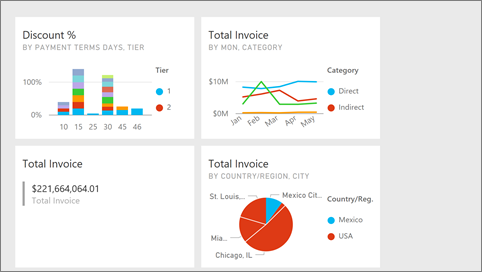
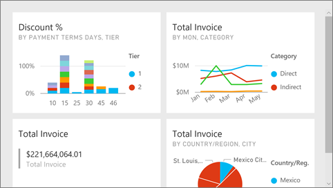

<properties
   pageTitle="Display dashboards, dashboard tiles, and report pagess in Full Screen mode"
   description="Display dashboards, dashboard tiles, and report pages in Full Screen Mode, aka *TV mode*."
   services="powerbi"
   documentationCenter=""
   authors="mihart"
   manager="erikre"
   backup=""
   editor=""
   tags=""
   featuredVideoId=""
   qualityFocus=""
   qualityDate=""/>

<tags
   ms.service="powerbi"
   ms.devlang="NA"
   ms.topic="article"
   ms.tgt_pltfrm="NA"
   ms.workload="powerbi"
   ms.date="08/09/2017"
   ms.author="mihart"/>

# Full Screen mode in Power BI

## What is Full Screen mode?

Display your content (dashboards, report pages, tiles, and visualizations) without the distraction of menus and navigation bars.  You get an unadulterated, full view of your content at a glance, all the time. This is sometimes referred to as TV Mode. The functionality available in Full Screen mode varies by content.  

Some uses for Full Screen mode are:

- presenting your dashboard, tile, visual, or report at a meeting or conference
- displaying in an office on a dedicated large screen or projector
- viewing on a small screen
- reviewing in locked mode -- you can touch the screen or mouse over tiles without opening the underlying report or dashboard

>**NOTE**:
>Full Screen mode is different from [Focus (Pop out) mode](powerbi-service-display-dash-in-focus-mode.md).

Watch Amanda open and navigate her dashboard in Full Screen mode and then apply some URL parameters to control the default display. Then follow the step-by-step instructions below the video to try it out yourself.

<iframe width="560" height="315" src="https://www.youtube.com/embed/c31gZkyvC54" frameborder="0" allowfullscreen></iframe>

## Dashboards and report pages in Full Screen mode  

1. From the Power BI menu bar above your dashboard or report, select the **Full Screen** icon  . Your dashboard canvas or report page fills the entire screen. The example below is a dashboard.

      

2. In Full Screen mode, you have several menu options.  To reveal the menu, just move your mouse or cursor. 

     Menu for dashboards    
         

     Menu for report pages    
        

        
    Use the **Back** button  to navigate to the previous page in your browser. If the previous page was a Power BI page, it too will display in Full Screen mode.  Full Screen mode will persist until you exit out.

        
    Use this button to print your dashboard or report page in Full Screen mode. 

        
    Use the **Fit to screen** button to display your dashboard at the largest size possible without resorting to scrollbars.     

    

           
    Sometimes you don't care about scrollbars, but want the dashboard to fill the entire width of the available space. Select the **Fit to width** button.    

    

           
    In Full Screen reports, use these arrows to move between the pages in the report.    

3. To exit Full Screen mode, select the **Exit Full Screen** icon.

      

## Visualizations and dashboard tiles in Full Screen mode

1. To display dashboard tiles and report visualizations in Full Screen mode, you must start with that tile or visualization already in [Focus mode](powerbi-service-display-dash-in-focus-mode.md). 

    

2. Then, select the Full screen icon   for that tile or  visual. The tile or visual will display full screen without menus or navigation bars.

    

## Next steps  
[Dashboards in Power BI](powerbi-service-dashboards.md)  
[Focus mode for dashboards and dashboard tiles](powerbi-service-display-dash-in-focus-mode.md)    

More questions? [Try the Power BI Community](http://community.powerbi.com/)
