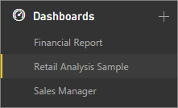

<properties 
   pageTitle="Dashboards in Power BI"
   description="Dashboards in Power BI"
   services="powerbi" 
   documentationCenter="" 
   authors="v-anpasi" 
   manager="mblythe" 
   editor=""
   tags=""/>
 
<tags
   ms.service="powerbi"
   ms.devlang="NA"
   ms.topic="article"
   ms.tgt_pltfrm="NA"
   ms.workload="powerbi"
   ms.date="09/28/2015"
   ms.author="v-anpasi"/>
# Dashboards in Power BI

[← Getting started](https://support.powerbi.com/knowledgebase/topics/63037-getting-started)

Dashboards, reports, and datasets are at the heart of Power BI. Create personalized ***dashboards*** to monitor your most important data, at a glance.  A dashboard combines on-premises and cloud-born data in a single pane of glass, providing a consolidated view across the organization regardless of where the data lives. Each metric, or insight, is displayed on the dashboard as a ***tile***. 

Need help understanding the building blocks that make up Power BI?  See [Power BI - Basic Concepts](http://support.powerbi.com/knowledgebase/articles/487029-power-bi-preview-basic-concepts).

There are samples available for you to use with Power BI. Below shows the Retail Analysis Sample. For detailed information about the sample, see [Sample datasets](http://support.powerbi.com/knowledgebase/articles/471112-sample-datasets).

Each tile is a snapshot of information taken from an underlying dataset.  Learn how to [add tiles to a dashboard](http://support.powerbi.com/knowledgebase/articles/425669-tiles-in-power-bi). The tiles on a dashboard can be [resized, moved, deleted, linked, and renamed](http://support.powerbi.com/knowledgebase/articles/424878-edit-a-tile-resize-move-rename-delete). 

### Create a dashboard

Learn how to [create a new dashboard](http://support.powerbi.com/knowledgebase/articles/475163-create-a-power-bi-dashboard)and add tiles.

### Share a dashboard

Learn how to [share a read-only dashboard with your colleagues](http://support.powerbi.com/knowledgebase/articles/431008-share-a-dashboard).

Learn how to [co-own a dashboard among colleagues](https://support.powerbi.com/knowledgebase/articles/651040).

### Rename a dashboard

Need a more descriptive dashboard name?  [Rename it](http://support.powerbi.com/knowledgebase/articles/475172-rename-a-dashboard).

### Delete a dashboard

Don't need the dashboard any more?  [Delete it](http://support.powerbi.com/knowledgebase/articles/475173-delete-a-dashboard).

### Add tiles to a dashboard

[Get data](http://support.powerbi.com/knowledgebase/articles/434354-get-data)and [add tiles](http://support.powerbi.com/knowledgebase/articles/425669-tiles-in-power-bi)to your dashboard [from a report](https://support.powerbi.com/knowledgebase/articles/430323) and [from Q&A](https://support.powerbi.com/knowledgebase/articles/424874).

### Dashboard size

Dashboards can be wider and longer than the browser window. If so, they have scroll bars. Because you want to show everything important at a glance, we recommend making the dashboard fit the browser window. For more tips, see [Tips for designing a great dashboard](http://support.powerbi.com/knowledgebase/articles/433616-tips-for-designing-a-great-dashboard).

### Working with Dashboards in the navigation pane

Power BI can have more than one dashboard -- as you add more dashboards, their titles are added to the list under the **Dashboards** heading.  The dashboard you're currently viewing is highlighted. Only one dashboard can be open at a time.

## See Also:

[Get Started with Power BI](http://support.powerbi.com/knowledgebase/articles/430814-get-started-with-power-bi)

[Power BI - Basic Concepts](http://support.powerbi.com/knowledgebase/articles/487029-power-bi-preview-basic-concepts)

