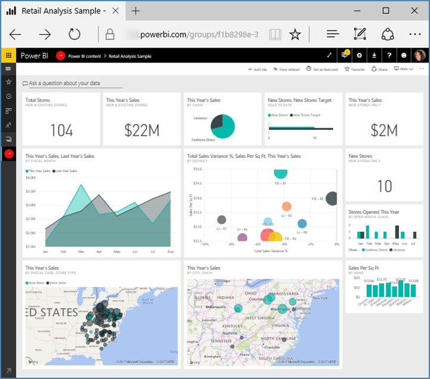

<properties
   pageTitle="what is a Power BI dashboard?"
   description="Dashboards are a key feature of Power BI service."
   services="powerbi"
   documentationCenter=""
   authors="mihart"
   manager="erikre"
   backup=""
   editor=""
   tags=""
   qualityFocus="monitoring"
   qualityDate="04/05/2017"/>

<tags
   ms.service="powerbi"
   ms.devlang="NA"
   ms.topic="article"
   ms.tgt_pltfrm="NA"
   ms.workload="powerbi"
   ms.date="04/04/2017"
   ms.author="mihart"/>

# Dashboards in Power BI service

##  What is a dashboard?

A Power BI ***dashboard*** is a single page, often called a canvas, that uses visualizations to tell a story. Because it is limited to one page, a well-designed dashboard contains only the most-important elements of that story.

The visualizations on a dashboard come from reports and datasets. In fact, one way to think of a dashboard is as an entryway into the underlying reports and datasets. Selecting a visualization takes you to the report or dataset that was used to create it.

Dashboards are a wonderful way to monitor your business, to look for answers, and to see all of your most-important metrics at a glance. The visualizations on a dashboard may come from one underlying dataset or many, from on-premises or the cloud, be static or regularly-refreshed or streaming.

Finally, a dashboard isn't just a pretty picture. A dashboard is highly interactive and highly customizable.

##  Dashboard ***creators*** and dashboard ***consumers***  
Depending on your role, you may be someone who creates dashboards for your own use or to share with colleagues. You want to learn how to create and share dashboards.

Or, you may be someone who receives dashboards from others and you want to learn how to understand and interact with the dashboard.

Reports are often confused with dashboards since they too are canvases filled with visualizations. But there are some major differences: reports can be more than one page, a report is based on data from a single dataset, and the report canvas includes many more options and panes for creating, editing, and filtering visualizations.

Reports look similar to dashboards except that a report can have many pages worth of visualizations.  and But behind the dashboard you'll find reports and datasetsIf you want to dig deeper, clicking a visualization takes you to the underlying report that was used to create the visual.  

is something you create or something a colleague creates and shares with you. It is a single canvas that contains zero or more tiles and widgets. Each tile displays a single visualization that was created from a dataset and pinned to the dashboard. There are many ways to add tiles to your dashboard; too many to be covered in this overview topic. To learn more, see Dashboard tiles in Power BI. When you open Power BI service, you'll see a dashboard displayed.

Dashboards are something that differentiates Power BI service from Power BI Desktop.

***Dashboards*** monitor your most important data, at a glance.  A dashboard combines on-premises and cloud-born data, providing a consolidated view regardless of where the data lives. Each visualization, or insight, is displayed on the dashboard as a ***tile***.  Each tile on the dashboard is a snapshot of information taken from one or more underlying datasets. The tiles update as the underlying data changes. Learn how to [add tiles to a dashboard](powerbi-service-dashboard-tiles.md).

The image below shows the dashboard for the Retail Analysis sample. This is just one of the industry samples that we've pre-loaded into Power BI service for you to use for testing and learning. For more information about the samples, including how to open them, see [Sample datasets](powerbi-sample-datasets.md).

Need help understanding the building blocks that make up Power BI service?  See [Power BI - Basic Concepts](powerbi-service-basic-concepts.md).

##  Working and interacting with dashboards

There are so many ways to interact with a dashboard, that one article couldn't possibly cover them all.  Please use the navigation to the left of this article to start exploring. If the table of contents item for **Dashboards** isn't already expanded, simply select **Dashboards** and then select **More** to display the full list of dashboard articles.

It's a long list.  Here are a few suggestions if you're just getting started.

**Create a dashboard**: Learn how to [create a new dashboard](powerbi-service-create-a-dashboard.md) and add tiles.

**Add tiles to a dashboard**: [Get data](powerbi-service-get-data.md) and [add tiles](powerbi-service-dashboard-tiles.md) and [images, videos, web code, and text boxes](powerbi-service-add-a-widget-to-a-dashboard.md) to your dashboard from reports, Q&A, SSRS, Excel, and more.

**Share a dashboard**: Learn how to [share a read-only version of your dashboard with your colleagues](powerbi-service-share-unshare-dashboard.md) and how to [co-own a dashboard among colleagues](powerbi-service-organizational-content-packs-introduction.md).

**Dashboard size**: Display your dashboard without controls and menus using [full screen mode](powerbi-service-dash-and-reports-fullscreen.md).

Dashboards can be wider and longer than the browser window. If so, they have scroll bars. Because you want to show everything important at a glance, we recommend making the dashboard fit the browser window. For more tips, see [Tips for designing a great dashboard](powerbi-service-tips-for-designing-a-great-dashboard.md).

**Working with Dashboards in the navigation pane**: Power BI can have more than one dashboard -- as you add more dashboards, their titles are added to the list under the **Dashboards** heading.  The dashboard you're currently viewing is highlighted. Only one dashboard can be open at a time.

## See also

[Get Started with Power BI](powerbi-service-get-started.md)

[Power BI - Basic Concepts](powerbi-service-basic-concepts.md)

More questions? [Try the Power BI Community](http://community.powerbi.com/)
