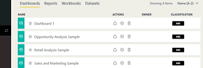
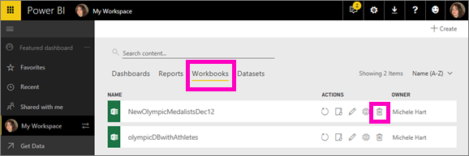
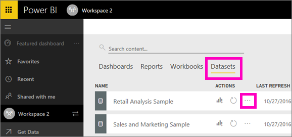
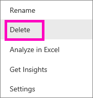
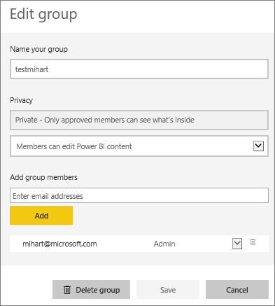

<properties
   pageTitle="Delete a dashboard, report, workbook, dataset, or workspace from Power BI"
   description="Learn how to delete almost anything from Power BI"
   services="powerbi"
   documentationCenter=""
   authors="mihart"
   manager="mblythe"
   backup=""
   editor=""
   tags=""
   qualityFocus="no"
   qualityDate=""/>

<tags
   ms.service="powerbi"
   ms.devlang="NA"
   ms.topic="article"
   ms.tgt_pltfrm="NA"
   ms.workload="powerbi"
   ms.date="11/10/2016"
   ms.author="mihart"/>

#  Delete almost anything in Power BI service
This article teaches you how to delete a dashboard, report, workbook, dataset, and workspace in Power BI service.
## Delete a dashboard

Dashboards can be removed. Removing the dashboard does not delete the underlying dataset or any reports associated with that dashboard.

-   If you are the owner of the dashboard, you can remove it. If you've shared the dashboard with colleagues, removing the dashboard from your Power BI workspace will remove the dashboard from their Power BI workspace.

-   If a dashboard is shared with you and you no longer want to see it, you can remove it.  Removing a dashboard does not remove it from anyone else's Power BI workspace.

-   If a dashboard is part of an [organizational content pack](powerbi-service-organizational-content-pack-delete.md), the only way to remove it is to remove the associated dataset.

### To delete a dashboard  
1.  In your workspace, select the **Dashboards** tab.

2. Locate the dashboard to delete and select the Delete icon . 

    

## Delete a report  

Don't worry, deleting a report does not delete the dataset that the report is based on.  And any visualizations that you pinned from the report are also safe -- they remain on the dashboard until you delete them individually.

### To delete a report  
1.  In your workspace, select the **Reports** tab.

2. Locate the report to delete and select the Delete icon   .   

3.  Confirm the deletion.

    

    > [AZURE.NOTE] If the report is part of a [content pack](powerbi-service-organizational-content-packs-introduction.md), you will not be able to delete it using this method.  See [Deleting an organizational content pack](powerbi-service-organizational-content-pack-delete.md).

## Delete a workbook  

Workooks can be removed. However, removing a workbook also removes all reports and dashboard tiles that contain data from this workbook.

If the workbook is stored on OneDrive for Business, deleting it from Power BI does not delete it from OneDrive.

### To delete a workbook  
1.  In your workspace, select the **Workbooks** tab.

2. Locate the workbook to delete and select the Delete  icon.

    

3.  Confirm the deletion.

    

## Delete a dataset  

Datasets can be deleted. However, deleting a dataset also deletes all reports and dashboard tiles that contain data from this dataset.

If a dataset is part of one or more [organizational content packs](powerbi-service-organizational-content-pack-delete.md), the only way to delete it is to remove it from the content packs where it's being used, wait for it to be processed, and then try deleting it again.

### To delete a dataset  
1.  In your workspace, select the **Datasets** tab.

2. Locate the dataset to delete and select the ellipses (...).  

    

3.  From the dropdown, select **Delete**.

    

3.  Confirm the deletion.

    

##  Delete a workspace
Group workspaces can be deleted by editing the group name.

1.  Start in the workspace you'd like to delete.

2. In the top-right corner, select the ellipses (...) and choose **Edit group**.  

   

3.  At the bottom of the **Edit group** window, select **Delete group**.

      

## Having trouble deleting?

-   If the item to be renamed has been shared with you, or is part of a content pack, you won't see the gear icon and you won't have access to Settings.

## See also
[Power BI reports](powerbi-service-new-reports.md)

[Power BI - Basic Concepts](powerbi-service-basic-concepts.md)

More questions? [Try the Power BI Community](http://community.powerbi.com/) 
