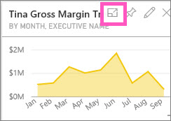
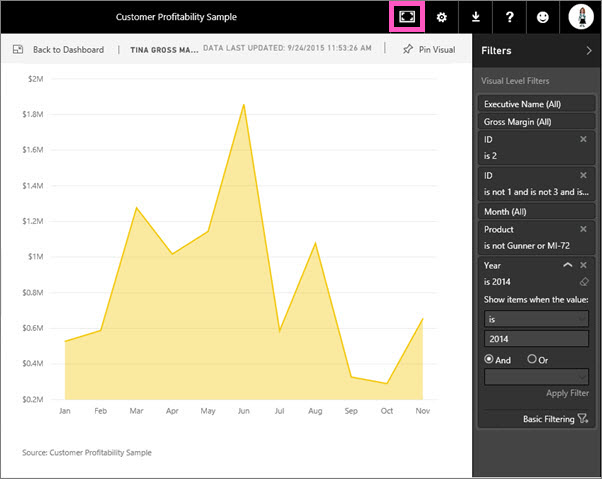
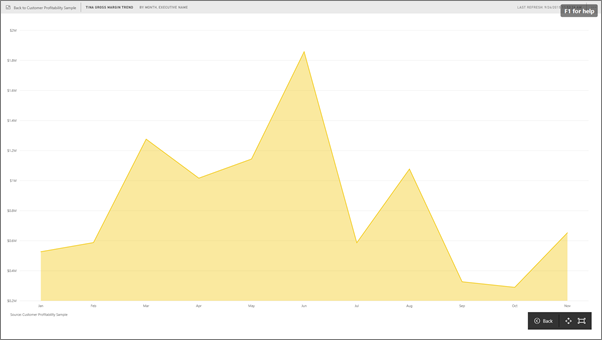

<properties
   pageTitle="Display a dashboard tile in Full Screen mode (TV mode)"
   description="Display a dashboard tile in full screen TV mode"
   services="powerbi"
   documentationCenter=""
   authors="mihart"
   manager="mblythe"
   editor=""
   tags="power bi"/>

<tags
   ms.service="powerbi"
   ms.devlang="NA"
   ms.topic="article"
   ms.tgt_pltfrm="NA"
   ms.workload="powerbi"
   ms.date="03/07/2016"
   ms.author="mihart"/>

# Display a dashboard tile in Full Screen Mode

Tiles must first be [popped out](powerbi-service-display-dash-in-focus-mode.md) before they can be displayed in Full Screen Mode.

## What is Full Screen Mode?

Display your [dashboards, reports](powerbi-service-dash-and-reports-fullscreen.md), and tiles without the distraction of menus and navigation buttons.  You get an unadulterated, full view of your business at a glance, all the time. This is sometimes referred to as TV Mode.

Some uses for Full Screen Mode are:

- presenting your tile at a meeting or conference
- displaying your tile in an office on a dedicated large screen or projector
- looking at your tile on a small screen
- reviewing your tile in locked mode -- you can touch the screen or mouse over the tile without opening the underlying report

## To turn Full Screen Mode on (and off)

1. [Pop out the tile](powerbi-service-display-dash-in-focus-mode.md).

    

2. Your tile fills the report canvas. Now view the tile in Full Screen Mode by selecting the Full Screen icon.

    

3. In Full Screen Mode, the tile fills your entire screen.  
  

4. To exit Full Screen Mode, select the **Exit Full Screen** icon located in the bottom right corner of the screen.

## See also

[Dashboards in Power BI](powerbi-service-dashboards.md)

[Power BI - Basic Concepts](powerbi-service-basic-concepts.md)
