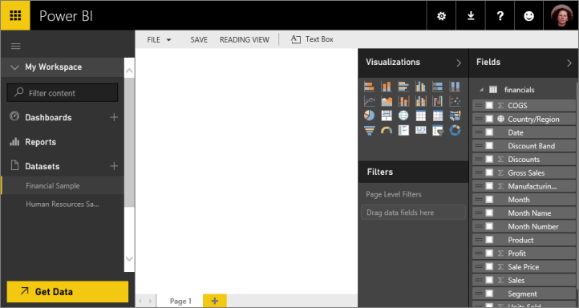

<properties 
   pageTitle="Explore a dataset in Power BI"
   description="Explore a dataset in Power BI"
   services="powerbi" 
   documentationCenter="" 
   authors="maggiesMSFT" 
   manager="mblythe" 
   editor=""
   tags=""/>
 
<tags
   ms.service="powerbi"
   ms.devlang="NA"
   ms.topic="article"
   ms.tgt_pltfrm="NA"
   ms.workload="powerbi"
   ms.date="11/06/2015"
   ms.author="maggies"/>
# Explore a dataset in Power BI

Exploring a dataset is similar to [creating a report](powerbi-service-reports.md).  When you click **Explore** you'll see the same canvas, navigation, and Fields and Filters pane. Dataset explore always starts with a blank canvas and always opens in [Editing View](powerbi-service-interact-with-a-report-in-editing-view.md). Use dataset explore to dig into your data, create visualizations, create reports, and pin visualizations to your dashboard.

## Open your dataset

1.  [Get data](powerbi-service-get-data.md).

2.  Right-click the dataset you'd like to explore and select **Explore**. 

    

3.  Power BI opens a new blank report based on the dataset.

    

From this point, you can start [creating visualizations the way you do in report Editing View](https://powerbi.uservoice.com/knowledgebase/articles/441777-part-i-add-visualizations-to-a-power-bi-report).  

Now you can:

-   [Pin a tile from your report](powerbi-service-pin-a-tile-to-a-dashboard-from-a-report.md) to a dashboard.

-   [Add a new page](powerbi-service-add-a-page-to-a-report.md) to your report.

-   [Delete a page](powerbi-service-delete-a-page-from-a-report.md) from your report.

-   [Reorder pages](powerbi-service-reorder-pages-in-a-report.md) in your report.

## Rename a dataset in Power BI

You can rename datasets. In the navigation pane, right-click the dataset to be renamed and select **Rename**.

## Delete a dataset from Power BI

You can delete datasets from Power BI.  When you delete a dataset:

-   If the dataset connects to a file in OneDrive, the connection is deleted but the file itself is not deleted from OneDrive.

-   Dashboard tiles that use the dataset are deleted.

-   Reports that use the dataset are deleted.

> NOTE: The only way to delete your connection to an organizational content pack is to delete the dataset. That deletes all related dashboards and reports.

In the navigation pane, right-click the dataset you want to delete, or select the ellipsis (...) and select **Delete**.

## See also

[Get started with Power BI](powerbi-service-get-started.md)

[Get Data](powerbi-service-get-data.md)

[Power BI - Basic concepts](powerbi-service-basic-concepts.md)

[Sample datasets available for your use](powerbi-sample-datasets.md)

