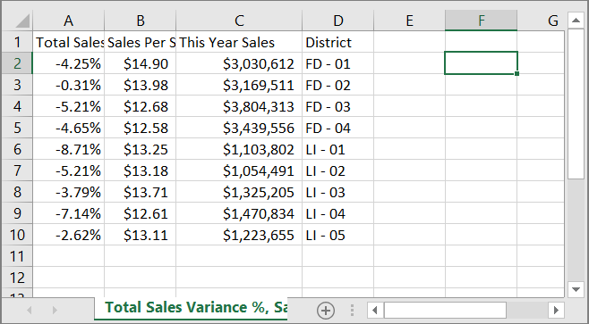
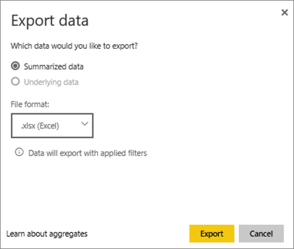
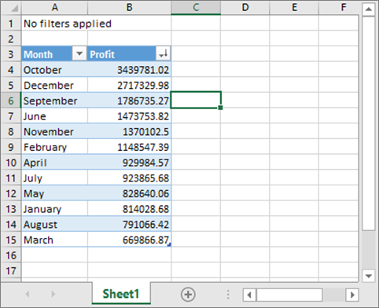
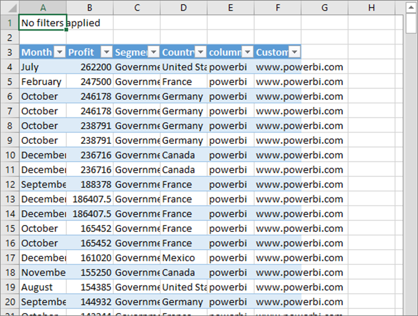

<properties
   pageTitle="Export data from a visualization"
   description="Export data from a report visualization and dashboard visualization and view it in Excel."
   services="powerbi"
   documentationCenter=""
   authors="mihart"
   manager="mblythe"
   backup=""
   editor=""
   tags=""
   featuredVideoId="jtlLGRKBvXY"
   qualityFocus="no"
   qualityDate=""/>

<tags
   ms.service="powerbi"
   ms.devlang="NA"
   ms.topic="article"
   ms.tgt_pltfrm="NA"
   ms.workload="powerbi"
   ms.date="01/09/2017"
   ms.author="mihart"/>

# Export data from Power BI visualizations
If you'd like to see the data that is used to create a visualization, you can [display that data in Power BI](powerbi-service-reports-see-data.md) or export that data to Excel as a .xlsx or .csv file.   

Watch Will export the data from one of the visualizations in his report, save it as an .xlsx file, and open it in Excel. Then follow the step-by-step instructions below the video to try it out yourself.

<iframe width="560" height="315" src="https://www.youtube.com/embed/KjheMTGjDXw" frameborder="0" allowfullscreen></iframe>

## From a visualization on a Power BI dashboard

1. Select the ellipses in the top right corner of the visualization.

    

2. Choose the  **Export data** icon.

    

3.  The data is exported to a .csv file. If the visual is filtered, then the downloaded data will also be filtered.

4. Your browser will prompt you to save the file.  Once saved, open the .csv file in Excel.

   

## From a visualization in a report

1. Select the ellipses in the top right corner of the visualization. Choose  **Export data**.

    

    

2. If your visualization has an aggregate, you'll have two options: **Summarized data** and **Underlying data**. For help understanding aggregates, see [Aggregates in Power BI](powerbi-service-aggregates.md).

   -  **Summarized data**: select this option if you don't have an aggregate or if you do have an aggregate but don't want to see the complete breakdown. Summarized data is available as .xlsx and .csv. When you select  **Export**, the data is exported to either an .xlsx or .csv file and your browser prompts you to save the file. Once saved, open the file in Excel.

       In this example, our Excel export shows one total per month.

    

   -  **Underlying data**: select this option if your visualization does have an aggregate and you'd like to see all the underlying details. In the example below, our visualization is using the **sum** of **Profit**. Underlying data is available as .xlsx. When you select **Export**, the data is exported to an .xlsx file and your browser prompts you to save the file. Once saved, open the file in Excel.

       In this example, our Excel export shows profit for every month broken down by segment and country. In other words, the data is flattened and not aggregated.

    

## Limitations and considerations
-  The maximum number of rows that can be exported is 30,000 (for Power BI Free users) and 150,000 (for Power BI Pro users).

-  Custom visuals, and R visuals, are not currently supported.

-  If there is unicode in the .csv file, the text in Excel may not display properly. Although, opening it in Notepad will work fine. Examples of unicode are currency symbols and foreign words. the workaround for this is to import the csv into Excel, instead of opening the csv directly. To do this:
   1. Open Excel
   2. From the **Data** tab, select **Get external data** > **From text**.

## See also

[Dashboards in Power BI](powerbi-service-dashboards.md)

[Reports in Power BI](powerbi-service-reports.md)

[Power BI - Basic Concepts](powerbi-service-basic-concepts.md)

More questions? [Try the Power BI Community](http://community.powerbi.com/)
