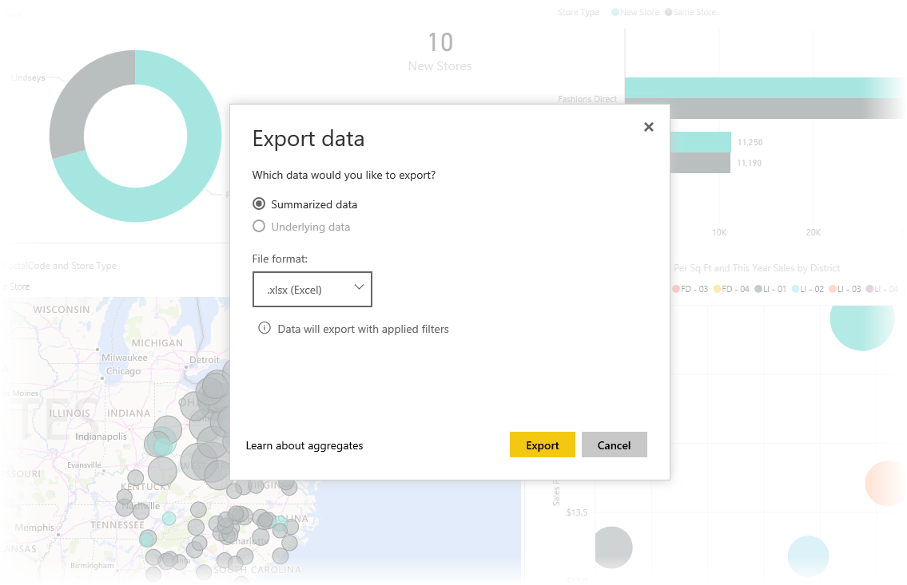
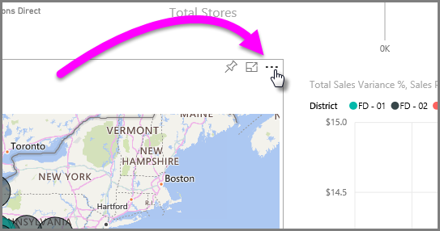
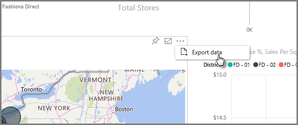
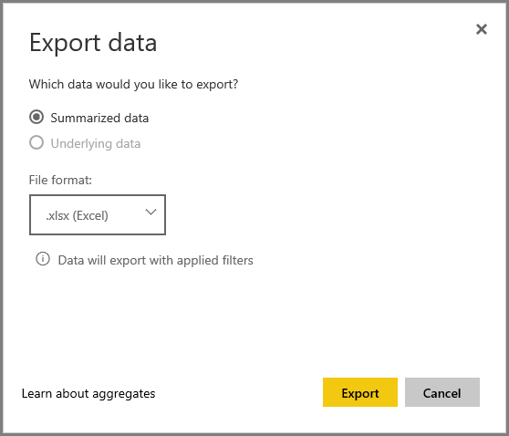
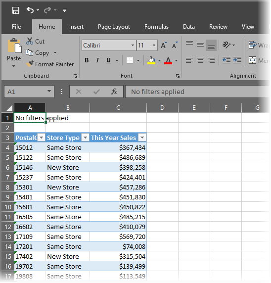

<properties
   pageTitle="Export data from Power BI to Excel"
   description="Export data or visuals from Power BI to Excel"
   services="powerbi"
   documentationCenter=""
   authors="davidi"
   manager="mblythe"
   backup=""
   editor=""
   tags=""
   qualityFocus="no"
   qualityDate=""/>

<tags
   ms.service="powerbi"
   ms.devlang="NA"
   ms.topic="article"
   ms.tgt_pltfrm="NA"
   ms.workload="powerbi"
   ms.date="11/30/2016"
   ms.author="davidi"/>

# Export data from Power BI visualizations
In the **Power BI** service, you can easily export the data behind any Power BI visual into an Excel workbook.

To export the data from a visual into Excel, follow these steps:

1. In **Power BI**, select the ellipses in the top right corner of the visual.

    

2. Select **Export data** from the menu that appears.

    

3.  The **Export data** dialog appears, where you can select the file format (choose *.xlsx (Excel)* to export the data into an Excel workbook), then select **Export.** The data that is exported is the data that creates the visuals, so any filters or other shaping applied to display the chart also constrains the data that is exported. So if the chart displays 17 cities on a filtered map (out of 200 cities in the data model itself), only the data associated with those 17 cities is exported.

    

4.  The file is created and made available by the browser to **Open**, **Save**, or **Cancel**. The name of the file matches the title of the visual.

    

5. When you download and open the Excel file, you see the data from the visual displayed in a table.

    

## Limitations and Considerations

When you export data from a **Power BI** visual into Excel, keep the following considerations in mind:

-   With a Power BI Pro license, users can export up to 150,000 rows of data for each export. For Power BI Free users, you can export up to 30,000 rows of data.
-   Custom visuals, and R visuals, are not currently supported.

## See also

[Dashboards in Power BI](powerbi-service-dashboards.md)

[Reports in Power BI](powerbi-service-reports.md)

[Power BI - Basic Concepts](powerbi-service-basic-concepts.md)

More questions? [Try the Power BI Community](http://community.powerbi.com/)
