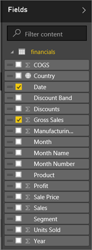
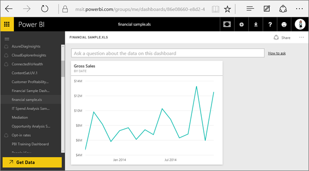

<properties
   pageTitle="Get started with Power BI"
   description="Get started with Power BI"
   services="powerbi"
   documentationCenter=""
   authors="mihart"
   manager="mblythe"
   backup=""
   editor=""
   tags=""
   qualityFocus="no"
   qualityDate=""/>

<tags
   ms.service="powerbi"
   ms.devlang="NA"
   ms.topic="article"
   ms.tgt_pltfrm="NA"
   ms.workload="powerbi"
   ms.date="07/07/2016"
   ms.author="mihart"/>

# Get started with Power BI

##  Getting Started

This tutorial helps you get started with Power BI service.  If you're looking for help with Power BI Desktop, see [Get started with Desktop](powerbi-desktop-getting-started.md).

Microsoft Power BI helps you stay up to date with the information that matters to you.  With Power BI, ***dashboards*** help you keep a finger on the pulse of your business.  Your dashboards display ***tiles*** that you can click to open ***reports*** for exploring further.  Connect to multiple ***datasets*** to bring all of the relevant data together in one place.

Need help understanding the building blocks that make up Power BI?  See [Power BI - Basic Concepts](powerbi-service-basic-concepts.md).

If you have important data in Excel or CSV files, you can create a Power BI dashboard to stay informed anywhere and share insights with others.  Do you have a subscription to a SaaS application like Salesforce?  Get a head start by [connecting to Salesforce](powerbi-content-pack-salesforce.md) to automatically create a dashboard from that data, or [check out all the other SaaS apps](powerbi-service-get-data.md) you can connect to. If you are part of an organization, see if any [organizational content packs](powerbi-service-organizational-content-packs-introduction.md) have been published for you.

Read about all the other ways to [get data for Power BI](powerbi-service-get-data.md).

## Step 1: Get data

Here's an example of getting data from a CSV file. Want to follow along with this tutorial? [Download this sample CSV file](http://go.microsoft.com/fwlink/?LinkID=619356).

1.  [Sign in to Power BI](http://www.powerbi.com/). Don’t have an account? You can sign up for [Power BI for free](http://www.powerbi.com/ "try out the new Power BI Preview for free").

1.  If you're in your workspace, select **Get Data** at the bottom of the left navigation pane.

    

2.  Select **Files**. 

    

3.  Select **Local File**, browse to the file on your computer, and choose **Open**.

    

4.  Power BI uploads the CSV file and adds it as a new dataset (the yellow asterisk indicates a new item).  Since we did not already have a dashboard, Power BI also created a new dashboard for us.  In the left navigation pane, the new dashboard is listed under the **Dashboards** heading, and the new dataset appears under the **Datasets** heading. 

    

## Step 2: Start exploring your dataset

Now that you have connected to data, explore to find insights.  When you've found something you want to monitor, you can create a dashboard to keep up-to-date with changes.

1.  Select the dataset image on the dashboard to explore the data you just connected to or, under the **Datasets** heading,click the dataset name to open it.

    

    >NOTE: Another way to explore your data is **Quick Insights**.  For more information, see [Introduction to Quick Insights](powerbi-service-auto-insights.md)

2.  In the **Fields** list on the right side of the page, select fields to build a visualization.  Select the checkbox beside **Gross Sales** and  **Date**.

    

3.  Power BI analyzes the data and creates a visual.  If you selected **Date** first, you'll see a table.  If you selected **Gross Sales** first, you'll see a chart. Switch to a different way of displaying your data. Try changing to a line chart by selecting the line chart option.

    

4.  When you have a visualization you want on your dashboard, hover over the visualization and select the **Pin** icon.  When you pin this visualization, it will be stored on your dashboard so you can track the latest value at a glance.

    

5.  Because this is a new report, you need to save it before you can pin a visualization from it to the dashboard. Give your report a name (e.g., *Sales Over Time*) and select **Save and Continue**. 

    

    The new report appears in the navigation pane under the **Reports** heading.

6.  Pin the tile to an existing dashboard or to a new dashboard. 

    

    -   **Existing dashboard**: select the name of the dashboard from the dropdown.
    -   **New dashboard**: type the name of the new dashboard.

7.  Select **Pin**.

    A Success message (near the top right corner) lets you know the visualization was added, as a tile, to your dashboard.

    

8.  Back on your dashboard, you can see your new visualization. Make your dashboard even better by [renaming, resizing, linking, and repositioning tiles](powerbi-service-edit-a-tile-in-a-dashboard.md).

    

    Select the new tile on your dashboard to return to the report any time.

##  Step 3: Continue exploring with Q&A (natural language querying)

1.  For a quick exploration of your data, try asking a question in the Q&A box. The Q&A question box is located at the top of your dashboard. For example, try typing "**what segment had the most revenue**".

    

1. Select the pin icon  to show this visualization on your dashboard too.

2. Pin the visualization to the Financial Sample dashboard.

    

3. Select the back arrow  to return to your dashboard where you'll see the new tile.

Ready to try more?  Here are some great ways to explore more of Power BI.

-   [Connect to another dataset](powerbi-service-get-data.md).
-   [Share your dashboard](powerbi-service-share-unshare-dashboard.md) with your colleagues.
-   Read [tips for designing dashboards](powerbi-service-tips-for-designing-a-great-dashboard.md).
-   View your dashboards with a [Power BI app on a mobile device](powerbi-power-bi-apps-for-mobile-devices.md)

Not quite ready to jump right in? Start with these topics designed to help you feel comfortable with Power BI.

-   [Learn how reports, datasets, dashboards, and tiles all fit together](powerbi-service-basic-concepts.md)
-   [Power BI videos](powerbi-videos.md)
-   [See what samples we have available for you to use](powerbi-sample-datasets.md)

### Stay in touch with Power BI

-   Follow [@MSPowerBI on Twitter](https://twitter.com/mspowerbi)
-   Subscribe to our [YouTube video channel](https://www.youtube.com/channel/UCy--PYvwBwAeuYaR8JLmrfg)
-   Watch our [Power BI Getting Started webinars](powerbi-webinars.md) on demand
