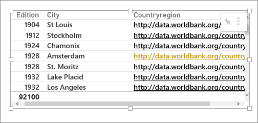
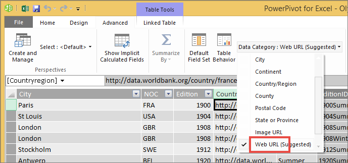

<properties
   pageTitle="Hyperlinks in tables"
   description="Hyperlinks in tables"
   services="powerbi"
   documentationCenter=""
   authors="mihart"
   manager="mblythe"
   editor=""
   tags=""/>

<tags
   ms.service="powerbi"
   ms.devlang="NA"
   ms.topic="article"
   ms.tgt_pltfrm="NA"
   ms.workload="powerbi"
   ms.date="11/14/2015"
   ms.author="mihart"/>
# Hyperlinks in tables

This topic teaches you how to create and work with hyperlinks in tables and matrixes.  URLs in Power BI tables (and matrixes) can function as hyperlinks. Underlined text in a table or matrix that changes color as you hover over it, is a hyperlink.  Clicking on it will take you to the linked URL. 

To learn how to add hyperlinks to visualization titles, see xxxx.

## To create a hyperlink in Power BI

Hyperlinks in tables and matrixes can be created in Power BI Desktop but not from Power BI Service. Hyperlinks can also be created in Excel Power Pivot before the workbook is imported into Power BI. Both methods are described below.

## Create a table or matrix hyperlink in Power BI Desktop

1. If the hyperlink doesn't already exist as a column in your dataset, add it as a [custom column](tation/powerbi-desktop-common-query-tasks.md).

2. Select the column and in the **Modeling** tab choose the dropdown for **Data Category**.

  

3. Select **Web URL**.

4. Publish and open the report in Power BI Service.

5. Add the new column to a table or matrix.

## Create a table or matrix hyperlink in Excel Power Pivot

1.  Open the workbook in Excel.

2.  Select the **PowerPivot** tab and then choose **Manage**.

    

3.  When Power Pivot opens, select the **Advanced **tab.

    

4.  Place your cursor in the column that contains the URLs that you'd like to turn into hyperlinks in Power BI tables.

    >**NOTE**: The URLS must start with either **http:// , https://** or **www**.

5.  In the **Reporting Properties** group, select the **Data Category** dropdown and choose **Web URL**. 

    

6.  From the Power BI service, connect to this workbook.

7.  Create a table visualization that includes the URL field.

    

## See also

[Visualizations in Power BI reports](powerbi-service-visualizations-for-reports.md)

[Power BI - Basic Concepts](powerbi-service-basic-concepts.md)
