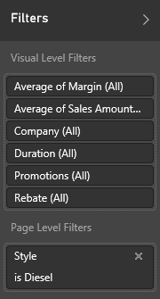
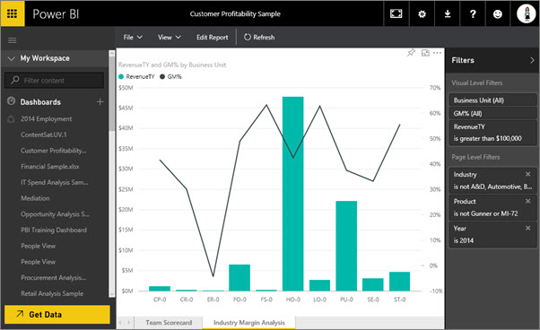

<properties
   pageTitle="Interact with a report in Reading View in Power BI"
   description="Interact with a report in Reading View in Power BI"
   services="powerbi"
   documentationCenter=""
   authors="mihart"
   manager="mblythe"
   editor=""
   tags=""/>

<tags
   ms.service="powerbi"
   ms.devlang="NA"
   ms.topic="article"
   ms.tgt_pltfrm="NA"
   ms.workload="powerbi"
   ms.date="12/02/2015"
   ms.author="mihart"/>

# Interact with a report in Reading View in Power BI

Reports in Power BI Reading View are very interactive. When you highlight a value in one visualization, it can change the values in the rest of the page. You can filter values on a page, and change the way values are sorted in a visualization. It's a great way to play with and get to know your data.

Reports [shared with you](powerbi-service-share-unshare-dashboard.md) can only be opened in Reading View, not Editing View.

- **Highlight the related visualizations on a page**.

    The visualizations on a single report page are all "connected" to each other.  What this means is that if you select one or more values in one visualization, other visualizations will change based on that selection.

    

    **NOTE**: To select more than one element in a visualization, hold down the CTRL key.

- **Hover over visual elements to see the details**.

    

- **Sort the data in a visualization**  

    Select empty space inside the visualization and right-click to open **Sort by**. Select the dropdown arrow to choose which field to sort by or select the AZ icon to switch between ascending and descending.    

     

- **Interact with filters**

    If the report author added filters to a page in a report, you can interact with them in Reading View.

 1.  Select the Filter icon in the upper-right corner.

      

 2.  You'll see the filters that have been applied to the visual you have selected (Visual level filters), and across the whole report page (Page level filters).

    

 3.  Hover over a filter and expand it by selecting the down arrow.

    

- **Pop out a visualization**

    Hover over a visualization and select the Pop-out icon . When you pop-out a visualization, it expands to fill the entire report canvas.

  

  For more information, see [Add a filter to a report](powerbi-service-add-a-filter-to-a-report.md) and [About filters and highlighting in reports](powerbi-service-about-filters-and-highlighting-in-reports.md).

- **Adjust the display dimensions**  
   Reports are viewed on many different devices, with varying screen sizes and aspect ratios.  The default rendering may not be what you want to see on your device.  If so, you can do the following:

 - Fit to Page: scale content to best fit the page
 - Fit to Width: Scale content to the width of the page
 - Actual Size: Display content at full size  

  In Reading View, the display option you select is temporary - it is not saved when you close the report.

  For more information: [Tutorial: Change display settings in a report](powerbi-service-tutorial-change-report-display-settings.md).

## See also

[Reports in Power BI](powerbi-service-reports.md)

 [About filters and highlighting in Power BI reports](powerbi-service-about-filters-and-highlighting-in-reports.md)
