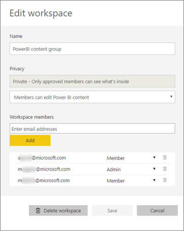
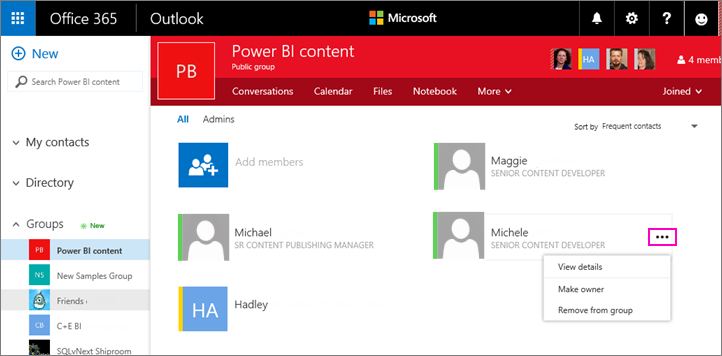
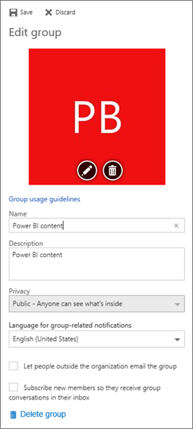

<properties 
   pageTitle="Manage your app workspace in Power BI and Office 365"
   description="App workspaces in Power BI are a collaborative experience built on Office 365 groups. Manage your app workspaces in Power BI and also in Office 365."
   services="powerbi" 
   documentationCenter="" 
   authors="maggiesMSFT" 
   manager="erikre" 
   backup="ajayan"
   editor=""
   tags=""
   qualityFocus="no"
   qualityDate=""/>
 
<tags
   ms.service="powerbi"
   ms.devlang="NA"
   ms.topic="article"
   ms.tgt_pltfrm="NA"
   ms.workload="powerbi"
   ms.date="08/17/2017"
   ms.author="maggies"/>
# Manage your app workspace in Power BI and Office 365

> [AZURE.NOTE] Have you heard about the new *apps* yet? Apps are the new way to distribute content to large audiences in Power BI. You create apps in *app workspaces*, which replace groups and group workspaces. We recommend using apps instead of organizational content packs or read-only workspaces. Learn [more about apps](powerbi-service-what-are-apps.md).

As creator or admin of an app workspace in Power BI or in Office 365, you manage some aspects of the workspace in Power BI. Other aspects you manage in Office 365. 

**In Power BI** you can:

-   Add or remove app workspace members, including making a workspace member an admin.
-   Edit the app workspace name.
-   Delete the app workspace.

**In Office 365** you can:

-   Add or remove your app workspace's group members, including making a member an admin.
-   Edit the group name, image, description, and other settings.
-   See the group email address.
-   Delete the group.

> [AZURE.NOTE] You need a [Power BI Pro](powerbi-free-vs-pro.md) license to be an admin or member of an app workspace. Your app users need a Power BI Pro license, too, unless your app workspace is in a Power BI Premium capacity. Then business users can access your app with a Power BI free license instead. Read [What is Power BI Premium?](powerbi-premium.md) for details.

## Edit your app workspace in Power BI

1.  In the Power BI service, select the arrow next to **Workspaces** > select the ellipsis (**…**) next to your workspace name > **Edit workspace**. 

    

    > [AZURE.NOTE] You only see **Edit workspace** if you’re an app workspace admin.

3.  Here you can rename, add or remove members, or delete the app workspace. 

    

4.  Select **Save** or **Cancel**.

## Edit Power BI app workspace properties in Office 365 

1.  In the Power BI service, select the arrow next to **Workspaces** > select the ellipsis (**…**) next to your workspace name > **Members**. 

    

    This opens the Outlook for Office 365 group view of your app workspace.

    You may need to sign into your corporate account.

3.  Tap the ellipsis (**…**) next to a member's name to make the member an admin or delete the member from the app workspace. 

    

## Add an image and set other workspace properties in the Office 365 group

When you distribute your app from the app workspace, the image you add here will be the image for your app. See the [Add an image to your app](powerbi-service-create-apps.md#add-an-image-to-your-app-optional) section of the article [Create and distribute an app in Power BI](powerbi-service-create-apps.md).

1.  In the Outlook for Office 365 view of your app workspace, select the group image to edit group workspace properties.

    

2.  You can edit the name, description, and language, add an image, and set other properties here.

    

3.  Select **Save** or **Discard**.

## Next steps

- [Create apps and app workspaces in Power BI](powerbi-service-create-apps.md)
- More questions? [Try the Power BI Community](http://community.powerbi.com/)
