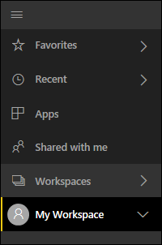
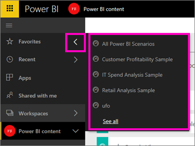
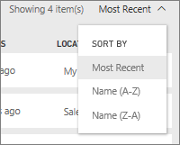

<properties
   pageTitle="Searching and sorting your content in Power BI service"
   description="documentation for sorting, and sorting content in Power BI workspaces"
   services="powerbi"
   documentationCenter=""
   authors="mihart"
   manager="erikre"
   backup=""
   editor=""
   tags=""
   qualityFocus="no"
   qualityDate=""/>

<tags
   ms.service="powerbi"
   ms.devlang="NA"
   ms.topic="article"
   ms.tgt_pltfrm="NA"
   ms.workload="powerbi"
   ms.date="04/17/2017"
   ms.author="mihart"/>

# Searching, and sorting content in Power BI
A combination of Power BI automated organization, user tagging, searching, and sorting allows you to quickly find what you need in Power BI service.

## How Power BI helps you navigate your content

Power BI service organizes your content in several ways.  First, it separates your content into dashboards, reports, workbooks, and datasets. You'll see this organization on many of the Power BI screens. Next, Power BI service classifies your content in ways that make it even easier to find what you need, quickly. Take a look at your left navbar.

Content that you create is available in **My workspace**, content associated with a group is available in an **app workspace**, content that you want to access quickly is saved in **Favorites**, content that is shared with you is available in **Shared with me**, and your last-viewed content is also available in **Recent**.

For more information, see [How content is organized in Power BI service](powerbi-service-how-content-organized.md)

>**NOTE**: One additional way to organize your content is to pick the one dashboard that you expect to view most often, and set it as your *featured* dashboard. Each time you open Power BI service, this is the dashboard that will display first. To learn more, see [Featured dashboard](powerbi-service-featured-dashboards.md).

## Favorite dashboards and apps

Do you have a number of dashboards and apps that you visit often? By [setting them as *favorites*](powerbi-service-favorite-dashboards.md), they'll always be available from your left navbar. 

.

Working with favorites is described in more detail in the article [Favorites in Power BI service](powerbi-service-favorite-dashboards.md).

## Searching and sorting in workspaces
A workspace has four content tabs: Dashboards, Reports, Workbooks, and Datasets.  Each of these tabs contains a search field and a sort button.  When you're starting out with Power BI service, you might not find these helpful because you'll have only one or two items per tab.  However, over time you may may end up with long lists of content.  Use searching and sorting to easily find what you need.

-  Enter a search term to find a match on the current screen

    

-  Select the sort button to display options for the current page. The options are to sort by name or by owner.

    

##    Considerations and troubleshooting

-    For datasets, **Sort by** is not available by owner.

##  See also
[Workspaces in Power BI](powerbi-service-workspaces.md)

[Power BI - Basic Concepts](powerbi-service-basic-concepts.md)

More questions? [Try the Power BI Community](http://community.powerbi.com/)
