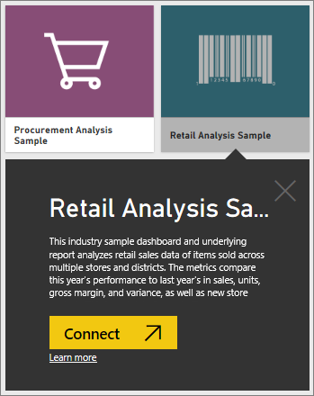
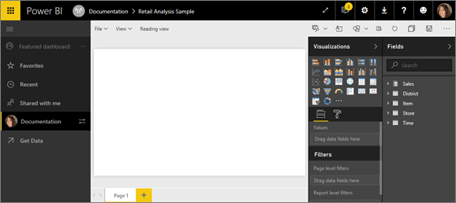
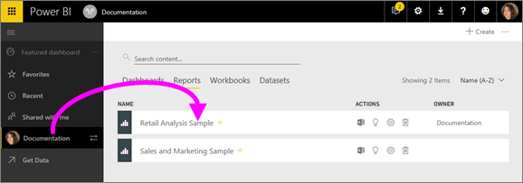
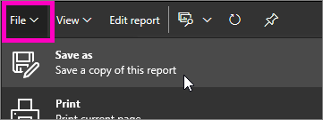
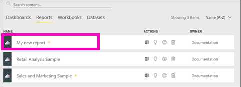
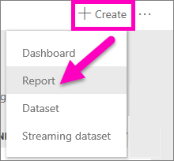
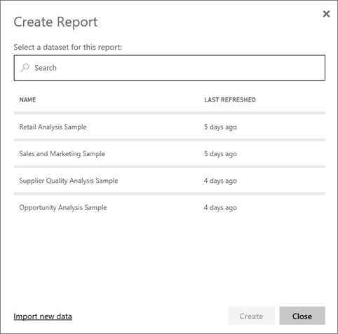
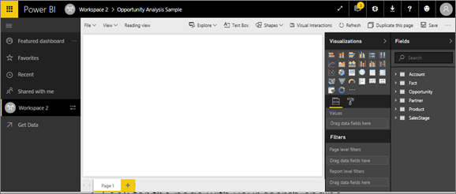
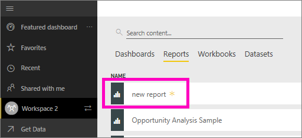

<properties
   pageTitle="Create a new Power BI report"
   description="Learn how to create a new Power BI report from a dataset."
   services="powerbi"
   documentationCenter=""
   authors="mihart"
   manager="mblythe"
   backup=""
   editor=""
   tags=""
   qualityFocus="no"
   qualityDate=""/>

<tags
   ms.service="powerbi"
   ms.devlang="NA"
   ms.topic="article"
   ms.tgt_pltfrm="NA"
   ms.workload="powerbi"
   ms.date="10/27/2016"
   ms.author="mihart"/>
# Create a new Power BI report

You've read [Reports in Power BI](powerbi-service-new-reports.md) and now you want to create your own. There are many different ways to add a new report to your workspace.  You could import a report, [have one shared with you](powerbi-service-share-unshare-dashboard.md), create a report from an existing report, create a report from scratch, or create an empty report.

## Import a report

In this example we'll use one of the [Power BI samples](powerbi-sample-datasets.md) to add a report to a workspace.

1. [Open a workspace](powerbi-service-new-workspace.md).

2. From the leftnav, select **Get Data**.

    

3.  From the bottom left corner, select **Samples**.

    

4.  Select one of the samples and click **Connect**.

   

5. Power BI adds the report to your active workspace. Select the **Report** tab. A yellow asterisk to the right of the report name lets you know that it's new.

    

## Create a new report from a dataset

This method creates a new report from a dataset.

1.  [Add a dataset to your workspace](powerbi-service-new-dataset-add.md).

2. In that same workspace, select the **Datasets** tab.

3. Choose the dataset you'd like to use to create a report and select the report icon .

     

3.  The Power BI report editor opens. Explore your data and [add visualizations](powerbi-service-visualizations-for-reports.md) to create a report.

     

4.  [Save your report](powerbi-service-save-a-report.md).

## Create a new report from an existing report

1.  Start in a workspace and select a report to open it.

     

2.  From the **File** menu, select **Save As**.

    

3.  Type a name for the new report and select **Save**. The new report is saved to the same workspace.

    

    A Success message lets you know that the new report was saved to Power BI.

    

4.  Back in the workspace, the new report has a yellow asterisk. Select the new report to open it.

    

5.  Have fun updating and editing your new report.

## Create a new report from scratch

1.  Start in the workspace where you'd like to create the report.

2. Select **Create** > **Report**.

     

2.  Every report needs a dataset. Select from the list of datasets already associated with this workspace or import new data. The datasets listed here are the same datasets listed in the workspace's **Datasets** tab.

    

3.  Select **Create**. The report editor opens in [Editing view](powerbi-service-interact-with-a-report-in-editing-view.md) with a blank canvas. The **Fields** pane lists the tables and fields you can use to create visualizations.

    

5.  Have fun [filling the canvas with visualizations](powerbi-service-visualizations-for-reports.md).

6. Save the new report by selecting **File** > **Save**. Back in the workspace, the new report has a yellow asterisk.

    

## Next Steps:

[Create new visualizations](powerbi-service-add-visualizations-to-a-report-ii.md)

## See also
[Power BI - Basic Concepts](powerbi-service-basic-concepts.md)

More questions? [Try the Power BI Community](http://community.powerbi.com/)
