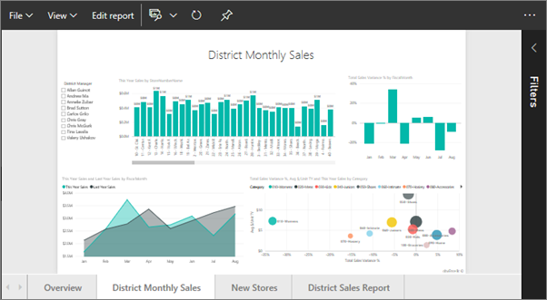

<properties
   pageTitle="Open a Power BI report in Reading View"
   description="Open a Power BI report in Reading View"
   services="powerbi"
   documentationCenter=""
   authors="mihart"
   manager="mblythe"
   backup=""
   editor=""
   tags=""
   qualityFocus="no"
   qualityDate=""/>

<tags
   ms.service="powerbi"
   ms.devlang="NA"
   ms.topic="article"
   ms.tgt_pltfrm="NA"
   ms.workload="powerbi"
   ms.date="12/11/2016"
   ms.author="mihart"/>

# Open a Power BI report in Reading View  
##   Reading View
Reading View is a great way to explore the data in a Power BI report, without worrying that you'll break something.  You can browse the report, interact with the visualizations, and pin any of the visualizations to your dashboard. 

>[AZURE.NOTE] To edit the report and save your changes, [open it in Editing View](powerbi-service-go-from-reading-view-to-editing-view.md).

1.  [Create a report](powerbi-service-create-a-new-report.md) and open it in Reading View.

2.  Open a report by selecting it from the list in your workspace **Reports** tab.

    

	Or, open a report from a dashboard, by selecting a tile that was created from a report.

2.  The report opens in Reading view.  

    

3.  There's [so much you can do in Reading View](powerbi-service-interact-with-a-report-in-reading-view.md).  This sample report has multiple pages, so start exploring by selecting each tab at the bottom of the report canvas. To read more about Reading view, see [Interact with a report in Reading view](powerbi-service-interact-with-a-report-in-reading-view.md).

## See also  
Read more about [reports in Power BI](powerbi-service-reports.md)

[Get started with Power BI](powerbi-service-get-started.md)

[Power BI - Basic Concepts ](powerbi-service-basic-concepts.md)

More questions? [Try the Power BI Community](http://community.powerbi.com/)  
