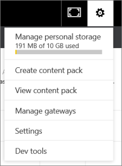

<properties 
   pageTitle="Manage, update, and delete organizational content packs"
   description="Read about managing, updating, and deleting organizational content packs in Power BI."
   services="powerbi" 
   documentationCenter="" 
   authors="ajayan" 
   manager="erikre" 
   backup="maggiesMSFT"
   editor=""
   tags=""
   qualityFocus="no"
   qualityDate=""/>
 
<tags
   ms.service="powerbi"
   ms.devlang="NA"
   ms.topic="article"
   ms.tgt_pltfrm="NA"
   ms.workload="powerbi"
   ms.date="01/23/2017"
   ms.author="ajayan"/>
# Manage, update, and delete organizational content packs

You can package up and share your dashboards, reports, Excel workbooks, and datasets with your colleagues as [organizational content packs](powerbi-service-organizational-content-packs-introduction.md). Your colleagues can use them as-is, or they can create their own copies.

Only the content pack creator can do some organizational content pack tasks:

-   Republish.
-   Restrict or expand access to the content pack.
-   Set and change scheduled refresh.
-   Delete the content pack.

## Modify and re-publish an organizational content pack
If you make changes to the original content pack dashboard, report, or Excel workbook, Power BI prompts you to republish. Additionally, as the content pack creator, you can update any of the options you selected in the Create Content Pack window when you were creating the original content pack. 

## Republish with new content

When you make and save a change to the dashboard that you included in a content pack, Power BI reminds you to update it so others can see the changes. For example, if you pin a new tile or just change the name of the dashboard.

1.  Select **View Content Packs** in the message.
  
    
2.  Or select the cog icon in the upper-right corner  and select **View Content Pack**.

    

    Notice the warning icon .  This lets you know that you've modified the content pack in some way and it no longer matches what you published.

2.  Select **Edit**.  

3.  Make any necessary changes in the **Update Content Pack** window and select **Update**. A **Success** message appears.

	-   For group members who haven't customized the content pack, the update is automatically applied.

	-   Group members who have customized the content pack receive a notification that there is a new version.  They can navigate to the content pack library and get the updated content pack without losing their personalized version.  They'll now have 2 versions: the personalized version and the updated content pack.  In the personalized version, all tiles from the original content pack will be gone.  But tiles pinned from other reports will still render.    

## Update the audience: expand or restrict access

Another modification available to content pack creators is expanding and restricting access to the content pack.  Perhaps you published a content pack to a broad audience and you've decided to restrict access to a smaller group.  

1.  Select the cog icon  and choose **View Content Packs**.

2.  Select **Edit**. 

3.  Make any necessary changes in the **Update Content Pack** window and select **Update**. For example, delete the original distribution group in the **Specific Groups** field and replace it with a different distribution group (that has fewer members).

    A Success message appears.

    For any coworker who isn't part of the new alias:

	-   For group members who haven't customized the content pack, the dashboard and reports associated with that content pack are no longer available and the content pack doesn't appear in the Navigation Pane.

	-   For group members who have customized the content pack, the next time they open the customized dashboard, all tiles from the original content pack will be gone.  But tiles pinned from other reports will still render. The original content pack reports and dataset are no longer available, and the content pack doesn't appear in the Navigation pane.   

## Refresh an organizational content pack

As the content pack creator, you can [schedule refresh of the datasets](powerbi-refresh-data.md).  When you create and upload the content pack, that refresh schedule is uploaded with the datasets. If you change the refresh schedule, you need to re-publish the content pack (see above).

## Delete an organizational content pack from the library

You can only delete a content pack from the content pack library if you're the content creator. 

> **Tip**: You can [delete your connection to a content pack](powerbi-service-organizational-content-pack-delete.md) you didn't create. That doesn't delete the content pack from the library.

1. To delete a content pack from the content pack library, select the cog icon  and choose **View Content Packs**.

2. Select **Delete \> Yes**. 

	-   For group members who haven't customized the content pack, the dashboard and reports associated with that content pack are automatically removed. They're no longer available, and the content pack doesn't appear in the Navigation Pane.

	-   For group members who have customized the content pack, the next time they open the customized dashboard, all tiles from the original content pack will be gone.  But tiles pinned from other reports will still render. The original content pack reports and dataset are no longer available, and the content pack doesn't appear in the Navigation pane.   

### See also

-   [Introduction to organizational content packs](powerbi-service-organizational-content-packs-introduction.md)
-  [Get Started with Power BI](powerbi-service-get-started.md)
-  [Power BI - Basic Concepts](powerbi-service-basic-concepts.md)
-  [Create a group in Power BI](powerbi-service-create-a-group-in-power-bi.md)
-  More questions? [Try the Power BI Community](http://community.powerbi.com/)

