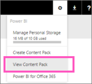

<properties 
   pageTitle="Manage, update, and delete organizational content packs"
   description="Manage, update, and delete organizational content packs"
   services="powerbi" 
   documentationCenter="" 
   authors="maggiesMSFT" 
   manager="mblythe" 
   editor=""
   tags=""/>
 
<tags
   ms.service="powerbi"
   ms.devlang="NA"
   ms.topic="article"
   ms.tgt_pltfrm="NA"
   ms.workload="powerbi"
   ms.date="10/14/2015"
   ms.author="maggies"/>
# Manage, update, and delete organizational content packs

A few organizational content pack tasks can only be made by the content pack creator.

-   Republish

-   Restrict or expand access to the content pack

-   Set and change scheduled refresh

-   Delete the content pack

## Modify and re-publish an organizational content pack
If you make changes to the original content pack dashboard and report, Power BI will prompt you to republish. Additionally, as the content pack creator, you can update any of the options you selected in the Create Content Pack window when you were creating the original content pack. 

## Republish with new content

When you make and save a change to the dashboard that you used to create the content pack, Power BI will remind you to update it so others can see the changes. For example, if you pin a new tile or simply change the name of the dashboard.

1.  Select the cog icon  and choose **View Content Packs**.

    

2.  Select **Edit**.  Notice the warning icon.  This lets you know that you've modified the content pack in some way and it no longer matches what was published.

3.  Make any necessary changes in the **Update Content Pack** window and select **Update**. A Success message appears.

	-   If a group member has not customized the content pack, the update is automatically applied.

	-   If a group member has customized the content pack, he will receive a notification that there is a new version.  He can navigate to the content pack library and get the updated content pack without losing his personalized version.  He'll now have 2 versions: his personalized version and the updated content pack.  In the personalized version, all tiles from the original content pack will be gone.  But tiles pinned from other reports will still render.    

## Update the audience - expand or restrict access

Another modification available to content pack creators is expanding and restricting access to the content pack.  Perhaps you published a content pack to a broad audience and you've been asked to restrict access to a single group.  

1.  Select the cog icon  and choose **View Content Packs**.

2.  Select **Edit**. 

3.  Make any necessary changes in the **Update Content Pack** window and select **Update**. For example, delete the group alias in the **Specific Groups** field and replace it with a different alias (that has fewer members).

    A Success message appears.

    For any coworker who isn't part of the new alias:

	-   If that group member has not customized the content pack, the update is automatically applied, and the dashboard and reports associated with that content pack will no longer be available (and won't appear in the Navigation Pane.)

	-   If that group member has customized the content pack, the next time he opens the customized dashboard, all tiles from the original content pack will be gone.  But tiles pinned from other reports will still render. The original content pack reports and dataset will no longer be available (and won't appear in the Navigation pane).   

## Refresh an organizational content pack

As the content pack creator, you can [schedule refresh of the datasets](powerbi-refresh-data.md).  When you create and upload the content pack, that refresh schedule is uploaded with the datasets. If you change the refresh schedule, you need to re-publish the content pack (see above).

## Delete an organizational content pack

You can only delete a content pack from the content pack library if you're the content creator. 

> TIP: You can [delete your connection to a content pack](powerbi-service-organizational-content-pack-delete.md) you didn't create. That doesn't delete the content pack from the library.

1. To delete a content pack from the content pack library, select the cog icon  and choose **View Content Packs**.

2. Select **Delete \> Yes**. 

	-   If a group member has not customized the original content pack, then the content is automatically removed, and the dashboard and reports associated with that content pack will no longer be available (and won't appear in the Navigation Pane).

	-   If a group member has customized the content pack, the next time she opens the customized dashboard all tiles from the original content pack will be gone.  But tiles pinned from other reports will still render. The original content pack reports and dataset will no longer be available (and won't appear in her Navigation pane).

## See also

[Introduction to organizational content packs](powerbi-service-organizational-content-packs-introduction.md)

[Get Started with Power BI](powerbi-service-get-started.md)

[Power BI - Basic Concepts](powerbi-service-basic-concepts.md)

[Groups in Power BI](powerbi-service-groups.md)

