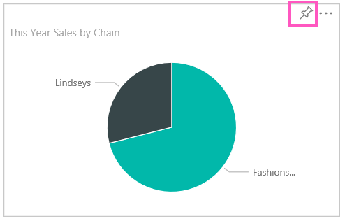

<properties 
   pageTitle="Pin a tile to a Power BI dashboard from a report"
   description="Pin a tile to a Power BI dashboard from a report"
   services="powerbi" 
   documentationCenter="" 
   authors="v-aljenk" 
   manager="mblythe" 
   editor=""
   tags=""/>
 
<tags
   ms.service="powerbi"
   ms.devlang="NA"
   ms.topic="article"
   ms.tgt_pltfrm="NA"
   ms.workload="powerbi"
   ms.date="10/14/2015"
   ms.author="v-aljenk"/>

# Pin a tile to a Power BI dashboard from a report

[← All about dashboards](https://support.powerbi.com/knowledgebase/topics/65158-all-about-dashboards)

One way to add a new [dashboard tile](http://support.powerbi.com/knowledgebase/articles/425669-tiles-in-power-bi) is from within a [Power BI report](http://support.powerbi.com/knowledgebase/articles/425684-reports-in-power-bi). In fact, you can add many new tiles from a report.  Each of these tiles, when clicked, is a link back into the report.

**NOTE**:  You can pin tiles from shared reports to a dashboard, but your changes aren't saved after you log out.

1.  [Get data](http://support.powerbi.com/knowledgebase/articles/434354-connect-to-a-data-source).

2.  Open a [report](http://support.powerbi.com/knowledgebase/articles/425684-reports-in-power-bi).

### Pin a tile from a report in Reading View

When you open a report that has one or more pages, it [opens in Reading View](http://support.powerbi.com/knowledgebase/articles/439920-open-a-report-in-exploration-mode): you can interact with the visualizations and filters, but not edit the report. You can pin a tile from Reading View or from Editing View.

1.  Hover over the visualization you want to pin, and select the pin  icon. 

    

2.  Pin the tile to an existing dashboard or to a new dashboard. 

    -   Existing dashboard: select the name of the dashboard from the dropdown.

    -   New dashboard: type the name of the new dashboard.

3.  Select **Pin**.

    A Success message (near the top right corner) lets you know the visualization was added, as a tile, to your dashboard.

    

4.  From the navigation pane, select the dashboard with the new tile. There, you can [rename, resize, link, and move](http://support.powerbi.com/knowledgebase/articles/424878-edit-a-tile-resize-move-rename-delete) the pinned visualization.

### Pin a tile from Editing View

1.  Select **Edit Report** to open the report in Editing View.

    

2.  Follow steps 1-4 above.

## See Also:

[Reports in Power BI](https://support.powerbi.com/knowledgebase/articles/425684)

[Q&A in Power BI](https://support.powerbi.com/knowledgebase/articles/474566)

[Power BI Preview - Basic Concepts](http://support.powerbi.com/knowledgebase/articles/487029-power-bi-preview-basic-concepts)

[Dashboards in Power BI Preview](http://support.powerbi.com/knowledgebase/articles/424868-dashboards-in-power-bi)
