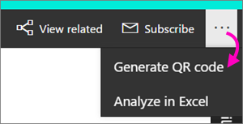

<properties
   pageTitle="Create a QR code for a report in Power BI"
   description="QR codes in Power BI can connect anything in the real world directly to related BI information in the Power BI mobile app, no search needed."
   services="powerbi"
   documentationCenter=""
   authors="maggiesMSFT"
   manager="erikre"
   backup=""
   editor=""
   tags=""
   qualityFocus="no"
   qualityDate=""/>

<tags
   ms.service="powerbi"
   ms.devlang="NA"
   ms.topic="article"
   ms.tgt_pltfrm="NA"
   ms.workload="powerbi"
   ms.date="06/15/2017"
   ms.author="maggies"/>

# Create a QR code for a report in the Power BI service

QR codes in Power BI can connect anything in the real world directly to related BI information &#151; no navigation or search needed.

You can create a QR code in the Power BI service for any report, even for a report you can't edit. Then you place the QR code in a key location. For example, you could paste it in an email, or print it out and paste it in a specific location. 

Colleagues you've shared the report with can scan the QR code for access to the report, right from [their mobile device](powerbi-mobile-qr-code-for-tile.md). They can use either the QR code scanner located in the Power BI app, or any other QR scanner installed on their device.

## Add a QR code to a report in the Power BI service

1. Open a report in the Power BI service.

2. Select the ellipsis (...) in the top-right corner and select **Generate QR code**. 

    

3. A dialog box with the QR code appears. 

    

4. From here you can scan the QR code or download and save it so you can: 

     - Add it to an email or other document, or 
     - Print it and place it in a specific location. 

## Print the QR code

Power BI generates the QR code as a JPG file, ready to print. 

1. Select **Download**, then open the JPG file on a computer connected to a printer.  

    > [AZURE.TIP] The JPG file has the same name as the tile. For example, "Sales and Marketing Sample.jpg".

2. Print the file at 100% or “actual size”.  

3. Cut out the QR code along its edge and glue it to a place relevant to the report. 

## Next steps

-  [Connect to Power BI data from the real world](powerbi-mobile-data-in-real-world-context.md) with the mobile apps
-  [Scan a Power BI QR code from your mobile device](powerbi-mobile-qr-code-for-tile.md)
-  [Create a QR code for a tile](powerbi-service-qr-code-for-tile.md)
- Questions? [Try asking the Power BI Community](http://community.powerbi.com/)
