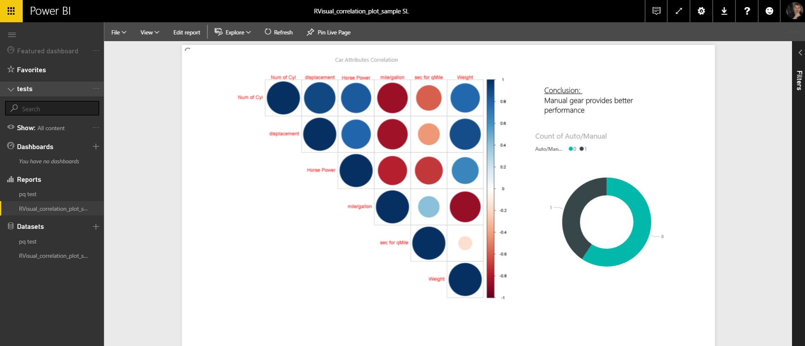
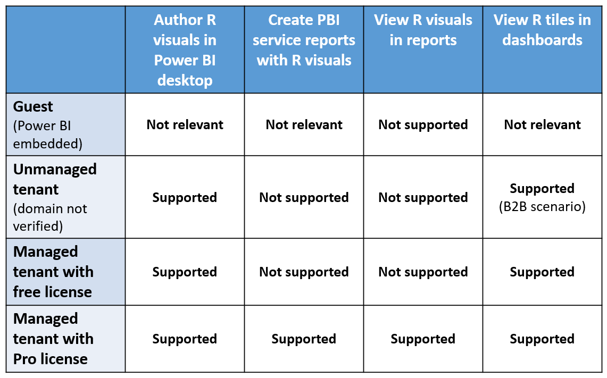

<properties
   pageTitle="Create advanced analytics and visualizations using R scripts in Power BI"
   description="Use R scripts in Power BI to create advanced analytics and advanced visualizations"
   services="powerbi"
   documentationCenter=""
   authors="davidiseminger"
   manager="mblythe"
   backup=""
   editor=""
   tags=""
   qualityFocus="no"
   qualityDate=""/>

<tags
   ms.service="powerbi"
   ms.devlang="NA"
   ms.topic="article"
   ms.tgt_pltfrm="NA"
   ms.workload="powerbi"
   ms.date="12/01/2016"
   ms.author="davidi"/>

# Creating R visuals in the Power BI service

The Power BI service supports viewing and interacting with visuals created with R scripts. Visuals created with R scripts, commonly called *R visuals*, can present advanced data shaping and analytics such as forecasting, using the rich analytics and visualization power of R.

> **Note:** The [R programming language](https://www.r-project.org/) is among the most widely used programming languages by statisticians, data scientists, and business analysts. The R language has an open source community that offers over 7,000 add-on packages, as well as widely used [R User Groups](http://msdsug.microsoft.com/). The version of R deployed in the Power BI service is *Revolution R Open 3.2.2.*

The following image shows a Power BI dashboard with a collection of R visuals used for advanced analytics.

R visuals are created in a [Power BI Desktop report](powerbi-desktop-get-the-desktop.md), like the report shown in the following image.

Once the report is created in **Power BI Desktop**, you can publish the report containing one or more R visuals to the Power BI service. R visuals currently can only be created in **Power BI Desktop**, and then published to the Power BI service. For more information on creating R visuals, see [Create Power BI visuals using R (Power BI Desktop)](powerbi-desktop-r-visuals.md).

Note that in the service not all of the R packages are supported. See supported packages at the end of this article for the list of packages currently supported in the Power BI service.

You can download this [sample Power BI Desktop file](http://download.microsoft.com/download/D/9/A/D9A65269-D1FC-49F8-8EC3-1217E3A4390F/RVisual_correlation_plot_sample SL.pbix) (.pbix file) that contains a few R visuals to see how this works, and to experiment.

R visuals that are created in **Power BI Desktop**, and then published to the Power BI service, for the most part behave like any other visual in the Power BI service; you can interact, filter, slice, and pin them to a dashboard, or share them with others. For more information about sharing dashboards and visuals, see [share a dashboard with colleagues and others](powerbi-service-share-unshare-dashboard.md). One difference from other visuals is that R visuals cannot show tool tips and cannot be used to filter other visuals.

As you can see in the following image, R visuals in the Power BI service, either in dashboards or reports, largely appear and behave like any other visual, and users don't need to be aware of the underlying R script that created the visual.

## R scripts security

R visuals are created from R scripts, which could potentially contain code with security or privacy risks.

These risks mainly exist in the authoring phase when the script author run the script on their own computer.

The Power BI service applies a *sandbox* technology to protect users and the service from security risks.

This *sandbox* approach imposes some restrictions on the R scripts running in the Power BI service, such as accessing the Internet, or accessing to other resources that are not required to create the R visual.

## R scripts error experience

When an R script encounters an error, the R visual is not plotted and an error message is displayed. For details on the error, select **See details** from the R visual error on the canvas, as shown in the following image.

As another example, the following image shows the error message that appears when an R script failed to run properly due to a missing R package in Azure.

## Licensing

R visuals require a [Power BI Pro](powerbi-free-trial-for-power-bi-pro.md) license to render in reports, refresh, filter and cross-filter. For more information about Power BI Pro licenses, and how they differ from free licenses, see [Power BI Pro content - what is it?](powerbi-powerbi-pro-content-what-is-it.md)

Free users of Power BI can only consume tiles shared with them. See [purchasing Power BI Pro](powerbi-admin-purchasing-power-bi-pro.md) for more information.

The following table describes R visuals capabilities based on licensing.

## Known Limitations

R visuals in the Power BI service have a few limitations:

-   R visuals support is limited to the packages identified on the following page <make this a link to the supported packages page per my excel>. There currently is no support for custom packages.

-   Data size limitations – data used by the R visual for plotting is limited to 150,000 rows. If more than 150,000 rows are selected, only the top 150,000 rows are used and a message is displayed on the image.

-   Calculation time limitation – if an R visual calculation exceeds 60 seconds the script times out, resulting in an error.

-   R visuals are refreshed upon data updates, filtering, and highlighting. However, the image itself is not interactive and does not support tool tips.

-   R visuals respond to highlighting other visuals, but you cannot click on elements in the R visual in order to cross filter other elements.

-   R visuals are currently not supported for the *Time* data type. Please use Date/Time instead.

-   R Visuals do not display when using **Publish to web**.

-   R visuals currently do not print with dashboard and reports printing

-   R visuals are currently not supported in the DirectQuery mode of Analysis Services

## Supported packages

The following R packages are currently supported in the Power BI service. These packages are in alphabetical order.

### Supported Packages:

abc, abc.data, acepack, actuar, ade4, AdMit, andrews, aod, apcluster, ape, aplpack, approximator, arm, arules, arulesViz, assertthat, BACCO, BaM, BAS, base64enc, bayesm, bayesQR, bayesSurv, BayesTree, BayHaz, bbemkr, BCBCSF, BCE, bclust, BenfordTests, bisoreg, bit, bit64, bitops, BMA, Bmix, BMS0, bnlearn,, boa, boot, bootstrap, bqtl, BradleyTerry2, brew, brglm,, bspec, bspmma, BVS, C50, calibrator, car, caret,, catnet, caTools, cclust, class, clue, cluster, coda, coin, CORElearn, corpcor, corrplot, crayon, cslogistic, cubature, cvTools, data.table, date, dbscan, deal, deepnet, deldir, dendextend, DEoptimR, deSolve, DiagrammeR, dichromat, digest, dlm, DMwR, dplyr, DPpackage, dse, dtw, e1071, earth, EbayesThresh, ebdbNet, ellipse, emulator, ensembleBMA, entropy, EvalEst, evaluate, evdbayes, exactLoglinTest, expm, extremevalues, FactoMineR, factorQR, faoutlier, fBasics, fields, filehash, fitdistrplus, flashClust, FME, fmsb, foreach, forecast, Formula, fracdiff, fTrading, futile.logger, gam, gamlr, gclus, gdata, gee, genetics, geoRglm, geosphere, ggdendro, ggmcmc, ggplot2, ggthemes, glmmBUGS, glmnet, gmodels, gmp, gnm, GPArotation, , gridBase, gridExtra, growcurves, grpreg, gss, gsubfn, gtable, gtools, haplo.stats, hash, hbsae, hdrcde, heavy, HH, HI, Hmisc, HSAUR, ifultools, intervals, ipred, irlba, irr, iterators, jpeg, kernlab, KernSmooth, KFKSDS, kinship2, kknn, klaR, knitr, labeling, lars, lattice, latticeExtra, lava, lavaan, lazyeval, leaps, LearnBayes, LiblineaR, LICORS, limSolve, lme4, lmm, lmtest, locfit, locpol, LogicReg, lsa, lubridate, magic, magrittr, mapdata, mapproj, maps, maptree, MASS, MasterBayes, Matrix, matrixcalc, MatrixModels, maxent, maxLik, mboost, mda, memoise, mi, mice, microbenchmark, mime, misc3d, miscTools, mitools, mixtools, mlbench, mnormt, MNP, modeltools, mombf, monomvn, MSBVAR, msm, multcomp, munsell, , mvtnorm, NbClust, ncvreg, nlme, nloptr, NLP, NMF, nnet, nnls, nortest, numbers, numDeriv, OutlierDC, pacbpred, party, partykit, PAWL, pbivnorm, pcaPP, pdc, PerformanceAnalytics, plotmo, plotrix, pls, plyr, png, polynom, predmixcor, PresenceAbsence, profdpm, proto, proxy, pryr, pscl, psych, qap, qdapRegex, quadprog, quantreg, qvcalc, R.oo, .utils, ramps, RandomFieldsUtils, RColorBrewer, Rcpp, RcppArmadillo, RcppEigen, registry, reliampo, relimp, reshape, reshape2, RGraphics, rjson, RJSONIO, Rmpfr, rms, , robustbase, ROCR, rpart.plot, rrcov, rscproxy, RSGHB, RTextTools, rworldmap, SampleSizeMeans, SampleSizeProportions, sbgcop, scales, scatterplot3d, sciplot, segmented, seriation, setRNG, sfsmisc, SIS, SixSigma, skmeans, slam, smoothSurv, sna, snow, SnowballC, snowFT, sp, spacetime, spam, SparseM, spatial, spBayes, spikeslab, splancs, spls, spTimer, sqldf, sROC, stabledist, stabs, stepPlr, stringdist, stringr, stsm, stsm.class, survival, tau, tcltk2, tensorA, textcat, textir, tfplot, TH.data, tidyr, timeDate, timeSeries, tm, topicmodels, tree, tseries, tsfa, tsoutliers, TSP, vcd, VennDiagram, VGAM, VIM, whisker, wordcloud, xgboost, XML, xts, yaml, zipfR, zoo
