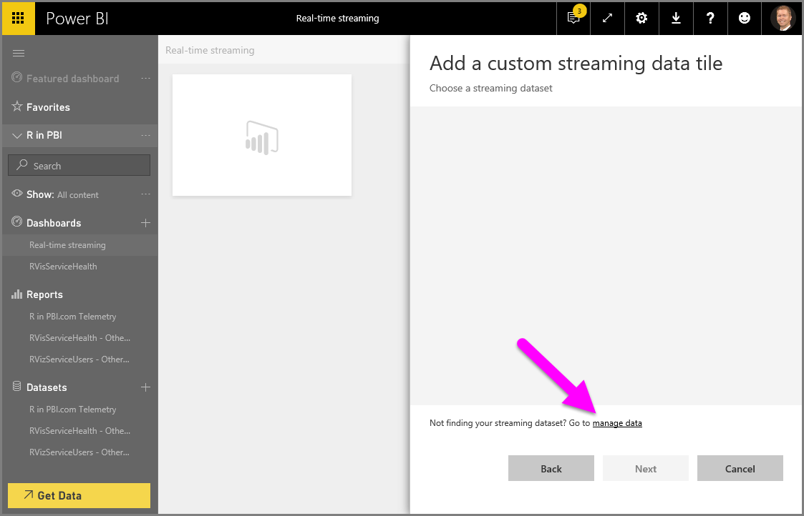
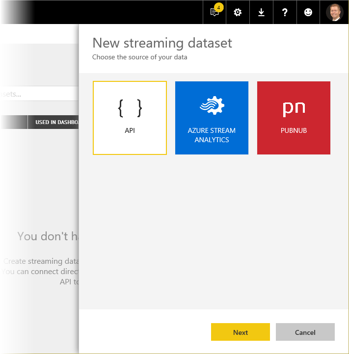
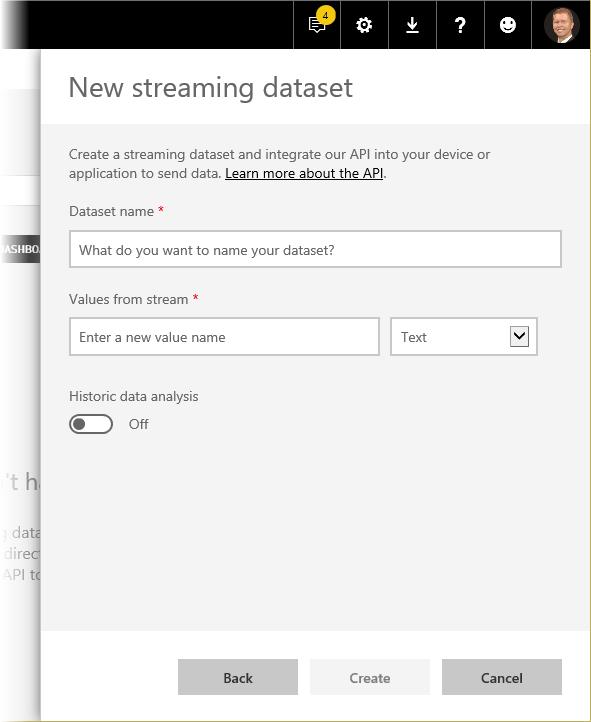

<properties
   pageTitle="Real-time streaming in Power BI (Preview)"
   description="Get real-time data streaming and visuals in Power BI"
   services="powerbi"
   documentationCenter=""
   authors="davidiseminger"
   manager="mblythe"
   backup=""
   editor=""
   tags=""
   qualityFocus="no"
   qualityDate=""/>

<tags
   ms.service="powerbi"
   ms.devlang="NA"
   ms.topic="article"
   ms.tgt_pltfrm="NA"
   ms.workload="powerbi"
   ms.date="07/26/2016"
   ms.author="davidi"/>

# Real-time streaming in Power BI (Preview)

With Power BI real-time streaming, you can stream data and update dashboards in real-time. Any visual or dashboard that can be created in Power BI can also be created to display and update real-time data and visuals. The devices and sources of streaming data can be factory sensors, social media sources, service usage metrics, and anything else from which time-sensitive data can be collected or transmitted.

## Get real-time data streaming into, and visualized by Power BI

There are three options available to implement real-time streaming in Power BI:

-   **Power BI REST API** using a real-time streaming endpoint
-   **Azure Stream Analytics**
-   **Pubnub**

These options enable you to stream data into, or *send data*, to Power BI.

On the receiving end in Power BI, using real-time streaming in Power BI requires that you set up a dataset that can *receive and display* that data. This is called a **Streaming data** dataset.

## Set up your real-time streaming dataset in Power BI

To get started with real-time streaming, you need to set up a **Streaming data** dataset in Power BI. To do this, in your dashboard (either an existing dashboard, or a new one) select **Add a tile** and then select **Custom streaming data**.

If you don't have streaming data set up yet, don't worry - you can select **manage data** and to get started.

On this page, you can input the endpoint of your streaming dataset if you already have one created (into the text box). If you don't have a streaming dataset yet, select the plus icon ( + ) in the upper right corner to see the available options to create a streaming dataset.

When you click on the **+** icon, you see the three options mentioned earlier:

## Create your streaming dataset with the option you like best

As mentioned earlier, there are three ways to create a real-time streaming dataset feed that can be consumed and visualized by Power BI. Those three ways are the following:

-   **Power BI REST API** using a real-time streaming endpoint
-   **Azure Stream Analytics**
-   **Pubnub**

Let's take a quick look at each of those options in turn.

### Using the POWER BI REST API

**Power BI REST API** - Recent improvements to the Power BI REST API are designed to make real-time streaming easier for developers. When you select **API** from the **New streaming dataset** window, you're presented with entries to provide that enable Power BI to connect to and use your endpoint:

If you want Power BI to store the data that's sent through this data stream, enable *Historic data analysis* and you'll be able to do reporting and analysis on the collected data stream. You can also [learn more about the API](https://go.microsoft.com/fwlink/?linkid=822594).

Once you successfully create your data stream, you're provided with a REST API URL endpoint, which you application can call using *POST* requests to push your data to Power BI **streaming data** dataset you created.

### Using Azure Stream Analytics

When you select the **Azure Stream Analytics** option, you see the following screen:

For more information about setting up **Azure Stream Analytics** to work with **Power BI**, take a look at [this article](https://go.microsoft.com/fwlink/?LinkID=808648).

### Using Pubnub

With the integration of **Pubnub** streaming with Power BI, you can use your low-latency **Pubnub** data streams (or create new ones) and use them in Power BI. When you select **Pubnub** and then select **Next**, you see the following window:

If you want Power BI to store the data that's sent through this data stream, enable *Historic data analysis* and you'll be able to do reporting and analysis on the collected data stream. You can also [learn more about Pubnub and Power BI](https://go.microsoft.com/fwlink/?linkid=821989).
