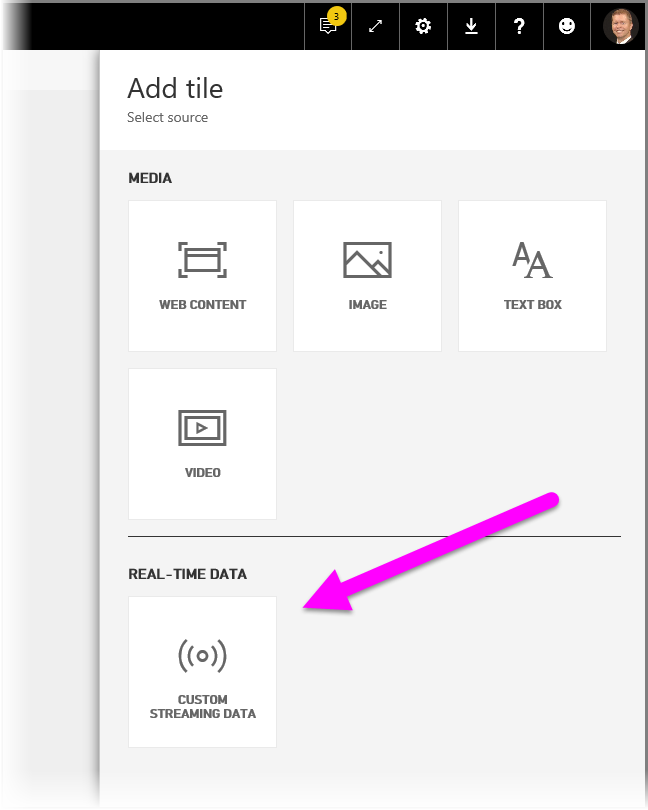
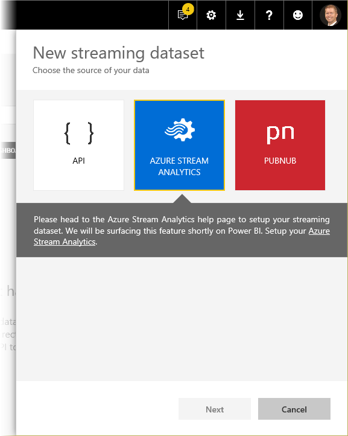

<properties
   pageTitle="Real-time streaming in Power BI (Preview)"
   description="Get real-time data streaming and visuals in Power BI"
   services="powerbi"
   documentationCenter=""
   authors="davidiseminger"
   manager="mblythe"
   backup=""
   editor=""
   tags=""
   qualityFocus="no"
   qualityDate=""/>

<tags
   ms.service="powerbi"
   ms.devlang="NA"
   ms.topic="article"
   ms.tgt_pltfrm="NA"
   ms.workload="powerbi"
   ms.date="08/02/2016"
   ms.author="davidi"/>

# Real-time streaming in Power BI (Preview)

With Power BI real-time streaming, you can stream data and update dashboards in real-time. Any visual or dashboard that can be created in Power BI can also be created to display and update real-time data and visuals. The devices and sources of streaming data can be factory sensors, social media sources, service usage metrics, and anything else from which time-sensitive data can be collected or transmitted.

## Set up your real-time streaming dataset in Power BI

To get started with real-time streaming, you need to choose one of the two ways that streaming data can be consumed in Power BI:

-   **tiles** with visuals from streaming data
-   **datasets** created from streaming data that persist in Power BI

With either option, you'll need to set up **Streaming data** in Power BI. To do this, in your dashboard (either an existing dashboard, or a new one) select **Add a tile** and then select **Custom streaming data**.

If you don't have streaming data set up yet, don't worry - you can select **manage data** to get started.

On this page, you can input the endpoint of your streaming dataset if you already have one created (into the text box). If you don't have a streaming dataset yet, select the plus icon ( **+** ) in the upper right corner to see the available options to create a streaming dataset.

When you click on the **+** icon, you see three options:

The next section describes these options, and goes into more detail about how to create a streaming **tile** or how to create a **dataset** from the streaming data source, which you can then use later to build reports.

## Create your streaming dataset with the option you like best

There are three ways to create a real-time streaming data feed that can be consumed and visualized by Power BI:

-   **Power BI REST API** using a real-time streaming endpoint
-   **Azure Stream Analytics**
-   **PubNub**

The next sections look at each option in turn.

### Using the POWER BI REST API

**Power BI REST API** - Recent improvements to the Power BI REST API are designed to make real-time streaming easier for developers. When you select **API** from the **New streaming dataset** window, you're presented with entries to provide that enable Power BI to connect to and use your endpoint:

If you want Power BI to store the data that's sent through this data stream, enable *Historic data analysis* and you'll be able to do reporting and analysis on the collected data stream. You can also [learn more about the API](https://go.microsoft.com/fwlink/?linkid=822594).

Once you successfully create your data stream, you're provided with a REST API URL endpoint, which you application can call using *POST* requests to push your data to Power BI **streaming data** dataset you created.

### Using Azure Stream Analytics (coming soon)

When you select the **Azure Stream Analytics** option, you see the following screen:

Azure Stream Analytics isn't available in this preview, but is planned for the near future. For more information about setting up **Azure Stream Analytics** to work with **Power BI**, take a look at [this article](https://go.microsoft.com/fwlink/?LinkID=808648).

### Using PubNub

With the integration of **PubNub** streaming with Power BI, you can use your low-latency **PubNub** data streams (or create new ones) and use them in Power BI. When you select **PubNub** and then select **Next**, you see the following window:

**PubNub** data streams are often high volume, and are not always suitable in their original form for storage and historical analysis. To use Power BI for historical analysis of PubNub data, you'll have to aggregate the raw PubNub stream and send it to Power BI. One way to do that is with [Azure Stream Analytics](https://azure.microsoft.com/services/stream-analytics/).
