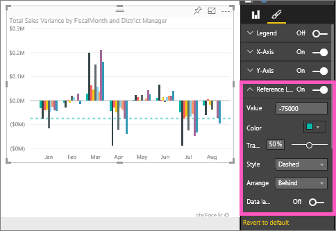

<properties
   pageTitle="Reference lines in your report"
   description="Reference lines in your report"
   services="powerbi"
   documentationCenter=""
   authors="mihart"
   manager="mblythe"
   backup=""
   editor=""
   tags=""
   qualityFocus="no"
   qualityDate=""/>

<tags
   ms.service="powerbi"
   ms.devlang="NA"
   ms.topic="article"
   ms.tgt_pltfrm="NA"
   ms.workload="powerbi"
   ms.date="03/05/2016"
   ms.author="mihart"/>

# Reference lines in your report
##  Two methods to create reference lines

Many charts are tracking performance against some goal or target, not just a comparison across categories. In these cases, plotting one or more lines that represents targets or goals is useful. These are *reference lines*.

Reference lines can be added to Line, Column, Bar, Area, Waterfall, and Scatter charts.

There are 2 ways to create references lines; one is by reference lines as you need them and the other is by using Desktop to create a reusable field in your dataset.  

## Reference lines as you need them

This example uses the Retail Analysis Sample.

 1. With your chart selected, select the paintbrush icon to open the Formatting pane.

    

 2. Expand the **Reference lines** area and move the slider to **On**.

 3. Add a reference line at -$75K by entering  **-75000** in the **Value** field.

      

## Reusable reference lines in a dataset

Use Power BI Desktop to create a new field (column) in your dataset. Then use that field over and over again in visuals based on that dataset.

 In this example you'll add a new field to the [Financial Sample](powerbi-sample-download-the-financial-sample-workbook.md).

1. Open the **financials** table.  This is where you'll create the new field (column).

2.  Select which column to use as the basis for the reference line.  In this example we'll use the reference line to show **Units Sold** above 200,000.

2. From the ribbon, select **Modeling** > **New Column**.

    

3. In the formula bar, type the following:

    **Unit Sales target = 2000**

    

    This calculated column will return the value 2000 regardless of where it is used.  **Unit Sales target** will show up in your Field list along with all the other fields from this dataset, and can be added to any visual that supports reference lines. 

4. Add the Unit Sales target to a line chart to show how any series relates to that specific reference line.    

    

##  See also
[Learn more about calculated columns](powerbi-desktop-calculated-columns.md)
