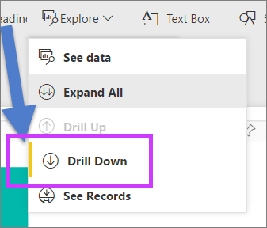
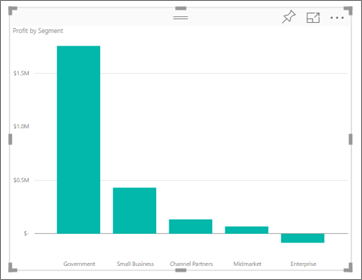
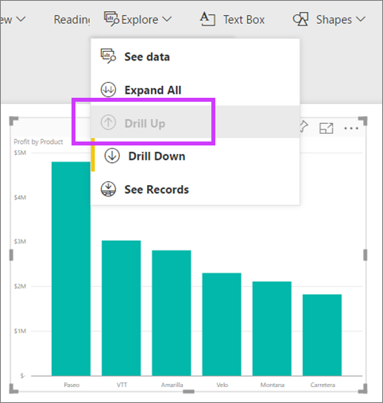
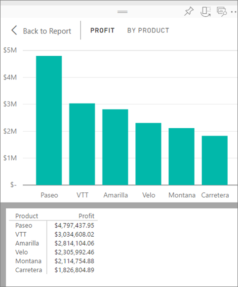

<properties
   pageTitle="reveal the data used to create the visual"
   description="This document shows how to view the data and individual records used to create a visual in Power BI."
   services="powerbi"
   documentationCenter=""
   authors="mihart"
   manager="mblythe"
   backup=""
   editor=""
   tags=""
   qualityFocus="no"
   qualityDate=""/>

<tags
   ms.service="powerbi"
   ms.devlang="NA"
   ms.topic="article"
   ms.tgt_pltfrm="NA"
   ms.workload="powerbi"
   ms.date="05/17/2016"
   ms.author="mihart"/>

# Drill down in a visualization in Power BI

  <iframe width="560" height="315" src="https://www.youtube.com/embed/MNAaHw4PxzE?list=PL1N57mwBHtN0JFoKSR0n-tBkUJHeMP2cP" frameborder="0" allowfullscreen></iframe>
  
  >**NOTE**: To learn how to create hierarchies using Power BI Desktop, watch the video [How to create and add hierarchies](https://youtu.be/q8WDUAiTGeU)

1.  In Power BI, open a report in [Reading View](powerbi-service-open-a-report-in-reading-view.md) or [Editing View](powerbi-service-go-from-reading-view-to-editing-view.md). Drill requires a visualization with a hierarchy. 

    A hierarchy is from the Financial sample is shown below.  The *Profit by Product *visualization has a hierarchy made up of **Product **and **Segment**; each product has one or more segments. By default, the visualization displays only the product data, because *Product *appears in the Axis bucket above *Segment*.
    
    

2.  To enable drill down, select **Explore** > **Drill Down**. The yellow bar next to **Drill Down** let's you know it's enabled.  

    

3.  Once enabled, drill down one field at a time by double-clicking one of the chart bars. In this example, I've double-clicked the product named **Velo** to see profit for Velo by Segment.

    

4.  To drill down all fields at once, select **Expand all**. 

    

5.  To drill back up, select **Drill Up**.

    
    
6.  To see the data being used to create the visual, select **See data**. The data is displayed in a pane below the visual. This pane remains as you continue drilling through the visual. 

    

### See also
[See the data and records used to create the visual](powerbi-service-reports-see-data.md)

[Visualizations in Power BI reports](powerbi-service-visualizations-for-reports.md)

[Power BI reports](powerbi-service-reports.md)

[Power BI - Basic Concepts](powerbi-service-basic-concepts.md)
