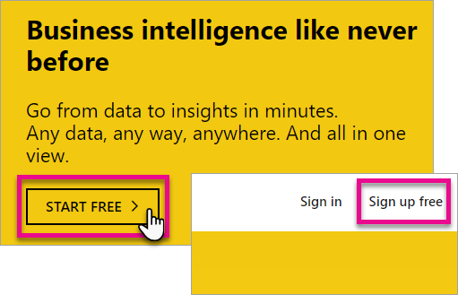
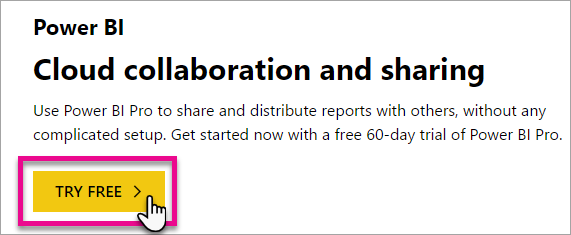
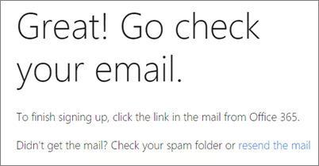
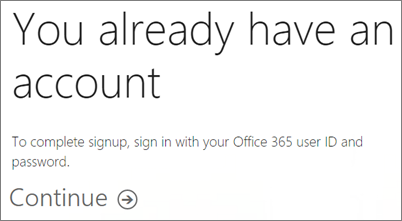

<properties
   pageTitle="Self-Service Sign up for Power BI"
   description="Self-Service Sign up for Power BI. This looks at how an individual can sign up for Power BI (free), a trial or purchase Power BI Pro."
   services="powerbi"
   documentationCenter=""
   authors="guyinacube"
   manager="mblythe"
   editor=""
   tags=""
   qualityFocus="no"
   qualityDate=""/>

<tags
   ms.service="powerbi"
   ms.devlang="NA"
   ms.topic="article"
   ms.tgt_pltfrm="NA"
   ms.workload="powerbi"
   ms.date="03/09/2016"
   ms.author="asaxton"/>
# Self-service sign up for Power BI

Signing up for Power BI, as an individual, is easy! You can choose to use a free account, a Pro trial account, or purchase Power BI Pro, even if you are in an existing organization. Once you have determined which you would like to use, this article will walk you through the steps to get up and running.

> **Note:** If you are in an organization, individual sign up may be disabled. See [#individual-sign-up-has-been-turned-off] for more information if you get an error indicating it has been turned off.

## What email address can be used with Power BI?

Power BI requires that you use a work, or school, email address to sign up. Power BI does not support email addresses provided by consumer email services or telecommunication providers. This includes outlook.com, hotmail.com, gmail.com and others.

If you try to sign up with a personal email address, you will get a message indicating to use a work or school email address.

> **Note:** Government (.gov) and military (.mil) email addresses are not allowed at this time.

## Signing up for Power BI (free) as an individual

The quickest way to sign up for Power BI is to sign up for a Power BI (free) account. There is no cost to this account, and it allows you to use many of the features available in the service. [Learn more](https://powerbi.microsoft.com/pricing/)

To sign up for Power BI, you can do the following.

1.	Browse to powerbi.com.

2.	Select **Get started free**.

    

    Or you can go to **Products** > **Pricing** and select **Sign up**.
    
    

3.	In the dialog to choose how to get started, select **Sign up** under Power BI.

    

4.	Enter the email address you are signing up with, and then select **Sign up**. Be sure your email address is allowed for sign up. [Learn more](#what-email-address-can-be-used-with-power-bi)

    

5.	If your account does not exist within an organization, you will get a message indicating to check your email.

    

    If your account is part of an existing organization, you will get a message asking you to sign in with that account. Select **Continue** and sign in with your Office 365 login.

    

6.	If you received an email, select the link within the email to verify your email address. This will bring you back into the sign up flow. You may need to supply some additional information about yourself.
7.	If you have an existing Office 365 account, you will see a message asking you to select **Start**.

    
    
8.	You will then be taken to https://app.powerbi.com and you can begin using Power BI as a free user.

### What this looks like within the service

When you are in the service, you can verify that you have a free account by going to the **gear** icon and selecting **Manage personal storage**.

 
## Power BI Pro 60 day trial

After you have signed up for your free account, you can optionally choose to try Pro for free. You will have access to all of the Pro features for the duration of the trial. [Learn more](powerbi-free-trial-for-power-bi-pro.md)

You will get an option to try Pro for free whenever you try to use a Pro feature. You can also choose to make use of it by going to the gear icon and selecting **Manage personal storage**. Then select **Try Pro for free** on the right.

 
Then you can select **Start trial**.

 
### What this looks like within the service

When you are in the service, you can verify that you have a Pro trial account by going to the **gear* icon and selecting **Manage personal storage**.

## Purchasing Power BI Pro as an individual

You can purchase Power BI Pro from the start, or can choose to upgrade to Pro after your free trial has ended. If your account is part of an organization, you can purchase Power BI Pro as an individual if your organization has not disabled individual purchases.

To purchase Power BI Pro as an individual, you can do the following.

1.	Browse to [powerbi.com](https://www.powerbi.com).

2.	Select **Products** > **Pricing**.

3.	Select **Purchase**.

    

4.	Answer the questions that are presented to guide the purchase. As an individual, there will be an option to select **Myself**. 

    

    > **Note**: If you are interested in the option to purchase for your team or organization, you can read about purchasing Power BI Pro for your organization. [Learn more](powerbi-admin-purchasing-power-bi-pro.md)

5.	If you aren’t already signed into Power BI, you will need to sign in with your Power BI (free) account.

6.	You will need to provide information to make the purchase.

### What this looks like within the service

When you are in the service, you can verify that you have a Pro account by going to the **gear** icon and selecting **Manage personal storage**.

## Individual Sign up has been turned off

When trying to sign up for Power BI, you may encounter the following message.

    Your IT department has turned off signup for Microsoft Power BI.
 

This could be because your organization has disabled individual sign ups. It could also be because you purchased Office 365 through a partner. [Learn more](powerbi-admin-syndication-partner.md).

If your organization has disabled individual sign ups, you will need to work with your IT group to get a Power BI license assigned to your account in order to continue.

## Troubleshooting

In many cases, registering for Power BI can be achieved by following the simple self-service signup process listed above. However, there are several reasons why you may not be able to complete self-service signup.  The table below summarizes some of the most common reasons you may not be able to complete signup and ways you can workaround these issues.

| **Symptom / Error Message** | **Cause and Workaround** |
|---|---|
| **Personal email addresses (e.g. nancy@gmail.com)** You receive a message like the following during signup:    *You entered a personal email address: Please enter your work email address so we can securely store your company's data.*    or    *That looks like a personal email address. Enter your work address so we can connect you with others in your company. And don’t worry. We won’t share your address with anyone.* | Power BI does not support email addresses provided by consumer email services or telecommunications providers.    To complete signup, try again using an email address assigned by your work or school.    If you still can't sign up and are willing to complete a more advanced setup process, you can [register for a new Office 365 trial subscription and use that email address to sign up](powerbi-admin-signing-up-for-power-bi-with-a-new-office-365-trial.md). |
| **.gov or .mil email addresses** You receive a message like the following during signup:    *Power BI unavailable: Power BI is not available for users with .gov or .mil email addresses at this time. Use another work email address or check back later.*    or    *We can't finish signing you up. It looks like Microsoft Power BI isn't currently available for your work or school.* | Power BI does not support .gov or .mil addresses at this time. |
| **Self-service signup disabled** You receive a message like the following during signup:    *We can't finish signing you up. Your IT department has turned off signup for Microsoft Power BI. Contact them to complete signup.*    or    *That looks like a personal email address. Enter your work address so we can connect you with others in your company. And don’t worry. We won’t share your address with anyone.* | Your organization’s IT administrator has disabled self-service signup for Power BI.    To complete signup, contact your IT administrator and ask them to follow the instructions on the page below to allow existing users to sign up for Power BI and to allow new users to join your existing tenant.    You may also experience this problem if you signed up for Office 365 through a partner. [Learn more](powerbi-admin-syndication-partner.md)    [Power BI in Your Organization](https://support.office.com/en-ca/article/Power-BI-in-your-Organization-d7941332-8aec-4e5e-87e8-92073ce73dc5#BKMK_HowCanIAllowO365Tenant) |
| **Email address is not an Office 365 ID** You receive a message like the following during signup:    *We can't find you at contoso.com.  Do you use a different ID at work or school?    Try signing in with that, and if it doesn't work, contact your IT department.* | Your organization uses IDs to sign in to Office 365 and other Microsoft services that are different than your email address.  For example, your email address might be Nancy.Smith@contoso.com but your ID is nancys@contoso.com.    To complete signup, use the ID that your organization has assigned to for signing in to Office 365 or other Microsoft services.  If you don't know what this is, contact your IT administrator.    If you still can't sign up and are able to complete a more advanced setup process, you can [register for a new Office 365 trial subscription and use that email address to sign up](powerbi-admin-signing-up-for-power-bi-with-a-new-office-365-trial.md). |

## See also

[Unable to add Power BI to Office 365 partner subscription](powerbi-admin-syndication-partner.md)