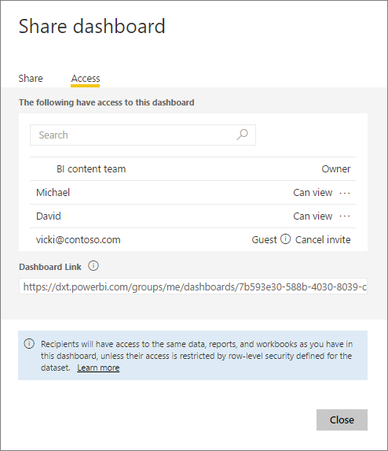

<properties
   pageTitle="Share reports with coworkers and others"
   description="How to share Power BI reports with colleagues in and out of your organization, and what you need to know about sharing."
   services="powerbi"
   documentationCenter=""
   authors="maggiesMSFT"
   manager="erikre"
   backup="ajayan"
   editor=""
   tags=""
   featuredVideoId="0tUwn8DHo3s"
   qualityFocus="complete"
   qualityDate="06/22/2016"/>

<tags
   ms.service="powerbi"
   ms.devlang="NA"
   ms.topic="article"
   ms.tgt_pltfrm="NA"
   ms.workload="powerbi"
   ms.date="08/11/2017"
   ms.author="maggies"/>

# Share reports with coworkers and others

*Sharing* is a good way to give a few people access to your dashboards and reports. Power BI offers [several ways to collaborate and distribute your reports](powerbi-service-how-should-i-share-my-dashboard.md), and sharing is just one.

With sharing, whether you share content inside or outside your organization, you and your recipients need a [Power BI Pro license](powerbi-premium.md#free-vs-pro-tiers). Also, the Power BI team is always interested in your feedback, so go to the [Power BI Community site](https://community.powerbi.com/) to make suggestions.

You can share a report from your own My Workspace, or from an app workspace. When you share a report, those you share it with can view it and interact with it, but can't edit it. They see the same data that you see in the dashboard and reports, unless row-level security (RLS) is applied. 

## Sharing just a report

To share just a report with people, first you need to [share a dashboard](powerbi-service-share-unshare-dashboard.md) with tiles that link to that report with them. You don't need to send them mail about sharing the dashboard. That gives them permission to see the underlying report. After you've shared the dashboard with them, you can just share the report. 

We've seen that when you share a dashboard , those reports are also shared at the same time. But what if you want to share just the report? Just send the report page URL to your colleagues. As long as they have Power BI Pro licenses, are members of the same distribution group, in the same email domain as you, or have at least one dashboard that links to that same report (the dashboard has tiles that were pinned from that report), they'll be able to open the report.

## Share a filtered version of a report
What if you want to share a filtered version of a report? Maybe a report that only shows data for a specific city or salesperson or year. This can be done by creating a custom URL.

1.   Open the report in [Editing view](powerbi-service-go-from-reading-view-to-editing-view.md), apply the filter, and save the report. 

    In this example we're filtering the [Retail Analysis sample](powerbi-sample-tutorial-connect-to-the-samples.md) to only show values where **Territory** equals **NC**.

    

2.  Add the following to the end of the report page URL:

    ?filter=*tablename*/*fieldname* eq *value*

    In our example, the name of the table is **Store**, the name of the field is **Territory**, and the value we want to filter on is **NC**:

     ?filter=Store/Territory eq NC

    

    Your browser adds special characters to represent slashes and spaces, so you end up with:

    app.powerbi.com/groups/me/reports/010ae9ad-a9ab-4904-a7a1-10a61f70f2f5/ReportSection2?filter=Store%252FTerritory%20eq%20NC

    >[AZURE.NOTE]The field must be of type **string** and neither the *tablename* or *fieldname* can contain spaces.

3.  Send this URL to your colleagues. When they click the link, Power BI will open a read-only version of the filtered report.

## Resharing

Resharing allows your coworkers to forward the email invitation to others in your organization (the invitation expires after one month). Coworkers can also reshare through the Power BI service and mobile apps. As the owner of the dashboard, you can turn off resharing and you can also revoke resharing on an individual basis (see below).

People outside your organization can't reshare.

## Unshare a dashboard

1.  Open the dashboard and select **Share** .

2.  Select **Access** to see the complete list of people.

    

3.  Select the ellipsis (**...**) next to **Can view** and select:

    

    -   **Stop sharing** with that person or

    -   **Disable reshares** to keep that person from sharing with anyone else.

    -   Or if the person hasn't yet accepted your share invitation, **Cancel Invite**.

## Turn off resharing

Only the dashboard owner can turn resharing on and off.

-   If you haven't sent the sharing invitation yet, clear the **Allow recipients to share your dashboard** check box at the bottom of the invitation.

-   If coworkers haven't accepted your sharing invitation yet, cancel the invitation and invite them again without selecting **Allow recipients to share your dashboard**.

-   If they have accepted your sharing invitation, select **Access**, select the ellipsis (**...**) next to **Can view** and click **Disable reshares**.

    

## Next steps

- Have feedback? Go to the [Power BI Community site](https://community.powerbi.com/) with your suggestions.
- [How should I collaborate on and share dashboards and reports?](powerbi-service-how-should-i-share-my-dashboard.md)
- [Share a dashboard that links to an Excel file](powerbi-service-share-dashboard-that-links-to-excel.md)
- More questions? [Try the Power BI Community](http://community.powerbi.com/).
