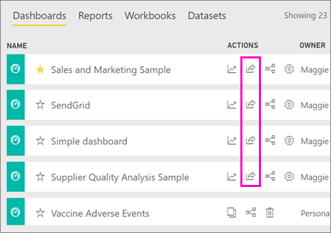
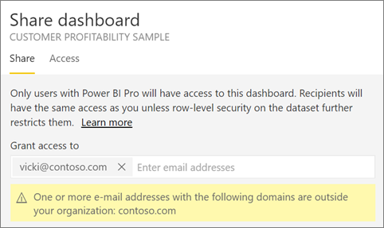
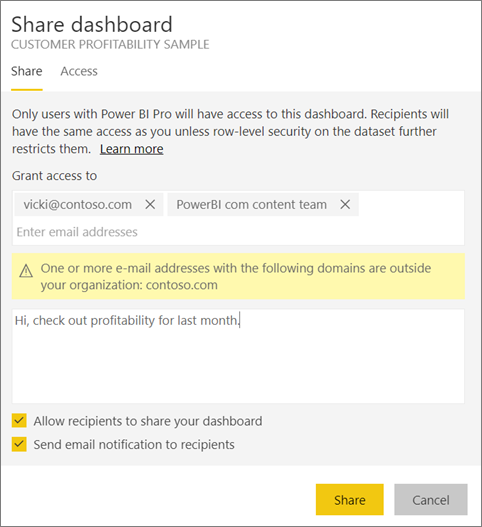
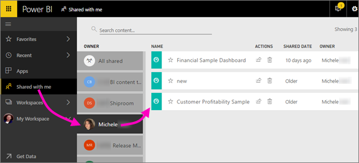
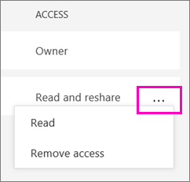

<properties
   pageTitle="Share dashboards with coworkers and others"
   description="How to share Power BI dashboards with colleagues in and out of your organization, and what you need to know about sharing."
   services="powerbi"
   documentationCenter=""
   authors="maggiesMSFT"
   manager="erikre"
   backup="ajayan"
   editor=""
   tags=""
   featuredVideoId="0tUwn8DHo3s"
   qualityFocus="monitoring"
   qualityDate="08/14/2017"/>

<tags
   ms.service="powerbi"
   ms.devlang="NA"
   ms.topic="article"
   ms.tgt_pltfrm="NA"
   ms.workload="powerbi"
   ms.date="08/14/2017"
   ms.author="maggies"/>

# Share dashboards with coworkers and others

*Sharing* is a good way to give a few people access to your dashboards and reports. Power BI offers [several ways to collaborate and distribute your dashboards](powerbi-service-how-should-i-share-my-dashboard.md), and sharing is just one.

With sharing, whether you share content inside or outside your organization, you and your recipients need a [Power BI Pro license](powerbi-premium.md#free-vs-pro-tiers). Suggestions? The Power BI team is always interested in your feedback, so go to the [Power BI Community site](https://community.powerbi.com/).

You can share a dashboard from your own My Workspace, or from an app workspace. When you share a dashboard, those you share it with can view it and interact with it, but can't edit it. They see the same data that you see in the dashboard and reports, unless [row-level security (RLS)](powerbi-admin-rls.md) is applied. The coworkers you share it with can share the dashboard with their coworkers, if you allow them to. The people outside your organization can view and interact with the dashboard too, but can't share it. 

You can also [share a dashboard from any of the Power BI mobile apps](powerbi-mobile-share-a-dashboard-from-the-iphone-app.md). You can share dashboards from the Power BI service and the Power BI mobile apps, but not from Power BI Desktop.

## Video: Share a dashboard
Watch Amanda share her dashboard with colleagues inside and outside her company. Then follow the step-by-step instructions below the video to try it out yourself.

<iframe width="560" height="315" src="https://www.youtube.com/embed/0tUwn8DHo3s?list=PL1N57mwBHtN0JFoKSR0n-tBkUJHeMP2cP" frameborder="0" allowfullscreen></iframe>

## Share a dashboard

1.   In your My Workspace or in an app workspace, open a dashboard and select **Share** .

2.  In the top box, enter the full email addresses for individuals, Office 365 groups, distribution groups, or security groups. You can't share with dynamic distribution lists. 

    You can share with people whose addresses are outside your organization, but you'll see a warning.

      

2. Add a message if you want. It's optional.

3.  To let your coworkers share your dashboard with others, check **Allow recipients to share your dashboard**.

    Allowing others to share is called *resharing*. If you let them, they can reshare from the Power BI service and the mobile apps, or forward the email invitation to others in your organization. The invitation expires after one month. People outside your organization can't reshare. As the owner of the dashboard, you can turn off resharing, or revoke resharing on an individual basis See [Stop sharing a dashboard or stop others from sharing](powerbi-service-share-unshare-dashboard.md#stop-sharing-a-dashboard-or-stop-others-from-sharing), below.

4.  Select **Share.**

      

	Power BI sends an email invitation with a link to the shared dashboard, and you see a **Success** notification. 

    When recipients in your organization click the link, Power BI adds the dashboard to their **Shared with me** list page. They can select your name to see all the dashboards you've shared. 

    

    When recipients outside your organization click the link, they see the dashboard, but not in the usual Power BI portal. See [Share a dashboard with people outside your organization](powerbi-service-share-unshare-dashboard.md#share-a-dashboard-with-people-outside-your-organization) below for details.

## Who has access to a dashboard I shared?

Sometimes you need to see the people you've shared a dashboard with, and see who they've shared it with.

1. In the list of dashboards or in the dashboard itself, select **Share** . 
2. In the **Share dashboard** dialog box, select **Access**.

    

    People outside your organization are listed as **Guest**.

## Stop sharing a dashboard or stop others from sharing

Only the dashboard owner can turn resharing on and off.

### If you haven't sent the sharing invitation yet

-  Clear the **Allow recipients to share your dashboard** check box at the bottom of the invitation before you send it.

### If you've already shared the dashboard

1. In the list of dashboards or in the dashboard itself, select **Share** . 
2. In the **Share dashboard** dialog box, select **Access**.

    

3.  Select the ellipsis (**...**) next to **Read and reshare** and select:

    

    -   **Read** to keep that person from sharing with anyone else.

    -   **Remove access** to keep that person from seeing the dashboard at all.

## Share a dashboard with people outside your organization

When you share with people outside your organization, they get an email with a link to the shared dashboard, and they have to sign in to Power BI to see the dashboard. If they don't have a Power BI Pro license, they can sign up for one after clicking the link.

After they sign in, they see the shared dashboard in its own browser window without the left navigation pane, not in their usual Power BI portal. They have to bookmark the link to access this dashboard in the future.

They can't edit any content in this dashboard or report. They can interact with the charts in the report (cross-highlight) and change any filters/slicers available on the reports connected to the dashboard, but can't save their changes.

Only your direct recipients can see the shared dashboard. For example, if you sent the email to Vicki@contoso.com, only Vicki can see the dashboard. No-one else can see that dashboard, even if they have the link, and Vicki has to use the same email address to access that dashboard. If she signs up with any other email address, she won't have access to the dashboard either.

People outside your organization can't see any data at all if role- or row-level security is implemented on on-premises Analysis Services tabular models.

If you send a link from a Power BI mobile app to people outside your organization, when they click the link the dashboard opens in a browser, not in the Power BI mobile app.

## Limitations and considerations

Things to keep in mind about sharing dashboards:

-   In general, you and your colleagues see the same data in the dashboard. Thus, if you have permissions to see more data than they do, they'll be able to see all your data in your dashboard. However, if [row-level security (RLS)](powerbi-admin-rls.md) is applied to the dataset underlying a dashboard, then the credentials of every person are used to determine which data they can access.

-   Everyone you share your dashboard with can see it and interact with your reports in [Reading View](powerbi-service-open-a-report-in-reading-view.md). They can't create reports or save changes to existing reports.

-   No-one can see or download the dataset.

-   Everyone can manually [refresh the dashboard data](powerbi-refresh-data.md).

-   If you use Office 365 for email, you can share with members of a distribution group by entering the email address associated with the distribution group.

-   Coworkers who have the same email domain as you, and coworkers whose domain is different but registered within the same tenant, can share the dashboard with others. For example, say the domains contoso.com and contoso2.com are registered in the same tenant. If your email address is konrads@contoso.com, then both ravali@contoso.com and gustav@contoso2.com can share, as long as you gave them permission to share.

- If your coworkers already have access to a specific dashboard, you can send a direct link to that dashboard just by copying the URL when you're on the dashboard. For example:   

    https://powerbi.com/dashboards/g12466b5-a452-4e55-8634-xxxxxxxxxxxx

- Likewise if your coworkers already have access to a specific dashboard, you can [send a direct link to the underlying report](powerbi-service-share-report.md). 

## Next steps

- Have feedback? Go to the [Power BI Community site](https://community.powerbi.com/) with your suggestions.
- [How should I collaborate on and share dashboards and reports?](powerbi-service-how-should-i-share-my-dashboard.md)
- [Share a report](powerbi-service-share-report.md)
- Questions? [Try the Power BI Community](http://community.powerbi.com/).
