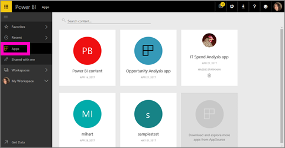

<properties
   pageTitle="The new Power BI navigation experience"
   description="Overview of the new Power BI navigation experience"
   services="powerbi"
   documentationCenter=""
   authors="mihart"
   manager="erikre"
   backup=""
   editor=""
   tags=""
   qualityFocus="no"
   qualityDate=""/>

<tags
   ms.service="powerbi"
   ms.devlang="NA"
   ms.topic="article"
   ms.tgt_pltfrm="NA"
   ms.workload="powerbi"
   ms.date="05/02/2017"
   ms.author="mihart"/>

# The new Power BI navigation experience

####    May 2017

We've redesigned the navigation experience to make it easier for you to find and navigate your Power BI content.  

-  streamlined the lists for dashboards, reports, workbooks, and datasets

- added quick access flyout menus for favorites, most-recent, and workspace selection

- added a way to identify related content for dashboards, reports, and datasets

-  added a separate content area for workbooks

-  created a separate area for your favorite dashboards

-  created a separate area for content that has been shared with you

-  created a separate area for your most-recent content

-   reduced the number of clicks required to accomplish tasks -- combined the lists of content, and the actions you can take on that content, on the same screen. For example, switching between dashboards and reports.

##  Content View

Let's start by looking at how the basic content (dashboards, reports, datasets, workbooks) is organized. Before this, all of your content was listed in the left navigation pane. Now, you still have that option, but the default is to display by content type within the context of a workspace. Select a workspace from the left navigation pane (left nav) and the tabs for the associated content (dashboards, reports, workbooks, datasets) fill the Power BI canvas to the right.

>**NOTE**: If you have Power BI Basic, you'll only see one workspace -- **My Workspace**.

##  Favorite dashboards

**Favorites** lets you quickly access those dashboards that are most important to you.  

1.  With the dashboard open, select **Favorite** from the top-right corner.

    

    **Favorite** changes to **Unfavorite** and the star icon becomes yellow.

    

2. To display a list of all the dashboards that you have added as favorites, in the left navpane, select the arrow to the right of **Favorites**. The advantage of this is that you can display this list from just about any page in Power BI service.

    

    From here you can select a dashboard to open it.

2.  To open the **Favorites** pane, in the left nav, select **Favorites** or select the Favorites icon .

    

    From here you can select a dashboard to open it, see who owns a dashboard, unfavorite a dashboard, or share a dashboard with colleagues.

3.  Another way to mark a dashboard as a favorite is from the **Dashboards** tab.  Just open the workspace that contains the dashboard, and select the star icon to the left of the dashboard name.

    

>**TIP**  To learn more, see [Favorite a dashboard](powerbi-service-favorite-dashboards.md)

##  Recents
Quickly get to the reports and dashboards that you’ve most recently accessed by visiting the **Recents** pane. This includes content from across all of your workspaces.

  

Similar to Favorites, you can quickly access your recents from anywhere by selecting the arrow next to **Recents**.

  

>**TIP**  To learn more, see [Recents in Power BI](powerbi-service-recents.md)

##  Apps

Apps are collections of dashboards and reports purpose-built by your organization to deliver key metrics for faster and easier data-driven decisions.

>**TIP**: To learn more, see **App workspaces** (below) and [What are Power BI apps](powerbi-service-what-are-apps.md).

##  Shared with me
**Shared with me** is the location for all dashboards that colleagues have shared with you.  You can filter by the owner of the dashboard or search to find what’s relevant. You can also sort the items by the date it was shared with you.  And for shared content you visit frequently, it's even easier to favorite it right from the **Shared with me** view.

>**TIP**  To learn more, see [Shared with me](powerbi-service-shared-with-me.md)

## Working with workspaces

Next in the left nav is *workspaces*. Workspaces can be thought of as *containers* used by people authoring Apps and creating dashboards and reports and other Power BI content. There are two types of workspaces: **My Workspace** and App workspaces.

>**NOTE**: If you are not a member or an admin, you may not see any app workspaces in your left nav.

### My Workspace
**My Workspace** stores all the content that you own. Think of it as your personal sandbox or work area for your own content. You can share content from My Workspace with colleagues. Within My Workspace, your content is organized into 4 tabs: Dashboards, Reports, Workbooks, and Datasets.

>**TIP**  To learn more, see [My Workspace](powerbi-service-workspaces.md)

### App workspaces
Apps and app workspaces are a feature of Power BI Pro. If you are someone who authors dashboards and reports for others, you'll use app workspaces to do this. An app workspace is the place where you'll create the app, so to create an app, you'll first need to create the app workspace. They’re the evolution of group workspaces – staging areas and containers for the content in the app.  You and your colleagues can collaborate on dashboards, reports, and other content that you plan to distribute to a wider audience, or even your entire organization.

>**TIP**: To learn more, visit [Create and distribute an a pp in Power BI](powerbi-service-create-apps#app-workspaces.md).

As with **My Workspace**, your content is organized into 4 tabs: Dashboards, Reports, Workbooks, and Datasets.

Switch workspaces by selecting **Workspaces** in the left nav.

##  Search and sort content
The new content view makes it easier to search, filter and sort your content. To search for a dashboard, report or workbook, type in the search area. Power BI filters to only the content that has your search string as part of the name.

You can also sort the content by name or owner.  

>**TIP**  To learn more, see [Power BI navigation: search, sort, filter](powerbi-service-navigation-search-filter-sort.md)

Have questions or feedback? [Visit the Power BI community forum](http://community.powerbi.com/t5/Navigation-Preview-Forum/bd-p/NavigationPreview)
