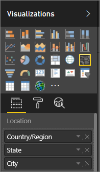

<properties
   pageTitle="Tips and Tricks for Power BI Map visualizations"
   description="Tips and Tricks for Power BI Map visualizations"
   services="powerbi"
   documentationCenter=""
   authors="mihart"
   manager="erikre"
   backup=""
   editor=""
   tags=""
   featuredVideoId="ajTPGNpthcg"
   qualityFocus="monitoring"
   qualityDate=""/>

<tags
   ms.service="powerbi"
   ms.devlang="NA"
   ms.topic="article"
   ms.tgt_pltfrm="NA"
   ms.workload="powerbi"
   ms.date="06/21/2017"
   ms.author="mihart"/>

# Tips and Tricks for Power BI Map visualizations

Power BI integrates with Bing to provide default map coordinates (a process called geo-coding) so you can create maps. Bing uses some algorithms and hints to retrieve the right locations. It first looks for data that has been categorized as a type of geo data and if none exists, it then uses column names to make a best guess.  

To increase the likelihood of correct geo-coding, use the following tips. The first set of tips is for you to use if you have access to the dataset itself. And the second set of tips is things you can do in Power BI if you don't have access to the dataset.

##  In the dataset: tips to improve the underlying dataset

If you have access to the dataset that is being used to create the map visualization, there are a few things you can do to increase the likelihood of correct geo-coding.

**1. Categorize geographic fields in Power BI Desktop**

In Power BI Desktop, you can ensure fields are correctly geo-coded by setting the *Data Category* on the data fields. Select the desired table, go to the **Advanced** ribbon and then set the **Data Category** to **Address**, **City**, **Continent**, **Country/Region**, **Country**, **Postal Code**, **State** or **Province**. These data categories help Bing correctly encode the date. To learn more, see [Data categorization in Power BI Desktop](powerbi-desktop-data-categorization.md).

**2. Use more than one location column.**    
 Sometimes, even setting the data categories for mapping isn't enough for Bing to correctly guess your intent. Some designations are ambiguous because the location exists in multiple countries or regions. For example, there's a ***Southampton*** in England, Pennsylvania, and New York.

Power BI uses Bing's [unstructured URL template service](https://msdn.microsoft.com/library/ff701714.aspx) to get the latitude and longitude coordinates based on a set of address values for any country. If your data doesn't contain enough location data, add those columns and categorize them appropriately.

 If you only have a City column, for example, Bing may have a hard time geo-coding. Add additional geo columns to make the location unambiguous.  Sometimes all it takes is adding one more location column to the dataset - in this case state/province. And don't forget to categorize it properly, see #1 above.

**3. Use specific Latitude and Longitude**

Add latitude and longitude values to your dataset. This removes any ambiguity and returns results more quickly. Latitude and Longitude fields must be in *Decimal Number* format, which you can set in the data model.

<iframe width="560" height="315" src="https://www.youtube.com/embed/ajTPGNpthcg" frameborder="0" allowfullscreen></iframe>

## Use geo-hierarchies and your colleagues can then drill to different "levels" of location

Create a hierarchy by dragging more than one geo field into the **Location** bucket. Used together in this way, the fields become a geo-hierarchy. In the example below we have added geo fields for: Country/Region, State, and City. In Power BI you and your colleagues can drill up and down using this geo-hierarchy. 

##  In Power BI: tips to get better results when using map visualizations

**1.    Use latitude and longitude fields (if they exist)**

In Power BI, if the dataset you are using has fields for longitude and latitude -- use them!  Power BI has special buckets to help make the map data unambiguous. Just drag the field that contains your latitude data into the **Visualizations > Latitude** area.  And do the same for your longitude data. When you do this, you also need to fill the *Location* field when creating your visualizations. Otherwise, the data is aggregated by default, so for example, the latitude and longitude would be paired at the state level, not the city level.

 

## See also

[Power Bi visualizations](powerbi-service-visualizations-for-reports.md)

More questions? [Try the Power BI Community](http://community.powerbi.com/)
