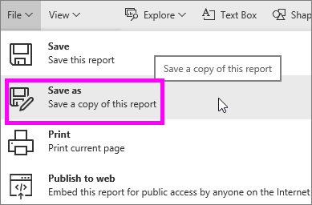

<properties
   pageTitle="Tutorial: Change the display settings for a page in a Power BI report"
   description="Tutorial: Change the display settings for a page in a Power BI report"
   services="powerbi"
   documentationCenter=""
   authors="mihart"
   manager="mblythe"
   backup=""
   editor=""
   tags=""
   qualityFocus="modifying"
   qualityDate=""/>

<tags
   ms.service="powerbi"
   ms.devlang="NA"
   ms.topic="article"
   ms.tgt_pltfrm="NA"
   ms.workload="powerbi"
   ms.date="08/15/2016"
   ms.author="mihart"/>

# Tutorial: Change the display settings for a page in a Power BI report

In the [previous article and video](powerbi-service-change-report-display-settings.md) you learned about two different ways to control page display in Power BI reports: **View** and **Page Size**. Now let's try it ourselves.

## First, let's change the page View setting

1.  Open a report in Editing View. This example uses the "New Stores" page of the [Retail Analysis sample](powerbi-sample-retail-analysis-take-a-tour.md).  By default, pages display using the **Fit to Page** setting.  In this case, Fit to Page displays the report page without scrollbars, but some of the detail and titles are too small to read.

    

2.  Make sure that no visualizations are selected on the canvas. Select **View** and review the display options.

    

3.  Let's see how the page looks using the **Actual size** setting.

    

    Not great, the dashboard now has double scrollbars.

4.  Switch to **Fit to Width**.

    

   Looks better, we now have scrollbars but it's easier to read the detail.

## Change the default view for a report page

All Power BI reports default to **Fit to page** view. But what if you want this report page to always open in **Actual size** view?

1.  On the **New stores** page of the report, switch back to **Actual size** view.

    

2.  Save the report with a different name by selecting **File > Save as**. You now have 2 copies of this report; in the original report, **New stores** will continue to open in the default view but in the new report it will open in **Actual size** view. Let's go see.

    

3.  Return to the **Retail Analysis Sample** dashboard by selecting it in the navigation pane. Scroll down to the **Reports** section and find the new report (it will have a yellow asterisk).  

    

4.  Select the report to open it and choose the **New stores** page. It opens in **Actual size** view!

    

## Now, let's explore the *page size* setting

1.  Open the "District monthly sales" page of the [Retail Analysis sample](powerbi-sample-retail-analysis-take-a-tour.md) in Editing View.

2.  Make sure that no visualizations are selected on the canvas.  In the **Visualizations** pane, select the paintbrush icon .

3.  Select **Page Size** &gt; **Type** to display the page size options.

    

4.  Select **Letter**.  On the canvas, only the contents that fit within 816 x 1056 pixels (Letter size) remain on the white portion of the canvas.

    

5.  If we change **View** to "Fit to Width," our canvas now displays only the page contents that fit into the letter size.

    

6.  Select **16:9** page ratio.

    

    The report page displays using a ratio of 16 wide by 9 high. To see the actual pixel size being used, take a look at the greyed out Width and Height fields (1280x720). There is a lot of empty space around the report canvas; this is because we previously set **View** to "Fit to width".

7.  Continue exploring the **Page Size** options.

## Using page View and Page Size together

Use page View and Page Size together to create a report that looks its best when embedded in another application.

In this exercise, you'll create a report page that will display in an application that has space for 500 pixels wide by 750 pixels high.

Remember in the previous step we saw that our report page is currently displaying at 1280 wide by 720 high. So we know that we'll need to do a lot of resizing and rearranging if we want all of our visuals to fit.

1. Resize and move the visuals so that they fit in less than half of the current canvas area.

    

2. Select **Page Size** &gt; **Custom**.

3. Set Width to 500 and set Height to 750.

    

4. Tweak the report page so that it looks its best. Switch between **View > Actual size** and **View > Fit to page** to make adjustments.

    

## See also
[Create reports for Cortana](powerbi-service-cortana-desktop-entity-cards.md)
Back to [Page display settings in a Power BI report](powerbi-service-change-report-display-settings.md)
Read more about  [reports in Power B ](powerbi-service-reports.md)
[Power BI - Basic Concepts](powerbi-service-basic-concepts.md)
More questions? [Try the Power BI Community](http://community.powerbi.com/)
