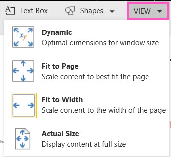
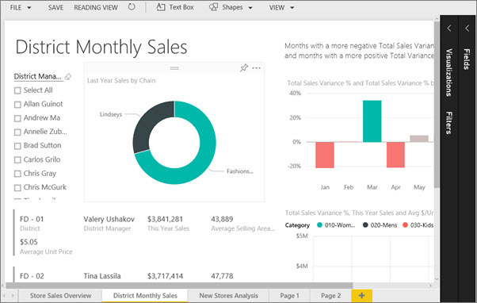
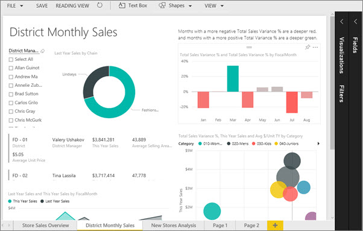
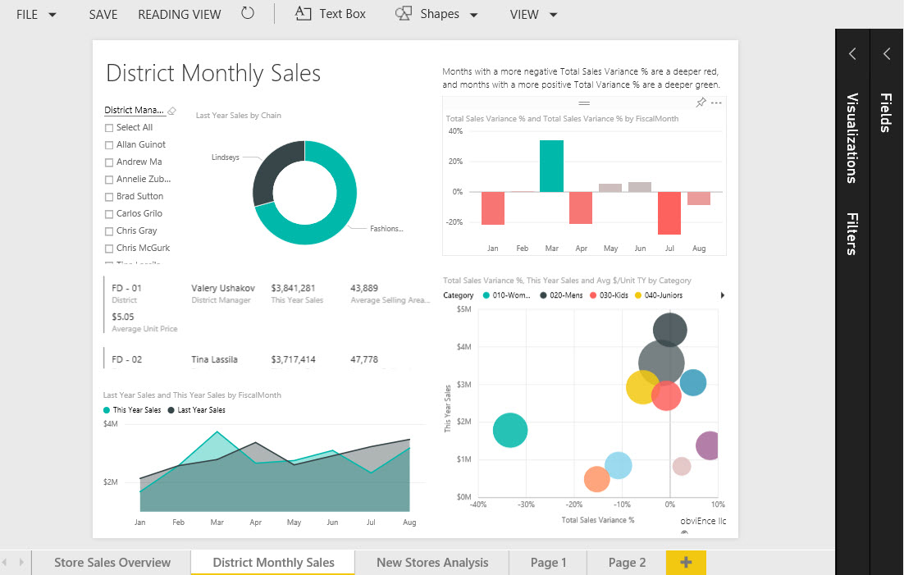
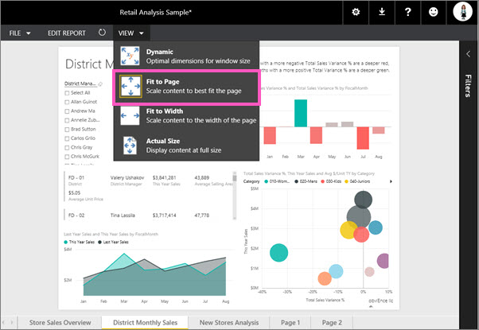
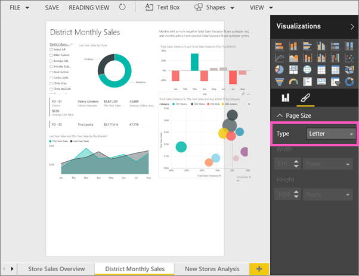

<properties
   pageTitle="Tutorial: Change the display settings for a page in a Power BI report"
   description="Tutorial: Change the display settings for a page in a Power BI report"
   services="powerbi"
   documentationCenter=""
   authors="mihart"
   manager="mblythe"
   editor=""
   tags="power bi"/>

<tags
   ms.service="powerbi"
   ms.devlang="NA"
   ms.topic="article"
   ms.tgt_pltfrm="NA"
   ms.workload="powerbi"
   ms.date="10/16/2015"
   ms.author="mihart"/>

# Tutorial: Change the display settings for a page in a Power BI report  

In the [previous article](powerbi-service-change-report-display-settings.md) you learned about two different ways to control page display in Power BI reports: **View** and **Page Size**. Now let's try it ourselves.

## First, let's change the page View setting.  
1.  Open a report in Editing View. This example uses the "District Monthly Sales" page of the [Retail Analysis sample](powerbi-sample-retail-analysis-take-a-tour.md).  By default, pages display using the **Dynamic** setting.  In this case, Dynamic displays the report page without scrollbars, but some of the titles are cut off.    
    

2.  Make sure that no visualizations are selected on the canvas. Select **View** and review the display options.  
    

3.  Let's see how the page looks using the **Actual Size** setting.  
    

    Not great, the headings are no longer cut off but now we have scrollbars.

4.  Switch to **Fit to Width**.  
    

    Looks better, but we still have one scrollbar.  

5.  Let's try **Fit to Page**.  
      

	No scrollbars and no cut off titles; this is the best option for us. 

6.  Save the report. The new page view setting is saved with the report.

7.  Open the report in Reading View and go to the "District Monthly Sales" page.

8.  Select View. The report page displays using "Fit to Page."  
    

## Now, let's change the Page Size setting  
1.  Re-open the report in Editing View. This example uses the "District Monthly Sales" page of the [Retail Analysis sample](powerbi-sample-retail-analysis-take-a-tour.md).    

2.  Make sure that no visualizations are selected on the canvas.  In the **Visualizations** pane, select the paintbrush icon  .    

3.  Select **Page Size** &gt; **Type** to display the page size options.  
    

4.  Select **16:9** page ratio.  
    

    The report page displays using a ration of 16 wide by 9 high. To see the actual pixel size being used, take a look at the greyed out Width and Height fields (1280x720).  There is a lot of empty space around the report canvas; this is because we previously set **View** to "Fit to Page."

5.  Select **Letter**.  On the canvas, only the contents that fit within 816 x 1056 pixels (Letter size) remain on the white portion of the canvas.  Depending on our View setting, the contents that have "fallen off" the canvas are still visible. Since our **View** setting is "Fit to Page" we still see, and can interact with, the visualizations in the grey area of our canvas.  
    

    If we change **View** to "Fit to Width," our canvas now displays only the page contents that fit into the letter size.   
    

6.  Continue exploring the **Page Size** options.

## Using page View and Page Size together  
Use page View and Page Size together to create a report that can be embedded in another application.  

In this exercise, you'll create a report that will display in Cortana.  Cortana displays contents at 400 pixels wide by any height.  

1.  Select **Page Size** &gt; **Custom**.

2.  Set Width to 400 and set Height to 2000.  
    

3.  Rearrange and resize the individual visualizations to fit within the page (white area).  You may find this easier to do if you switch between **View** &gt; **Fit to Page** and **View** &gt; **Actual Size**. 

    In both views you may notice that when you drag a visual onto the white space it snaps to the left border.  This helps you align the visualizations.

4.  Select **View** &gt; **Fit to Page**.  
    

## See Also  
Back to [Page display settings in a Power BI report](powerbi-service-change-report-display-settings.md)  
Read more about  [reports in Power B ](powerbi-service-reports.md)  
[Power BI - Basic Concepts](powerbi-service-basic-concepts.md)  
