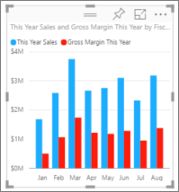

<properties
   pageTitle="Combo Chart in Power BI (Tutorial)"
   description="This documentation is a tutorial (with video) that shows you why and how to create a Combo Chart in Power BI."
   services="powerbi"
   documentationCenter=""
   authors="mihart"
   manager="erikre"
   backup=""
   editor=""
   tags=""
   featuredVideoId="lnv66cTZ5ho"
   qualityFocus="monitoring"
   qualityDate=""/>

<tags
   ms.service="powerbi"
   ms.devlang="NA"
   ms.topic="article"
   ms.tgt_pltfrm="NA"
   ms.workload="powerbi"
   ms.date="10/27/2017"
   ms.author="mihart"/>
# Combo Chart in Power  (Tutorial)

In Power BI, a combo chart is a single visualization that combines a line chart and a column chart. Combining the 2 charts into one lets you make a quicker comparison of the data.

Combo charts can have one or two Y axes.

## When to use a Combo Chart

Combo charts are a great choice:

-   when you have a line chart and a column chart with the same X axis.

-   to compare multiple measures with different value ranges.

-   to illustrate the correlation between two measures in one visualization.

-   to check whether one measure meet the target which is defined by another measure

-   to conserve canvas space.

## Create a basic, single-axis, Combo Chart

Watch Will create a combo chart using the Sales and Marketing sample.

<iframe width="560" height="315" src="https://www.youtube.com/embed/lnv66cTZ5ho?list=PL1N57mwBHtN0JFoKSR0n-tBkUJHeMP2cP" frameborder="0" allowfullscreen></iframe>

To create your own combo chart, sign in to Power BI and select **Get Data \> Samples \> Retail Analysis Sample**. 

1. From the "Retail Analysis Sample" dashboard, select the **Total Stores** tile to open the "Retail Analysis Sample" report.

2. Select **Edit Report** to open the report in Editing View.

3. [Add a new report page](powerbi-service-add-a-page-to-a-report.md).

4. Create a column chart that displays this year's sales and gross margin by month.

	a.  From the Fields pane, select **Sales** \> **This Year Sales** > **Value**.

	b.  Drag **Sales** \> **Gross Margin This Year** to the **Value** well.

	c.  Select **Time** \> **FiscalMonth** to add it to the **Axis** well. 

    

5. Select the ellipses (...) in the upper-right corner of the visualization, and select **Sort by FiscalMonth**.

6. Convert the column chart to a combo chart. With the column chart selected, from the **Visualizations** pane select the **Line and clustered column chart**.

    

7.  From the **Fields** pane, drag **Sales** \> **Last Year Sales** to the **Line Values** bucket.

    

    Your combo chart should look something like this:

    

## Create a combo chart with two axes

In this task, we'll compare gross margin and sales.

1.  Create a new line chart that tracks Gross Margin % last year by Month.  In January GM% was 35%, peaked at 45% in April, dropped in July and peaked again in August. Will we see a similar pattern in sales last year and this year?

    

2.  Add **This Year Sales > Value** and **Last Year Sales** to the line chart. The scale of **GM% Last Year** is much smaller than the scale of **Sales** which makes it difficult to compare.      

    

3.  To make the visual easier to read and interpret, convert the line chart to a Line and Stacked Column chart.

    

4.  Drag **Gross Margin% Last Year** from **Column Values** into **Line Values**. Power BI creates two axes, thus allowing the datasets to be scaled differently; the left measures dollars and the right measures percentage.

        

## Add titles to the axes

1.  Select the paint roller icon  to open the Formatting pane.

2. Select the down arrow to expand the **Y-axis** options.

3.  For **Y-Axis (Column)**, set **Position** to **Left**, set **Title** to **On**, **Style** to  **Show title only**, and **Display** as **Millions**.

    

4.  Under **Y-Axis (Column)** also ensure that **Show Secondary** is set to **On**. This displays options for formatting the line chart portion of the combo chart.

    

5.  For **Y-Axis (Line)**, leave **Position** as **Right**, turn **Title** to **On**, and set **Style** to **Show title only**.

    Your combo chart now displays dual axes, both with titles.

    

From here you might want to:

-  [Add the combo chart as a dashboard tile](powerbi-service-dashboard-tiles.md).

-  [Save the report](powerbi-service-save-a-report.md).

## Highlighting and cross-filtering

For information about using the Filters pane, see [Add a filter to a report](powerbi-service-add-a-filter-to-a-report.md).

Highlighting a column or line in a combo chart cross-filters the other visualizations on the report page... and vice versa.

## Next steps

[Add a visualization to a report](powerbi-service-add-visualizations-to-a-report-i.md)

[Visualizations in Power BI  reports](powerbi-service-visualizations-for-reports.md)

[Visualization types in Power BI](powerbi-service-visualization-types-for-reports-and-q-and-a.md)

[Power BI - Basic Concepts](powerbi-service-basic-concepts.md)

[Try it out -- it's free!](https://powerbi.com/)

More questions? [Try the Power BI Community](http://community.powerbi.com/)
