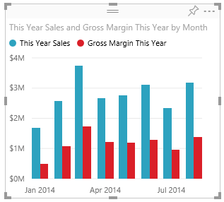
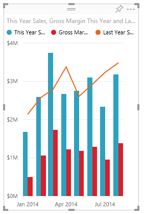
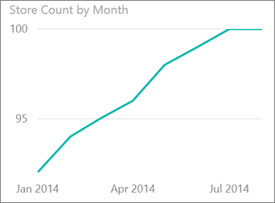
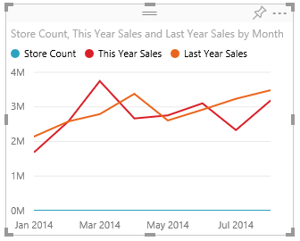
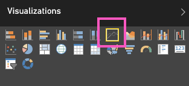
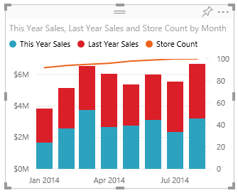
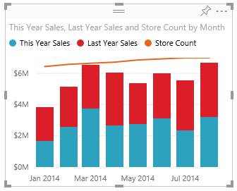
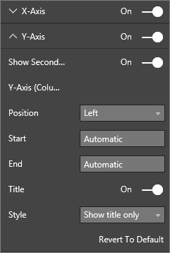
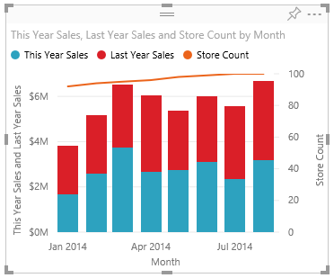

<properties 
   pageTitle="Tutorial: Combo Chart in Power BI"
   description="Tutorial: Combo Chart in Power BI"
   services="powerbi" 
   documentationCenter="" 
   authors="pcw3187" 
   manager="mblythe" 
   editor=""
   tags=""/>
 
<tags
   ms.service="powerbi"
   ms.devlang="NA"
   ms.topic="article"
   ms.tgt_pltfrm="NA"
   ms.workload="powerbi"
   ms.date="10/14/2015"
   ms.author="v-pawrig"/>
# Tutorial: Combo Chart in Power BI

[← Visualizations in reports](https://support.powerbi.com/knowledgebase/topics/65160-visualizations-in-reports)

In Power BI, a Combo Chart is a single visualization that combines a line chart and a column chart. Combining the 2 charts into one lets you make a quicker comparison of the data. 

Combo charts can have one or two Y axes.

## When to use a Combo Chart

Combo Charts are a great choice:

-   when you have a line chart and a column chart with the same X axis.

-   to compare multiple measures with different value ranges.

-   to illustrate the correlation between two measures in one visualization.

-   to check whether one measure meet the target which is defined by another measure

-   to conserve canvas space.

## Create a basic, single-axis, Combo Chart

To follow along, sign in to Power BI and select **Get Data \> Samples \> Retail Analysis Sample**. 

1. From the "Retail Analysis Sample" dashboard, select the **Total Stores** tile to open the "Retail Analysis Sample" report.

2. Select **Edit Report** to open the report in Editing View.

3. [Add a new report page](https://support.powerbi.com/knowledgebase/articles/474804).

4. Create a column chart that displays this year's sales and gross margin by month.

	1.  From the Fields pane, select **Sales** \> **This Year Sales**.

	2.  Drag **Sales** \> **Gross Margin This Year** to the **Value** well.

	3. Select **Time** \> **Month** to add it to the **Axis** well. 

    

5. Convert the column chart to a Combo chart.

	1.  With the column chart selected, open the Visualizations pane and select the **Line and Clustered Column chart**.

    

	2.  From the **Fields** pane, drag **Sales** \> **Last Year Sales** to the **Line Values** bucket.

    

    Your combo chart should look like this:

    

## Create a Combo Chart with two axes

In this task, we'll see what impact store count has on sales.

1.  Create a new line chart that tracks store count by month.  In January there were 92 stores and by July there were 100.  Will we see an increase in sales that corresponds to the increase in stores?

    

2.  Add **This Year Sales** and **Last Year Sales** to the line chart. The scale of **Store Count** is much smaller than the scale of **Sales** which makes it difficult to compare.      

    

3.  To make the visual easier to read and interpret, convert the line chart to a Line and Stacked Column chart.

    

4.  Drag **Store Count** from **Column Values** into **Line Values**. Power BI creates two axes, thus allowing the data sets to be scaled differently; the left measures dollars and the right measures count of stores.

    

      

## Optionally, turn off the second axis.

1.  In the **Visualizations** pane, select the paintbrush icon to display the customization options.

2.  Expand the Y-Axis options by selecting the down arrow.

3.  Select the slider for **Show Secondary** and turn it **Off**.

    

    

## Add titles to the axes

1.  Select the down arrow to expand the Y-axis options.

2.  Set **Show Secondary** to **On**.

3.  Set **Position** to **Left**.

4.  Set **Title** to **On**.

5.  Set **Style** to **Show title only**.

    

6.  Select the down arrow to expand the X-axis options.

7.  Set **Title** to **On**.

8.  Set **Style** to **Show title only**.

    Your Combo chart now displays dual axes, both with titles.

	

	[Add the Combo Chart as a dashboard tile](http://support.powerbi.com/knowledgebase/articles/425669-tiles-in-power-bi).

	[Save the report](http://support.powerbi.com/knowledgebase/articles/444112-save-a-report).

## Highlighting and cross-filtering

For information about using the Filters pane, see [Add a filter to a report](http://support.powerbi.com/knowledgebase/articles/464704-add-a-filter-to-a-report).

Highlighting a column or line in a Combo Chart cross-filters the other visualizations on the report page... and vice versa.

## See Also:

[Add a visualization to a report](https://powerbi.uservoice.com/knowledgebase/articles/441777)

[Visualizations in Power BI  reports](http://support.powerbi.com/knowledgebase/articles/434821-visualizations-in-power-bi-reports)

[Visualization types in Power BI](http://support.powerbi.com/knowledgebase/articles/469552-visualization-types-available-in-power-bi-reports)

[Power BI - Basic Concepts](http://support.powerbi.com/knowledgebase/articles/487029-power-bi-preview-basic-concepts)

[Try it out -- it's free!](https://powerbi.com/)

