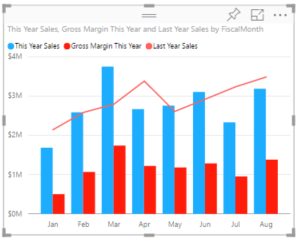
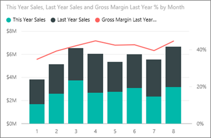
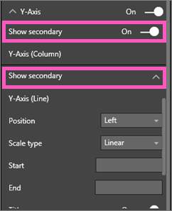
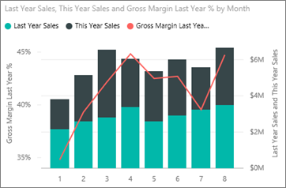

<properties
   pageTitle="Tutorial: Combo Chart in Power BI"
   description="Tutorial: Combo Chart in Power BI."
   services="powerbi"
   documentationCenter=""
   authors="mihart"
   manager="mblythe"
   editor=""
   tags=""
   qualityFocus="no"
   qualityDate=""/>

<tags
   ms.service="powerbi"
   ms.devlang="NA"
   ms.topic="article"
   ms.tgt_pltfrm="NA"
   ms.workload="powerbi"
   ms.date="02/23/2016"
   ms.author="mihart"/>
# Tutorial: Combo Chart in Power BI

In Power BI, a Combo Chart is a single visualization that combines a line chart and a column chart. Combining the 2 charts into one lets you make a quicker comparison of the data.

Combo charts can have one or two Y axes.

## When to use a Combo Chart

Combo Charts are a great choice:

-   when you have a line chart and a column chart with the same X axis.

-   to compare multiple measures with different value ranges.

-   to illustrate the correlation between two measures in one visualization.

-   to check whether one measure meet the target which is defined by another measure

-   to conserve canvas space.

## Create a basic, single-axis, Combo Chart

To follow along, sign in to Power BI and select **Get Data \> Samples \> Retail Analysis Sample**. 

1. From the "Retail Analysis Sample" dashboard, select the **Total Stores** tile to open the "Retail Analysis Sample" report.

2. Select **Edit Report** to open the report in Editing View.

3. [Add a new report page](powerbi-service-add-a-page-to-a-report.md).

4. Create a column chart that displays this year's sales and gross margin by month.

	a.  From the Fields pane, select **Sales** \> **This Year Sales** > **Value**.

	b.  Drag **Sales** \> **Gross Margin This Year** to the **Value** well.

	c.  Select **Time** \> **FiscalMonth** to add it to the **Axis** well. 

    

5. Convert the column chart to a Combo chart. With the column chart selected, from the **Visualizations** pane select the **Line and Clustered Column chart**.

    

7.  From the **Fields** pane, drag **Sales** \> **Last Year Sales** to the **Line Values** bucket.

    

    Your combo chart should look like this:

    

## Create a Combo Chart with two axes

In this task, we'll compare gross margin and sales.

1.  Create a new line chart that tracks Gross Margin % last year.  In January GM% was 35%, peaked at 45% in April, dropped in July and peaked again in August. Will we see a similar pattern in sales last year and this year?

    

2.  Add **This Year Sales** and **Last Year Sales** to the line chart. The scale of **GM% Last Year** is much smaller than the scale of **Sales** which makes it difficult to compare.      

    

3.  To make the visual easier to read and interpret, convert the line chart to a Line and Stacked Column chart.

    

4.  Drag **Gross Margin% Last Year** from **Column Values** into **Line Values**. Power BI creates two axes, thus allowing the data sets to be scaled differently; the left measures dollars and the right measures percentage.

    

      

## Optionally, turn off the second axis.

1.  In the **Visualizations** pane, select the paintbrush icon to display the customization options.

2.  Expand the Y-Axis options by selecting the down arrow.

3.  Select the slider for **Show Secondary** and turn it **Off**.

    

## Add titles to the axes

1.  Select the down arrow to expand the **Y-axis** options.

2.  Set **Show Secondary** to **On**. This reveals additional settings.

    

3.  Set **Position** to **Left**.

4.  Set **Title** to **On**.

5.  Set **Style** to **Show title only**.

6.  Select the down arrow to expand the X-axis options.

7.  Set **Title** to **On**.

8.  Set **Style** to **Show title only**.

    Your Combo chart now displays dual axes, switched to opposite sides, both with titles.

	

	[Add the Combo Chart as a dashboard tile](powerbi-service-dashboard-tiles.md).

	[Save the report](powerbi-service-save-a-report.md).

## Highlighting and cross-filtering

For information about using the Filters pane, see [Add a filter to a report](powerbi-service-add-a-filter-to-a-report.md).

Highlighting a column or line in a Combo Chart cross-filters the other visualizations on the report page... and vice versa.

## See also

[Add a visualization to a report](https://powerbi.uservoice.com/knowledgebase/articles/441777)

[Visualizations in Power BI  reports](powerbi-service-visualizations-for-reports.md)

[Visualization types in Power BI](powerbi-service-visualization-types-for-reports-and-q-and-a.md)

[Power BI - Basic Concepts](powerbi-service-basic-concepts.md)

[Try it out -- it's free!](https://powerbi.com/)
