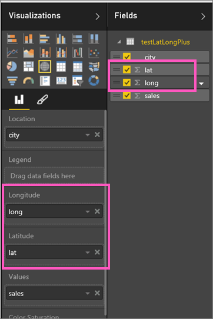

<properties 
   pageTitle="Tutorial: Filled Maps (Choropleths) in Power BI"
   description="Tutorial: Filled Maps (Choropleths) in Power BI"
   services="powerbi" 
   documentationCenter="" 
   authors="jastru" 
   manager="mblythe" 
   editor=""
   tags=""/>
 
<tags
   ms.service="powerbi"
   ms.devlang="NA"
   ms.topic="article"
   ms.tgt_pltfrm="NA"
   ms.workload="powerbi"
   ms.date="10/15/2015"
   ms.author="jastru"/>

# Tutorial: Filled Maps (Choropleths) in Power BI  

A Filled Map uses shading or tinting or patterns to display how a value differs in proportion across a geography or region.  Quickly display these relative differences with shading that ranges from light (less-frequent/lower) to dark (more-frequent/more).    

## When to use a Filled Map  
Filled Maps are a great choice:

-   to display quantitative information on a map.

-   to show spatial patterns and relationships.

-   when your data is standardized.

-   when working with socioeconomic data.

-   when defined regions are important.

-   to get an overview of the distribution across the geographic locations.

## Create a basic Filled Map  
We'll create a Filled Map that shows sentiment data by state.

These instructions use the Sales and Marketing Sample. To follow along, [download the sample](http://support.powerbi.com/knowledgebase/articles/514904-download-samples), sign in to Power BI and select **Get Data \> Files \> Local File** and upload the Sales and Marketing Sample.

>**Note:**  
>This tutorial uses the classic report canvas.  For more information, see Power BI classic report canvas vs. new report canvas.

1.  Start on a [blank report page ](http://support.powerbi.com/knowledgebase/articles/474804-add-a-page-to-a-power-bi-report)in [Editing View](http://support.powerbi.com/knowledgebase/articles/443094-edit-a-report)from the Sales and Marketing Sample dataset  

2.  and select the **Geo** \> **State** field.    

3.  [Convert the chart](http://support.powerbi.com/knowledgebase/articles/444663-change-the-type-of-visualization-in-a-report) to a Filled Map. Notice that **State** is now in the **Location** well. Bing Maps uses the field in the **Location** well to create the map.  The location can be a variety of valid locations: countries, states, counties, cities, zip codes or other postal codes etc. Bing Maps provides filled map shapes for locations around the world. Without a valid entry in the Location well, Power BI cannot create the Filled Map.  

4.  Filter the map to display only the continental United States.

	a.  At the bottom of the Visualizations pane, look for the **Filters** area.

	b.  Hover over **State** and click the expand chevron  
    

	c.  Place a checkmark next to **All** and remove the checkmark next to **AK**.

    

5.  Select **SalesFact** \> **Sentiment** to add it to the **Values** well. The field in the **Values** well controls the map shading.  

6.  The Filled Map is shaded in blue, with light blue representing the lower sentiment numbers and dark blue representing the higher, more-positive sentiment.  Here I've highlighted the state of Wyoming (WY) and see that Sentiment is very good, 74.  

7.  [Add the Filled Map as a dashboard tile (pin the visual)](http://support.powerbi.com/knowledgebase/articles/425669-tiles-in-power-bi). 

8.  [Save the report](http://support.powerbi.com/knowledgebase/articles/444112-save-a-report).

## Highlighting and cross-filtering  
For information about using the Filters pane, see [Add a filter to a report](https://support.powerbi.com/knowledgebase/articles/464704-add-a-filter-to-a-report).

Highlighting a Location in a Filled Map filters the other visualizations on the report page... and vice versa.

1.  On the Filled Map, select a state.  This highlights the other visualizations on the page. Selecting **Texas**, for example, shows me that Sentiment is 74, Texas is in the Central District \#23, and that most of the sales volume comes from the Moderation and Convenience segments.   
    

2.  On the line chart, toggle between **No** and **Yes**. This filters the Filled Map to show Sentiment for VanArsdel and for VanArsdel's competition.  
    

## Troubleshooting  
Map data can be ambiguous.  For example, there's a Paris, France, but there's also a Paris, Texas. Your geographic data is probably stored in separate columns – a column for city names, a column for state or province names, etc. – so Bing may not be able to tell which Paris is which. If your dataset already contains latitude and longitude data, Power BI has special fields to help make the map data unambiguous. Just drag the field that contains your latitude data into the Visualizations \> Latitude area.  And do the same for your longitude data.  
 

If you do not have access to latitude and longitude data, [follow these instructions to update your dataset](https://support.office.com/article/Maps-in-Power-View-8A9B2AF3-A055-4131-A327-85CC835271F7).

## See Also  
 [Add a visualization to a report](https://powerbi.uservoice.com/knowledgebase/articles/441777)  
 [Pin a visualization to a dashboard](http://support.powerbi.com/knowledgebase/articles/430323-pin-a-tile-to-a-dashboard-from-a-report)  
 [Power BI - Basic Concepts](http://support.powerbi.com/knowledgebase/articles/487029-power-bi-preview-basic-concepts)  
[Try it out -- it's free!](https://powerbi.com/)  